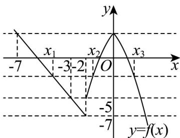

> [!faq]- 《专题3.4 函数的应用（一）（高效培优讲义）》官方解析
>
> > [!success]- **【答案】** $(-7,-3]$
>
> > [!note]- **【解析】**
> > 
> >
> > 当 $x < -2$ 时， $y = -2x - 11$ ，函数单调递减，此时 $y \in (-7, +\infty)$
> >
> > 当 $-2 \leq x < 0$ 时， $y = -x^2 + 2x + 3$ ，函数单调递增，此时 $y \in [-5, 3)$
> >
> > 当 $x = 0$ 时， $y = -x^2 - 2x + 3$ ，函数单调递减，此时 $y \in (-\infty, 3]$
> >
> > 作出函数 $f(x)=\left\{\begin{aligned}-x^{2}-2|x|+3,x&-2\\ -2x-11,x<-2\end{aligned}\right.$ 的图象如图所示，
> >
> > 设 $x_{1} < x_{2} < x_{3}$ ，且 $f(x_{1}) = f(x_{2}) = f(x_{3}) = t$
> >
> > 则 $t\in [-5,3)$
> >
> > 当 $x < -2$ 时，令 $f(x) = -5$ ，则 $x = -3$ ；令 $f(x) = 3$ ，则 $x = -7$ ；
> >
> > 则 $-7 < x_{1} \leq -3 < -2 \leq x_{2} < 0 < x_{3} \leq 2$
> >
> > 又函数 $y = -x^{2} - 2 |x| + 3$ 为偶函数，所以 $x_{2} + x_{3} = 0$ ，
> >
> > 由 $x_{1}\in (-7, - 3]$ ，即 $x_{1} + x_{2} + x_{3} = x_{1}\in (-7, - 3]$
> >
> > 故答案为： $(-7,-3]$ .
