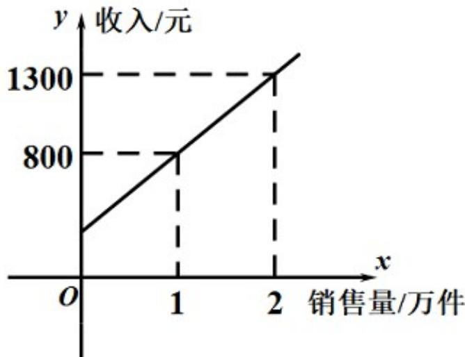

<!-- question-source:start -->
【变式1】某公司市场营销人员的个人月收入与其每月的销售量成一次函数关系，其图象如下图所示，由图

中给出的信息可知，营销人员没有销售量时的收入是（）

A.310元 B.300元 C.290元 D.280元
<!-- question-source:end -->

![[高中/课堂同步/题库/人教A版高中数学同步讲义(2026)/01_必修第一册/第三章 函数的概念与性质/专题3.4 函数的应用（一）（高效培优讲义）/题型01_一次函数模型/questions/answers/Q00074553A1.md]]
