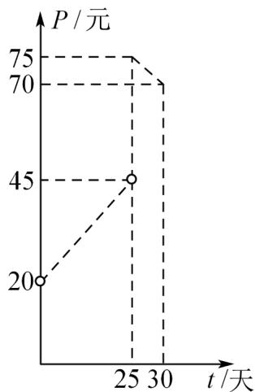

<!-- question-source:start -->
【变式3】某种商品在30天每件的销售价格 $P$ （元）与时间 $t$ （天）的函数关系用如图表示，该商品在30天

内日销售量 $Q$ （件）与时间 $t$ （天）之间的关系如下表：

<table><tr><td> $t/$ 天</td><td>5</td><td>10</td><td>20</td><td>30</td></tr><tr><td> $Q/$ 件</td><td>45</td><td>40</td><td>30</td><td>20</td></tr></table>

(1) 根据提供的图象（如图），写出该商品每件的销售价格 P 与时间 t 的函数关系式.

(2) 根据表 $^{1}$ 提供的数据，写出日销售量Q与时间t的一次函数关系式·

(3) 求该商品的日销售金额的最大值，并指出日销售金额最大的一天是 $^{30}$ 天中的第几天·(日销售金额=每

件的销售价格×日销售量）
<!-- question-source:end -->

![[高中/课堂同步/题库/人教A版高中数学同步讲义(2026)/01_必修第一册/第三章 函数的概念与性质/专题3.4 函数的应用（一）（高效培优讲义）/题型01_一次函数模型/questions/answers/Q00074555A1.md]]
