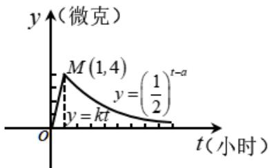

<!-- question-source:start -->
【典例1】某医药研究所开发一种新药，如果成年人按规定的剂量服用，据监测，服药后每毫升血液中的含

药量 $^{y}$ （微克）与时间 $^{t}$ （小时）之间近似满足如图所示的曲线：据进一步测定，每毫升血液中含药量不少于

0.25 微克时，治疗疾病有效，则服药一次治疗该疾病有效的时间为（ ）
<!-- question-source:end -->

![[高中/课堂同步/题库/人教A版高中数学同步讲义(2026)/01_必修第一册/第三章 函数的概念与性质/专题3.4 函数的应用（一）（高效培优讲义）/题型03_分段函数模型/questions/answers/Q00074560A1.md]]
