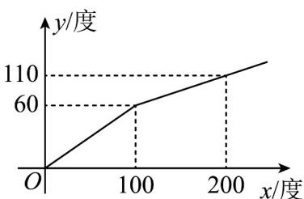

<!-- question-source:start -->
【变式2】某地的水电资源丰富，并且得到了较好的开发，电力充足·某供电公司为了鼓励居民用电，采用分段

计费的方法来计算电费·月用电量 $x$ (度)与相应电费 $y$ (元)之间的函数关系如图所示·当月用电量为 $300$ 度时，

应交电费

A. 130元 B. 140元 C. 150元 D. 160元
<!-- question-source:end -->

![[高中/课堂同步/题库/人教A版高中数学同步讲义(2026)/01_必修第一册/第三章 函数的概念与性质/专题3.4 函数的应用（一）（高效培优讲义）/题型03_分段函数模型/questions/answers/Q00074562A1.md]]
