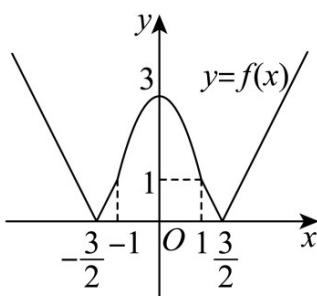

> [!faq]- 《第三章 函数的概念与性质（高效培优单元测试·强化卷）》官方解析
>
> > [!success]- **【答案】** C
>
> > [!note]- **【解析】**
> > 若 $\left|2x-3\right|=3-2x^{2}$ ，解得x=0或x=1，
> >
> > 结合二次函数和一次函数知 $g(x) = \begin{cases} |2x - 3|, & x \in (-\infty, 0) \cup (1, +\infty) \\ 3 - 2x^2, & x \in [0, 1] \end{cases}$
> >
> > 若 $\left|2x+3\right|=3-2x^{2}$ ，解得x=0或x=-1，
> >
> > 结合二次函数和一次函数知 $h(x) = \begin{cases} |2x + 3|, & x \in (-\infty, -1) \cup (0, +\infty) \\ 3 - 2x^2, & x \in [-1, 0] \end{cases}$
> >
> > 所以 $f(x)=\min\left\{g(x),h(x)\right\}=\begin{cases}\left|2x+3\right|,x<-1\\3-2x^{2},-1\leq x\leq1\\ \left|2x-3\right|,x\rangle1\end{cases}$
> >
> > 画出 $f(x)$ 的图象如下，
> >
> > 
> >
> > 结合图象及 $f(-x)=f(x)$ ，知 $f(x)$ 为偶函数，故 A 正确；
> >
> > 当 $x \in [1,3]$ 时 $x^{2} - 4x + 3 \leq 0$ ，即 $3x^{2} - 12x + 9 \leq 0$ ，所以 $4x^{2} - 12x + 9 \leq x^{2}$
> >
> > 所以 $|2x-3|<x$ ，所以 $f(x)\leq x$ 成立，故B正确；
> >
> > 对于 C，令 $f(x)=t$ ，则 $f(t)\leq1$
> >
> > 当 $t < -1$ 时， $\left|2t + 3\right| \leq 1$ ，解得 $-2 \leq t < -1$
> >
> > 当 $-1 \leq t \leq 1$ 时， $3 - 2t^2 \leq 1$ ，解得 $t \leq -1$ 或 $t - 1$ ，又 $-1 \leq t \leq 1$ ，所以 $t = \pm 1$ ，
> >
> > 当 $t > 1$ 时， $\left|2t - 3\right|\leq 1$ ，解得 $1 <   t\leq 2$
> >
> > 综上， $1\leq |t|\leq 2$ ，故 $1\leq \left|f(x)\right|\leq 2$
> >
> > 当 $x < -1$ 时， $1 \leq |2x + 3| \leq 2$ ，解得 $-\frac{5}{2} \leq x \leq -2$ ，
> >
> > 当 $-1 \leq x \leq 1$ 时， $1 \leq 3 - 2x^2 \leq 2$ ，解得 $\frac{\sqrt{2}}{2} \leq x \leq 1$ 或 $-1 \leq t \leq -\frac{\sqrt{2}}{2}$
> >
> > 当 $x > 1$ 时， $1 \leq |2x - 3| \leq 2$ ，解得 $2 \leq x \leq \frac{5}{2}$
> >
> > 综上，不等式的解集为 $x \in \left[-1, -\frac{\sqrt{2}}{2}\right] \cup \left[\frac{\sqrt{2}}{2}, 1\right] \cup \left[2, \frac{5}{2}\right] \cup \left[-\frac{5}{2}, -2\right]$ ，故 $C$ 错误；
> >
> > 对于 D，当 $x \in [2,3]$ ，令 $m = f(x) = 2x - 3 \in [1,3]$ ，
> >
> > 结合偶函数的性质， $x\in [-3, - 2]\cup [2,3]$ 时 $m = f(x)\in [1,3]$ ，则 $f[f(x)]\leq f(x)$ 等价于 $f(m) - m\leq 0$
> >
> > 结合 $^{B}$ 分析，当 $x\in[-3,-2]\cup[2,3]$ 时，有 $f[f(x)]\leq f(x)$ 成立，故 $^{D}$ 正确.
> >
> > 故选：C
> >
> > $$
> > f (x) _ {\text {在}} (- \infty , 0 ]
> > $$
> >
> > $$
> > x \in [ 2, 3 ]
> > $$
> >
> > $f(ax + 1) + f(x - a)\quad 0$ ，则（ ）A. $a\quad -2$ B. $a\quad -3$ C. $a\leq -2$ D. $a\leq -3$
> >
> > 【答案】B
> >
> > 【详解】由函数 $f(x)$ 为 $\mathbb{R}$ 上的奇函数，
> >
> > 则 $f(ax + 1) + f(x - a) \quad 0 \Leftrightarrow f(ax + 1) - f(x - a) = f(a - x)$
> >
> > 又 $f(x)$ 在 $(- \infty, 0]$ 上单调递增，则 $f(x)$ 在 $\mathbf{R}$ 上单调递增，
> >
> > 则 $f(ax+1)$ $f(a-x) \Leftrightarrow ax+1$ $a-x$
> >
> > 则 $\exists x\in [2,3]$ ，使得 $f(ax + 1) + f(x - a)\quad 0$ ， $\Leftrightarrow \exists x\in [2,3]$ ，使得 $ax + 1\quad a - x$
> >
> > 即 $a - \frac{x + 1}{x - 1}$ ，在 $x\in [2,3]$ 有解，
> >
> > 则 $a \left[-\frac{x+1}{x-1}\right]_{\min}$ ， $x \in [2,3]$ ，
> >
> > 令 $t = -\frac{x + 1}{x - 1}$ ，则 $t = -\frac{x + 1}{x - 1} = -\frac{x - 1 + 2}{x - 1} = -1 - \frac{2}{x - 1}$
> >
> > 又 $x \in [2,3]$ ，则 $\frac{2}{x-1} \in [1,2]$ ， $\Rightarrow -1 - \frac{2}{x-1} \in [-3,-2]$ ，
> >
> > 即 $t\in [-3, - 2]$ ，则 $a - 3$
> >
> > 故选：B.
> >
> > ## 二、选择题：本题共 $^{3}$ 小题，每小题 $^{6}$ 分，共 $^{18}$ 分．在每小题给出的选项中，有多项符合题目要求．全部选对的得 $^{6}$ 分，部分选对的得部分分，有选错的得 $^{0}$ 分.
