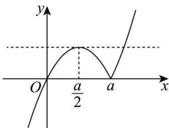
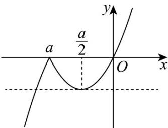
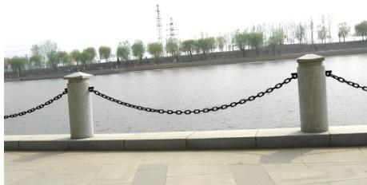
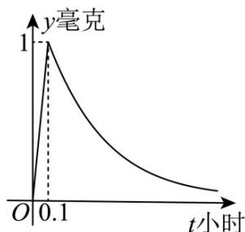

> [!faq]- 《第三章 函数的概念与性质（高效培优单元测试·强化卷）》官方解析
>
> > [!success]- **【答案】** (1) $(-∞,1]$ 和 $[2,+∞)$ ; (2)最大值是 $1$ ，最小值是 $0$ ； (3)答案见解析.
>
> > [!note]- **【解析】**
> > （1）a=2时， $f(x)=x\left|x-2\right|=\begin{cases}x(x-2),x&2\\x(2-x),x<2\end{cases}=\begin{cases}(x-1)^{2}-1,x&2\\-(x-1)^{2}+1,x<2\end{cases}$
> >
> > 所以增区间是 $(-∞,1]$ 和 $[2,+∞)$ ;
> >
> > (2) 由 (1) 知 $f(x)$ 在 $(\frac{1}{2}, 1]$ 上递增，在[1,2]上递减，在 $[2, \sqrt{2} + 1)$ 上递增，
> >
> > $f(1) = 1$ ， $f(2) = 0$ ，又 $f\left(\frac{1}{2}\right) = \frac{3}{4}$ ， $f(\sqrt{2} +1) = 1$
> >
> > 所以 $f(x)$ 在 $(\frac{1}{2},\sqrt{2}+1)$ 上的最大值是 $^{1}$ ，最小值是 $^{0}$ ;
> >
> > $$
> > f (x) = \left\{ \begin{array}{l} x (x - a), x \quad a \\ x (a - x), x <   a \end{array} = \left\{ \begin{array}{l} \left(x - \frac {a}{2}\right) ^ {2} - \frac {a ^ {2}}{4}, x \quad a \\ - \left(x - \frac {a}{2}\right) ^ {2} + \frac {a ^ {2}}{4}, x <   a \end{array} , \right. \right.
> > $$
> > - **①**：当 a > 0 时，函数 $f(x)$ 的图象如图①所示，
> >
> > 因为函数 $y = f(x)$ 在 $(m, n)$ 上既有最大值又有最小值， $(m, n)$ 是开区间，
> >
> > 所以最大值，最小值只能在 $x = a$ 和 $x = \frac{a}{2}$ 处取得， $f(a) = 0$ ， $f(\frac{a}{2}) = \frac{a^2}{4}$
> >
> > 由 $x(x-a)=\frac{a^{2}}{4}$ 解得 $x=\frac{(\sqrt{2}+1)a}{2}$ （负值舍去）， $f(0)=f(a)=0$
> >
> > 所以 $0 \leq m < \frac{a}{2}$ ， $a < n \leq \frac{(\sqrt{2} + 1)a}{2}$ ;
> >
> > 
> > - **②**：当 a < 0 时，函数 $f(x)$ 的图象如图②所示，
> >
> > 因为函数 $y = f(x)$ 在 $(m, n)$ 上既有最大值又有最小值， $(m, n)$ 是开区间，
> >
> > 所以最大值，最小值只能在 $x = a$ 和 $x = \frac{a}{2}$ 处取得， $f(a) = 0$ ， $f(\frac{a}{2}) = -\frac{a^2}{4}$
> >
> > 由 $x(a-x)=-\frac{a^{2}}{4}$ 解得 $x=\frac{(\sqrt{2}+1)a}{2}$ （正值舍去）， $f(0)=f(a)=0$
> >
> > 所以 $\frac{(\sqrt{2} + 1)a}{2} \leq m < a$ ， $\frac{a}{2} < n \leq 0$
> >
> > 
> >
> > 综上， $a > 0$ 时， $0\leq m <   \frac{a}{2}$ ， $a <   n\leq \frac{(\sqrt{2} + 1)a}{2}$ ； $a <   0$ 时， $\frac{(\sqrt{2} + 1)a}{2}\leq m <   a$ ， $\frac{a}{2} <  n\leq 0$
> >
> > 17. 函数 $f(x)=ax^{2}-\frac{1}{2}x+c(a,c\in\mathbb{R})$ ，满足 $f(1)=0$ ，且 $f(x)=0$ 在 $x\in R$ 时恒成立.
> >
> > (1)求 $a$ 、 $c$ 的值；
> >
> > (2)若 $h(x)=\frac{3}{4}x^{2}-bx+\frac{b}{2}-\frac{1}{4}$ ，解不等式 $f(x)+h(x)<0$ ；
> >
> > (3)是否存在实数 $m$ ，使函数 $g(x) = f(x) - mx$ 在区间 $[m,m + 2]$ 上有最小值-5？若存在，请求出 $m$ 的值；若
> >
> > 不存在，请说明理由·
> >
> > 【答案】(1) $a = c = \frac{1}{4}$ ；(2) 答案见解析；(3) 存在， $m = -3$ 或 $m = 2\sqrt{2} - 1$ .
> >
> > 【详解】（1）由 $f(1) = 0$ ，得 $a + c = \frac{1}{2}$
> >
> > 因为 $f(x)$ 0在 $\mathbb{R}$ 上恒成立，即 $ax^2 -\frac{1}{2} x + c$ 0在 $\mathbb{R}$ 上恒成立，
> >
> > 所以 $a > 0$ 且 $\triangleq \frac{1}{4} - 4ac \leq 0$ ，所以 $ac = \frac{1}{16}$ ，所以 $a\left(\frac{1}{2} - a\right) = \frac{1}{16}$ ，所以 $(a - \frac{1}{4})^2 \leq 0$
> >
> > 所以 $a = c = \frac{1}{4}$ .
> >
> > (2) 由 $^{(1)}$ 得 $f(x)=\frac{1}{4}x^{2}-\frac{1}{2}x+\frac{1}{4}$
> >
> > 因为 $h(x)=\frac{3}{4}x^{2}-bx+\frac{b}{2}-\frac{1}{4}$ ，
> >
> > 所以 $f(x)+h(x)=\frac{1}{4}x^{2}-\frac{1}{2}x+\frac{1}{4}+\frac{3}{4}x^{2}-bx+\frac{b}{2}-\frac{1}{4}=x^{2}-(b+\frac{1}{2})x+\frac{b}{2}$
> >
> > 由 $f(x) + h(x) < 0$ 得 $x^{2} - (b + \frac{1}{2})x + \frac{b}{2} < 0$
> >
> > 所以 $(x - b)(x - \frac{1}{2}) < 0$
> >
> > 所以，当 $b < \frac{1}{2}$ 时，不等式的解为 $b < x < \frac{1}{2}$ ，
> >
> > 当 $b = \frac{1}{2}$ 时，不等式无解，
> >
> > 当 $b > \frac{1}{2}$ 时，不等式的解为 $\frac{1}{2} < x < b$ ；
> >
> > 综上所述：当 $b < \frac{1}{2}$ 时，原不等式的解集为 $(b, \frac{1}{2})$ ;
> >
> > 当 $b = \frac{1}{2}$ 时，原不等式的解集为空集；
> >
> > 当 $b > \frac{1}{2}$ 时，原不等式的解集为 $(\frac{1}{2}, b)$
> >
> > (3) 因为 $g(x)=\frac{1}{4}x^{2}-\frac{1}{2}x+\frac{1}{4}-mx=\frac{1}{4}x^{2}-(\frac{1}{2}+m)x+\frac{1}{4}$
> >
> > 所以 $g(x)$ 的图象是开口向上的抛物线,对称轴为直线 $x = 2m + 1$
> >
> > 假设存在实数 m，使函数 $g(x)$ 在区间 $[m, m+2]$ 上有最小值 -5
> > - **①**：当 $2m + 1 < m$ ，即 $m < -1$ 时，函数 $g(x)$ 在区间 $[m, m + 2]$ 上是增函数，所以 $g(m) = -5$
> >
> > 即 $\frac{1}{4} m^2 - (\frac{1}{2} + m)m + \frac{1}{4} = -5$
> >
> > 化简得: $3m^{2}+2m-21=0$
> >
> > 所以 $(3m-7)(m+3)=0$
> >
> > 解得 $m = -3$ 或 $m = \frac{7}{3}$
> >
> > 因为 m < -1，所以 m = -3。
> > - **②**：当 $m \leq 2m + 1 \leq m + 2$ ，即 $-1 \leq m \leq 1$ 时，函数 $g(x)$ 的最小值为 $g(2m + 1) = -5$
> >
> > 即 $\frac{1}{4} (2m + 1)^2 -\left(\frac{1}{2} +m\right)(2m + 1) + \frac{1}{4} = -5$
> >
> > 化简得： $m^{2}+m-5=0$ ，解得 $m=\frac{-1-\sqrt{21}}{2}$ 或 $m=\frac{-1+\sqrt{21}}{2}$
> >
> > 因为 $-1 \leq m \leq 1$ ，所以 $m = \frac{-1 - \sqrt{21}}{2}$ 或 $m = \frac{-1 + \sqrt{21}}{2}$ 都舍去。
> > - **③**：当 $2m + 1 > m + 2$ ，即 $m > 1$ 时， $g(x)$ 在区间 $[m, m + 2]$ 上是减函数，
> >
> > 所以 $g(x)$ 的最小值为 $g(m+2)=-5$
> >
> > 即 $\frac{1}{4} (m + 2)^2 -\left(\frac{1}{2} +m\right)(m + 2) + \frac{1}{4} = -5$
> >
> > 化简得: $m^{2}+2m-7=0$ ，
> >
> > 解得 $m = -1 - 2\sqrt{2}$ 或 $m = -1 + 2\sqrt{2}$
> >
> > 因为 $m > 1$ ，所以 $m = -1 + 2\sqrt{2}$
> >
> > 综上，存在实数 $m$ ，当 $m = -3$ 或 $m = -1 + 2\sqrt{2}$ 时，函数 $g(x) = f(x) - mx$ 在区间 $[m,m + 2]$ 上有最小值-5.
> >
> > 18. 意大利著名天文学家伽利略曾错误的猜测链条在自然下垂时的形状是抛物线·直到 $1690$ 年雅各布·伯努
> >
> > 利正式提出该问题为“悬链线”，并向数学界征求答案·1961年他的弟弟约翰·伯努利和莱布尼茨、惠更斯三
> >
> > 人各自得到了正确答案·至今这类函数在物理及生活中有广泛的应用，人们称这类函数为双曲函数，是一类
> >
> > 与三角函数类似的函数，最基本的双曲函数是双曲正弦函数和双曲余弦函数·记双曲正弦函数为 $f(x)$ ，双
> >
> > 曲余弦函数为 $g(x)$ ，已知这两个最基本的双曲函数具有如下的性质：
> >
> > 
> > - **①**：定义域均为 $\mathbf{R}$ ，且 $f(x)$ 在 $\mathbf{R}$ 上是增函数；
> > - **②**：$f(x)$ 为奇函数， $g(x)$ 为偶函数；
> > - **③**：$f(x)+g(x)=\mathrm{e}^{x}$ （常数 e 是自然对数， $e=2.71828\cdots$ ）利用上述性质，解决一下问题：
> >
> > (1)求双曲正弦函数和双曲余弦函数的解析式；
> >
> > (2)证明：对任意实数 $x$ ， $\left[f(x)\right]^2 -\left[g(x)\right]^2$ 为定值；
> >
> > (3)证明： $F(x)=f(x)+g(x)+\ln\left[f(x)+g(x)\right]-2$ 有惟一的正零点 $x_{0}$ ，并比较 $x_{0}$ 和 $\ln\frac{3}{4x_{0}}$ 的大小.
> >
> > 【答案】(1)双曲正弦函数 $f(x)=\frac{\mathrm{e}^{x}-\mathrm{e}^{-x}}{2}$ ，双曲余弦函数 $g(x)=\frac{\mathrm{e}^{x}+\mathrm{e}^{-x}}{2}$ ; (2)证明见解析；
> >
> > (3)证明见解析； $x_{0}<\ln\frac{3}{4x_{0}}$
> >
> > 【详解】（1）因为 $f(x)$ 为奇函数，所以 $f(-x) = -f(x)$ ;
> >
> > 又 $g(x)$ 为偶函数，所以 $g(-x)=g(x)$
> >
> > 由 $f(x)+g(x)=\mathrm{e}^{x}$ 可得 $f(-x)+g(-x)=-f(x)+g(x)=\mathrm{e}^{-x}$ ;
> >
> > 即 $\left\{ \begin{array}{l} f(x) + g(x) = \mathrm{e}^x \\ -f(x) + g(x) = \mathrm{e}^{-x} \end{array} \right.$ ，可得 $\left\{ \begin{array}{l} f(x) = \frac{\mathrm{e}^x - \mathrm{e}^{-x}}{2} \\ g(x) = \frac{\mathrm{e}^x + \mathrm{e}^{-x}}{2} \end{array} \right.$ ；
> >
> > 即可得双曲正弦函数 $f(x) = \frac{\mathrm{e}^x - \mathrm{e}^{-x}}{2}$ ，双曲余弦函数 $g(x) = \frac{\mathrm{e}^x + \mathrm{e}^{-x}}{2}$ ；
> >
> > (2) 证明：将 $f(x) = \frac{\mathrm{e}^x - \mathrm{e}^{-x}}{2}$ 和 $g(x) = \frac{\mathrm{e}^x + \mathrm{e}^{-x}}{2}$ 代入可得：
> >
> > $\left[f(x)\right]^2 - \left[g(x)\right]^2 = \left(\frac{\mathrm{e}^x - \mathrm{e}^{-x}}{2}\right)^2 - \left(\frac{\mathrm{e}^x + \mathrm{e}^{-x}}{2}\right)^2 = \frac{\mathrm{e}^{2x} + \mathrm{e}^{-2x} - 2}{4} - \frac{\mathrm{e}^{2x} + \mathrm{e}^{-2x} + 2}{4} = -1$ 为定值；
> >
> > 因此可得对任意实数 $x$ ， $\left[f(x)\right]^2 -\left[g(x)\right]^2$ 为定值；
> >
> > (3) 证明：依题意可得 $F(x) = f(x) + g(x) + \ln [f(x) + g(x)] - 2 = e^x + \ln e^x - 2 = e^x + x - 2$
> >
> > 当 x 0 时，易知 $F(x)=\mathrm{e}^{x}+x-2$ 在 $(0,+\infty)$ 上单调递增；
> >
> > 且 $F(0) = \mathrm{e}^0 + 0 - 2 = -1 < 0$ ， $F\left(\frac{1}{2}\right) = \sqrt{\mathrm{e}} - \frac{3}{2} > 0$ ，即 $F(0)F\left(\frac{1}{2}\right) < 0$
> >
> > 由零点存在定理可得 $F(x)$ 在 $\left(0, \frac{1}{2}\right)$ 上存在唯一实数 $x_0$ ，使得 $F(x_0) = 0$
> >
> > 可得 $F(x)$ 有唯一的正零点 $x_{0}$ ，即 $e^{x_{0}} + x_{0} - 2 = 0$ ，
> >
> > 可得 $\mathrm{e}^{x_0} = 2 - x_0$ ，两边同时取对数可得 $x_0 = \ln (2 - x_0)$
> >
> > 所以 $x_0 - \ln \frac{3}{4x_0} = \ln (2 - x_0) - \ln \frac{3}{4x_0} = \ln (2 - x_0) + \ln \frac{4x_0}{3} = \ln \frac{4}{3}\left(-x_0^2 + 2x_0\right)$
> >
> > 因为 $y = -x_{0}^{2} + 2x_{0} = -(x_{0} - 1)^{2} + 1$ 在 $\left(0, \frac{1}{2}\right)$ 上单调递增，所以 $-x_{0}^{2} + 2x_{0} < -\frac{1}{4} + 1 = \frac{3}{4}$ ;
> >
> > 因此 $\ln \frac{4}{3}\left(-x_0^2 + 2x_0\right) < \ln \frac{4}{3} \times \frac{3}{4} = \ln 1 = 0$
> >
> > 可得 $x_{0}<\ln\frac{3}{4x_{0}}$
> >
> > 19. 为预防流感，某学校对教室用药熏消毒法·已知室内每立方米空气中的含药量 $^{y}$ （毫克）与时间 $^{t}$ （小
> >
> > 时）的关系近似满足如图所示曲线，根据图中提供的信息，从下列函数中选取恰当的两个函数，完成解
> >
> > 答.① $y = at$ ② $y = \log_{16}(t - b)$ ③ $y = \left(\frac{1}{16}\right)^{t - c}$ ④ $y = |t - d|$
> >
> > 
> >
> > (1)求从药物释放开始，每立方米空气中的含药量 $y$ （毫克）与时间 $t$ （小时）的解析式，并简要说明你选
> >
> > 取的理由；
> >
> > (2)据测定，当每立方米空气中的含药量降低到 $0.2$ 毫克以下时，学生方可进教室，那么从药物释放开始，
> >
> > 至少需要经过多少小时，学生才能回到教室·
> >
> > (参考数据： $\lg2\approx0.3$ ，结果保留 $^{2}$ 位小数)
> >
> > 【答案】(1) $y=\left\{\begin{aligned}&10t,(0\leq t\leq0.1),\\&\left(\frac{1}{16}\right)^{t-0.1},(t>0.1).\end{aligned}\right.$ ，答案见解析 (2)0.68 小时
> >
> > 【详解】（1）因为随着时间 $t$ 的增加， $y$ 的值先增后减，由图可知第一段线段为增函数，第二段曲线为减
> >
> > 函数，故选① y = at 和③ $y = \left( \frac{1}{16} \right)^{t-c}$
> >
> > 又线段经过点 $(0.1,1)$ ，则 $1 = 0.1a$ ，解得 $a = 10$ ，故图中第一段线段的方程为 $y = 10t$ （ $0 \leq t \leq 0.1$ ）
> >
> > 又因为点(0.1,1)在曲线 $y=\left(\frac{1}{16}\right)^{t-c}$ 上，所以 $1=\left(\frac{1}{16}\right)^{0.1-c}$ ，解得c=0.1
> >
> > 故从药物释放开始，每立方米空气中的含药量 $y$ （毫克）与时间 $t$ （小时）之间的函数关系式为
> >
> > $$
> > y = \left\{ \begin{array}{l} 1 0 t, (0 \leq t \leq 0. 1), \\ \left(\frac {1}{1 6}\right) ^ {t - 0. 1}, (t > 0. 1). \end{array} \right.
> > $$
> >
> > (2) 因为药物开始释放过程中室内药量一直在增加，即使药量小于 0.2 毫克，学生也不能进入教室，
> >
> > 所以只能当药物释放完后，室内药量减少到 $^{0.2}$ 毫克以下时，学生方可进入教室，
> >
> > 故 $\left(\frac{1}{16}\right)^{t-0.1}<0.2$ ，即 $2^{0.4-4t}<\frac{1}{5}$ ，两边取以 $^{10}$ 为底的对数得 $\lg2^{(0.4-4t)}<\lg\frac{1}{5}$
> >
> > 即得 $(0.4 - 4t)\lg 2 < \lg 2 - 1$ ，解得 $t > \frac{1}{4\lg 2} -\frac{0.3}{2}\approx 0.68$
> >
> > 所以从药物释放开始，至少需要经过 0.68 小时，学生才能回到教室·
