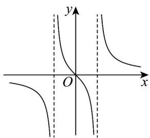
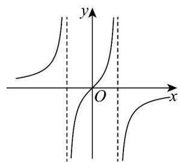
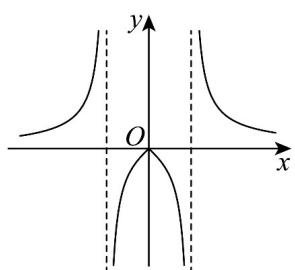
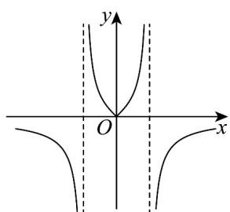

> [!faq]- 《第三章 函数的概念与性质（高效培优单元测试·提升卷）》官方解析
>
> > [!success]- **【答案】** D
>
> > [!note]- **【解析】**
> > 因为函数 $y = f(x)$ 的图象关于直线 x = -2 对称，所以 $f(x) = f(-4 - x)$ .
> >
> > 所以 $a = f\left(\frac{1}{3}\right) = f\left(-4 - \frac{1}{3}\right) = f\left(-\frac{13}{3}\right)$ ， $c = f(-1) = f(-4 + 1) = f(-3)$ .
> >
> > 又因为函数 $f(x)$ 在 $(- \infty, -2)$ 上单调递增，
> >
> > 且 $-\frac{13}{3} < -4 < -3 < -2$
> >
> > 所以 $f\left(-\frac{13}{3}\right)<f(-4)<f(-3)$ ，即 a<b<c·
> >
> > 故选：D
> >
> > 4. 函数 $f(x) = \frac{x}{4x^2 - 1}$ 的部分图象（虚直线方程为 $x = \pm \frac{1}{2}$ ）大致是（）
> >
> > 【答案】
> >
> > A
> >
> > 
> >
> > B
> > 
> >
> > C.
> >
> > 
> >
> > D
> >
> > 
> >
> > 【答案】A
> >
> > 【详解】对于函数 $f(x)$ ，由 $4x^{2}-1\neq0$ 可得 $x\neq\pm\frac{1}{2}$ ，故函数 $f(x)$ 的定义域为 $\left\{x\mid x\neq\pm\frac{1}{2}\right\}$
> >
> > $f(-x) = \frac{-x}{4(-x)^2 - 1} = -\frac{x}{4x^2 - 1} = -f(x)$ 故函数 $f(x)$ 为奇函数，可排除CD选项，
> >
> > 当 $x > \frac{1}{2}$ 时， $f(x) > 0$ ，可排除 B，从而可得 A 正确。
> >
> > 故选 **A**.
