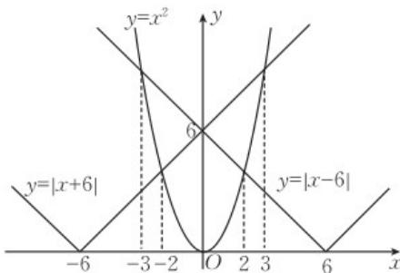

> [!faq]- 《第三章 函数的概念与性质（高效培优单元测试·提升卷）》官方解析
>
> > [!success]- **【答案】** ACD
>
> > [!note]- **【解析】**
> > 在同一坐标系中作出函数 $y=\left|x+6\right|$ ， $y=x^{2}$ ， $y=\left|x-6\right|$ 的图象，
> >
> > 
> >
> > 所以 $f(x)=\left\{\begin{aligned}&\left|x+6\right|,-2\leq x\leq0 或 x\quad3,\\&x^{2},-3<x<-2 或 2<x<3,\\&\left|x-6\right|，x\leq-3 或 0\leq x\leq2.\end{aligned}\right.$
> >
> > 对于 A， $f(-1)=|-1+6|=5$ ，故 A 正确；
> >
> > 对于 $^{B}$ ，由图可知 $f(x)$ 图象的最低点的纵坐标为 $^{4}$ ，所以 $f(x)$ 的值域为 $[4,+\infty)$ ，故 $^{B}$ 错误；
> >
> > 对于 C，由 $f(x)$ 的解析式可知：
> >
> > 当 $x \leq -3$ 时， $-x = 3$ ，由 $f(x)$ 的解析式可知： $f(-x) = f(x)$ ，
> >
> > 当-3<x<-2时，2<-x<3，由 $f(x)$ 的解析式可知： $f(-x)=f(x)$ ，
> >
> > 当 $-2 \leq x \leq 0$ 时， $0 \leq -x \leq 2$ ，由 $f(x)$ 的解析式可知： $f(-x) = f(x)$ ，
> >
> > 当 $0 \leq x \leq 2$ 时， $-2 \leq -x \leq 0$ ，由 $f(x)$ 的解析式可知： $f(-x) = f(x)$ ，
> >
> > 当 $2 < x < 3$ 时， $-3 < -x < -2$ ，由 $f(x)$ 的解析式可知： $f(-x) = f(x)$ ，
> >
> > 当 $x$ 3时， $-x\leq -3$ ，由 $f(x)$ 的解析式可知： $f(-x) = f(x)$
> >
> > 即 $f(x)$ 为偶函数，故 $^{C}$ 正确；
> >
> > 对于 $^{D}$ ，由图可知 $f(x)$ 在 $[-2,0]$ 上的解析式为 $f(x)=|x+6|=x+6$ ，则 $f(x)$ 在 $[-2,0]$ 上单调递增，故 $^{D}$ 正
> >
> > 确.
> >
> > 故选 **ACD**
