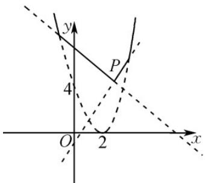

## 一、选择题：本题共8小题，每小题5分，共40分。在每小题给出的四个选项中，只有一项是符合题目要求的。

1. 将 $x_{1}, x_{2}, \cdots, x_{n}$ 中的最大数记为 $\max\left\{x_{1}, x_{2}, \cdots, x_{n}\right\}$ ，则函数 $f(x) = \max\left\{x^{2} - 4x + 4, 2x - 1, -x + 8\right\}$ 的最小值
为（）

【答案】B

【详解】作函数 $f(x)$ 的图象如图．令 $2x - 1 = -x + 8$ 得点 $P(3,5)$ ，则由图可知函数 $f(x)$ 的最小值为5．

![[高中/课堂同步/题库/人教A版高中数学同步讲义(2026)/01_必修第一册/第三章 函数的概念与性质/第三章 函数的概念与性质（高效培优单元测试·提升卷）/一_选择题/questions/Q00074594.md]]
![[高中/课堂同步/题库/人教A版高中数学同步讲义(2026)/01_必修第一册/第三章 函数的概念与性质/第三章 函数的概念与性质（高效培优单元测试·提升卷）/一_选择题/questions/Q00074595.md]]
![[高中/课堂同步/题库/人教A版高中数学同步讲义(2026)/01_必修第一册/第三章 函数的概念与性质/第三章 函数的概念与性质（高效培优单元测试·提升卷）/一_选择题/questions/Q00074596.md]]
![[高中/课堂同步/题库/人教A版高中数学同步讲义(2026)/01_必修第一册/第三章 函数的概念与性质/第三章 函数的概念与性质（高效培优单元测试·提升卷）/一_选择题/questions/Q00074597.md]]
![[高中/课堂同步/题库/人教A版高中数学同步讲义(2026)/01_必修第一册/第三章 函数的概念与性质/第三章 函数的概念与性质（高效培优单元测试·提升卷）/一_选择题/questions/Q00074598.md]]
![[高中/课堂同步/题库/人教A版高中数学同步讲义(2026)/01_必修第一册/第三章 函数的概念与性质/第三章 函数的概念与性质（高效培优单元测试·提升卷）/一_选择题/questions/Q00074599.md]]
![[高中/课堂同步/题库/人教A版高中数学同步讲义(2026)/01_必修第一册/第三章 函数的概念与性质/第三章 函数的概念与性质（高效培优单元测试·提升卷）/一_选择题/questions/Q00074600.md]]
![[高中/课堂同步/题库/人教A版高中数学同步讲义(2026)/01_必修第一册/第三章 函数的概念与性质/第三章 函数的概念与性质（高效培优单元测试·提升卷）/一_选择题/questions/Q00074601.md]]
![[高中/课堂同步/题库/人教A版高中数学同步讲义(2026)/01_必修第一册/第三章 函数的概念与性质/第三章 函数的概念与性质（高效培优单元测试·提升卷）/一_选择题/questions/Q00074602.md]]
