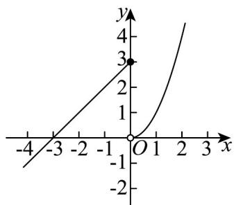

> [!faq]- 《第三章 函数的概念与性质（高效培优单元测试·提升卷）》官方解析
>
> > [!success]- **【答案】** $(-∞,-6]∪(-5,+∞)$
>
> > [!note]- **【解析】**
> > 因为 $f(x) = \begin{cases} x + 3, & x \leq 0 \\ x^2, & x > 0 \end{cases}$ ，所以 $f(x)$ 在 $(- \infty, 0]$ 上单调递增，在 $(0, +\infty)$ 上单调递增，
> >
> > 且当 $x > 0$ 时 $f(x) > 0$ ，当 $x < -3$ 时 $f(x) < 0$ ， $f(-3) = 0$ ， $f(0) = 3$ ， $f(3) = 9$ ， $f(-6) = -3$ ，则 $f(x)$ 的
> >
> > 图象如下所示：
> >
> > 
> >
> > 若 $f(x) > 0$ ，则 $f(x) + 3 > 3$ ， $f(x) + 3 > f(x) > 0$ ，显然满足 $f(f(x)) < f(f(x) + 3)$
> >
> > 此时相应的 x 的取值范围为 x > -3；
> >
> > 若 $f(x) = 0$ ，则 $f(x) + 3 = 3$ ，则 $f(f(x)) = f(0) = 3$ ， $f(f(x) + 3) = f(3) = 9$
> >
> > 显然满足 $f(f(x)) < f(f(x) + 3)$ ，此时相应的 x 的值为 x = -3；
> >
> > 若 $f(x) + 3 \leq 0$ ，即 $f(x) \leq -3$ ，则 $f(x) < f(x) + 3 \leq 0$
> >
> > 显然满足 $f(f(x)) < f(f(x) + 3)$
> >
> > 此时相应的 x 的取值范围为 $x \leq -6$ ；
> >
> > 当 $x \in (-6, -3)$ 时， $f(x) = x + 3 \in (-3, 0)$ ， $f(x) + 3 = x + 3 + 3 = x + 6 \in (0, 3)$
> >
> > 则 $f(f(x)) = (x + 3) + 3 = x + 6$ ， $f(f(x) + 3) = (x + 6)^2$
> >
> > 不等式 $f(f(x)) < f(f(x) + 3)$ ，即 $x + 6 < (x + 6)^{2}$ ，解得 x > -5 或 x < -6，
> >
> > 又 $x \in (-6, -3)$ ，所以 $-5 < x < -3$ ；
> >
> > 综上可得不等式 $f(f(x)) < f(f(x) + 3)$ 的解集为 $(- \infty, -6] \cup (-5, +\infty)$ .
> >
> > 故答案为： $\left(-\infty , - 6\right]\cup \left(-5, + \infty\right)$
