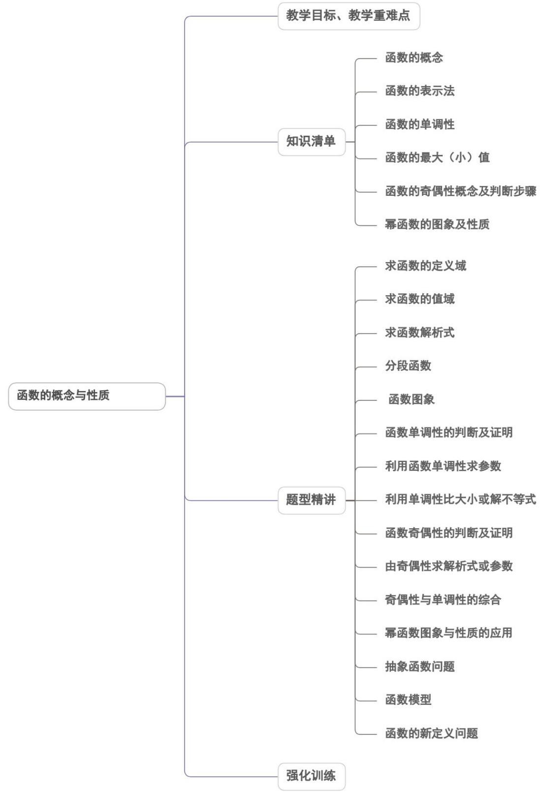
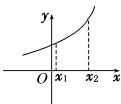
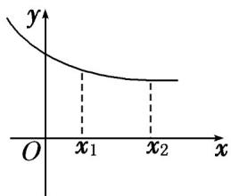
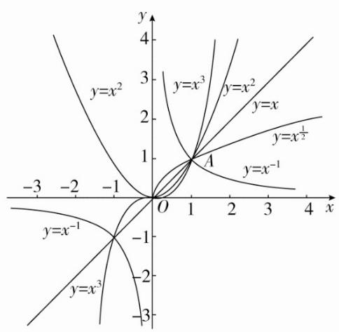

<!-- source-part:1 pages:1-50 -->

## 第三章 函数的概念与性质

## 内容概览

<table><tr><td>教学目标</td><td>1.了解函数的三种表示方法及特点;2.掌握求函数解析式的常用方法3.了解与认识分段函数及其定义域4.会用分析法与图象法表示分段函数,并能掌握分段函数的相关性质.5.理解单调函数的定义,理解增函数、减函数、单调区间、单调性的定义.6.掌握定义法证明函数单调性的步骤.7.掌握函数单调区间的写法.8.理解函数的最大(小)值的概念及其几何意义.9.会借助单调性求最值.10.掌握求二次函数在给定区间上的最值.11.掌握判断函数奇偶性的方法,会求与奇偶函数有关的函数解析式,能处理与函数单调性、周期性相关的综合问题.</td></tr><tr><td>教学重难点</td><td>1.重点能解决与函数单调性、奇偶性、周期性有关的综合问题.2.难点掌握幂函数的概念,能根据幂函数的要求求出幂函数的解析式,并能根据幂函数的性质求待定参数.</td></tr></table>

## 知识清单

## 知识点 01 函数的概念

## 1. 函数的定义

设 $A$ 、 $B$ 是非空的数集，如果按照某个确定的对应关系 $\pmb{f}$ ，使对于集合 $A$ 中的任意一个数 $x$ ，在集合 $B$ 中都

有唯一确定的数 $f(x)$ 和它对应，那么就称 $f: A \to B$ 为从集合 $A$ 到集合 $B$ 的一个函数。

记作： $y = f(x)$ ， $x \in A$ 。

其中， $x$ 叫做自变量， $x$ 的取值范围 $A$ 叫做函数的定义域；与 $x$ 的值相对应的 $y$ 值叫做函数值，函数值的集合

$\{f(x) \mid x \in A\}$ 叫做函数的值域.

2. 构成函数的三要素：定义域、对应关系和值域

① 构成函数的三个要素是定义域、对应关系和值域．由于值域是由定义域和对应关系决定的，所以，如果两

个函数的定义域和对应关系完全一致，即称这两个函数相等（或为同一函数）；

②两个函数相等当且仅当它们的定义域和对应关系完全一致，而与表示自变量和函数值的字母无关。

3. 区间的概念

（1）区间的分类：开区间、闭区间、半开半闭区间；

(2) 无穷区间；

(3) 区间的数轴表示.

区间表示：

$$
\{x \mid a <   x <   b \} = (a, b);
$$

$$
\{x \mid a \leq x \leq b \} = [ a, b ];
$$

$$
\{x \mid a <   x \leq b \} = (a, b ];
$$

$$
\{x \mid a \leq x <   b \} = [ a, b) \quad ;
$$

$$
\{x \mid x \leq b \} = (- \infty , b ] \quad ;
$$

$$
\{x \mid a \leq x \} = [ a, + \infty)
$$

<table><tr><td>定义。</td><td>名称。</td><td>符号。</td><td>数轴表示。</td></tr><tr><td> $\{x|a< x< b\}$ 。</td><td>闭区间。</td><td> $[a,b]$ 。</td><td>[IMAGE]</td></tr><tr><td> $\{x|a< x< b\}$ 。</td><td>开区间。</td><td> $(a,b)$ </td><td>[IMAGE]</td></tr><tr><td> $\{x|a< x< b\}$ 。</td><td>半闭半开。区间。</td><td> $[a,b)$ </td><td>[IMAGE]</td></tr><tr><td> $\{x|a< x< b\}$ 。</td><td>半开半闭。区间。</td><td> $(a,b]$ </td><td>[IMAGE]</td></tr></table>

## 【即学即练】

1．取整函数 $\left[x\right]=$ 不超过x的最大整数，如 $\left[-1.2\right]=-2,\left[2.4\right]=2$ ，已知函数 $f(x)=\frac{(x+1)^{2}}{x^{2}+1}+\frac{1}{2}$ ，则函数 $y=\left[f(x)\right]$ 的值域是（）

【答案】
A. $\{-2,-1,0,1\}$ B. $\{-2,-1,0\}$ C. $\{0,1,2\}$ D. $\{1,2,3\}$

【答案】C

【详解】因为 $f(x) = \frac{(x + 1)^2}{x^2 + 1} + \frac{1}{2}$

当 x=0 时， $f(0)=\frac{3}{2},\left[f(0)\right]=\left[\frac{3}{2}\right]=1$ ;

当 $x > 0$ 时， $f(x) = \frac{(x + 1)^2}{x^2 + 1} + \frac{1}{2} = \frac{3}{2} + \frac{2x}{x^2 + 1} = \frac{3}{2} + \frac{2}{x + \frac{1}{x}}$

又 $x + \frac{1}{x}$ $2\sqrt{x \cdot \frac{1}{x}} = 2$ ，当且仅当 $x = \frac{1}{x}$ ，即 x = 1 时取等号，

所以 $\frac{3}{2} < f(x) \leq \frac{5}{2}, \therefore [f(x)] = 1$ 或 2；

当 $x < 0$ 时， $f(x) = \frac{3}{2} + \frac{2x}{x^2 + 1} = \frac{3}{2} - \frac{2}{-x + \frac{1}{-x}}$

又 $-x+\frac{1}{-x}\quad2\sqrt{-x\cdot\frac{1}{-x}}=2$ ，当且仅当 $-x=\frac{1}{-x}$ ，即 x=-1 时取等号，

所以 $\frac{1}{2} \leq f(x) < \frac{3}{2}, \therefore [f(x)] = 0$ 或 1，

综上，得 $y = \left[f(x)\right]$ 的值域为 $\{0,1,2\}$

故选：C.

2. 已知函数 $f(x + 1)$ 的定义域为 $[-1,3]$ ，则 $f(x^2)$ 的定义域为（）A. $[-2,2]$ B. $[0,4]$ C. $[1,9]$ D. $[0,8]$

【答案】A

【详解】在 $y = f(x + 1)$ 中， $x \in [-1, 3]$ ， $\therefore x + 1 \in [0, 4]$ ，

∴ $f(x)$ 的定义域是 $[0,4]$ ，

故在 $f\left(x^{2}\right)$ 中 $0 \leq x^{2} \leq 4$ ，解得 $-2 \leq x \leq 2$

$\therefore f(x^{2})$ 的定义域是 $[-2,2]$

故选：A.

## 知识点 02 函数的表示法

1. 函数的三种表示方法：

解析法：用数学表达式表示两个变量之间的对应关系．优点：简明，给自变量求函数值．

图象法：用图象表示两个变量之间的对应关系．优点：直观形象，反应变化趋势．

列表法：列出表格来表示两个变量之间的对应关系．优点：不需计算就可看出函数值．

2. 分段函数：

分段函数的解析式不能写成几个不同的方程，而应写函数几种不同的表达式并用个左大括号括起来，并分别

注明各部分的自变量的取值情况.

## 【即学即练】

1．已知函数 $f(x)$ 在定义域 $(0,+\infty)$ 上单调，若对任意的 $x\in(0,+\infty)$ ，都有 $f(f(x)-\log_{2}x)=3$ ，则 $f(2^{2025})-2$ 的值是（）

【答案】

A. $2^{2025}$ B. $2^{2027}$ C. 2025

D. 2027

【答案】C

【详解】由函数 $f(x)$ 在定义域 $(0, +\infty)$ 上是单调函数，且 $f(f(x) - \log_2 x) = 3$

知 $f(x) - \log_2 x$ 是一个常数，令 $f(x) - \log_2 x = t$ ，则 $f(x) = t + \log_2 x$

$$
\therefore f (t) = t + \log_ {2} t = 3
$$

∵ $f(x)$ 在定义域 $(0, +\infty)$ 上单调，且 $f(2) = 2 + \log_{2} 2 = 3$

∴ t = 2 ，即 $f(x) = 2 + \log_{2} x$

$$
f \left(2 ^ {2 0 2 5}\right) - 2 = \log_ {2} 2 ^ {2 0 2 5} = 2 0 2 5.
$$

故选：C.

2. 已知非空集合 $A$ 、 $B$ 满足： $A \cup B = R$ ， $A \cap B = \emptyset$ ，函数 $f(x) = \begin{cases} x^2, & x \in A, \\ 4x - 3, & x \in B. \end{cases}$ 已知如下两个命题：①存在唯一的非空集合对 $(A, B)$ ，使得 $y = f(x)$ 为偶函数；②存在无穷多非空集合对 $(A, B)$ ，使得方程 $f(x) = 2$ 无解。则下列选项中正确的是（）

【答案】

A．①、②都正确

B．①、②都错误

C．①正确，②错误

D．①错误，②正确

【答案】D

【详解】命题①：
因为 $A \cup B = R$ ， $A \cap B = \varnothing$ ，
所以要么 $\left\{\begin{aligned}0 &\in A\\ 0 &\notin B\end{aligned}\right.$ ，要么 $\left\{\begin{aligned}0 &\in B\\ 0 &\notin A.\end{aligned}\right.$ 假设存在某个非空集合对 $(A,B)$ 满足 $\left\{\begin{aligned}0 &\in A\\ 0 &\notin B\end{aligned}\right.$ 且使 $f(x)$ 为偶函数，
那么将元素 0 从集合 A 中取出，放入集合 B，其它元素不变，得到一个新的非空集合对 $(A_{1},B_{1})$ ，
则新的非空集合对 $(A_{1},B_{1})$ 使 $f(x)$ 仍然为偶函数；
假设存在某个非空集合对 $(A,B)$ 满足 $\left\{\begin{aligned}0 &\in B\\ 0 &\notin A\end{aligned}\right.$ 且使 $f(x)$ 为偶函数，
那么将元素 0 从集合 B 中取出，放入集合 A，其它元素不变，得到一个新的非空集合对 $(A_{2},B_{2})$ ，
则新的非空集合对 $(A_{2},B_{2})$ 使 $f(x)$ 仍然为偶函数.

所以当存在非空集合对 $\left(A,B\right)$ 使 $f(x)$ 为偶函数时，非空集合对 $\left(A,B\right)$ 不唯一.

所以命题①错误.

命题②：

解方程 $x^{2} = 2$ ，解得 $x = \pm \sqrt{2}$ ；解方程 $4x - 3 = 2$ ，解得 $x = \frac{5}{4}$

当非空集合对 $(A,B)$ 满足 $\sqrt{2} \notin A, -\sqrt{2} \notin A, \frac{5}{4} \notin B$ 时，方程 $f(x) = 2$ 无解.

而满足这个条件的非空集合对有无穷多个，故命题②正确.

故选：D.

## 知识点 03 函数的单调性

## 1. 增函数与减函数

(1) 设函数 $f(x)$ 的定义域为 I，如果对于定义域 I 内某个区间 D 上的任意两个自变量的值 $x_{1}, x_{2}$ 当 $x_{1}<x_{2}$ 时，都有 $f(x_{1})<f(x_{2})$ ，那么就说函数 $f(x)$ 在区间D上是单调递增函数；
当 $x_{1}<x_{2}$ 时，都有 $f(x_{1})>f(x_{2})$ ，那么就说函数 $f(x)$ 在区间D上是单调递减函数.

(2) 单调性的图形趋势（从左往右）

上升趋势

下降趋势

(3) $x_{1}$ ， $x_{2}$ 的三个特征

（1）区间 I 上的自变量的两个值 $x_{1}$ ， $x_{2}$ 必须是任意的，即区间 I 内的全部 x，任意即所有，不可以随便取两个特殊值；

(2) 有序性：一般要对 $x_{1}$ 和 $x_{2}$ 的大小进行规定，通常规定 $x_{1} < x_{2}$ ；

(3) 同区间性：即 $x_{1}$ ， $x_{2}$ 同属于一个单调区间。

## 2. 函数的单调区间

若函数 $y = f(x)$ 在区间 $D$ 上是增函数或减函数，则称函数 $y = f(x)$ 在这一区间上具有(严格的)单调性，区间 $D$ 叫做 $y = f(x)$ 的单调区间。

## 【易错警示】

（1）函数单调性关注的是整个区间上的性质，单独一点不存在单调性问题，故单调区间的端点若属于定义域，则区间可开可闭，若区间端点不属于定义域则只能开。

(2) 单调区间 $D \subseteq$ 定义域 I.

（3）遵循最简原则，单调区间应尽可能大；

（4）单调区间之间可用“，”分开，不能用“U”，可以用“和”来表示；

## 3. 单调函数的运算性质

若函数 $f(x)$ 与 $g(x)$ 在区间 $D$ 上具有单调性，则在区间 $D$ 上具有以下性质：

(1) $f(x)$ 与 $f(x)+C$ （C为常数）具有相同的单调性.

(2) $f(x)$ 与 $-f(x)$ 的单调性相反.

(3) 当 $a > 0$ 时， $af(x)$ 与 $f(x)$ 单调性相同；当 $a < 0$ 时， $af(x)$ 与 $f(x)$ 单调性相反.

(4) 若 $f(x) \geq 0$ ，则 $f(x)$ 与 $\sqrt{f(x)}$ 具有相同的单调性.

(5) 若 $f(x)$ 恒为正值或恒为负值，则当 $a > 0$ 时， $f(x)$ 与 $\frac{a}{f(x)}$ 具有相反的单调性；

当 $a < 0$ 时， $f(x)$ 与 $\overline{f(x)}$ 具有相同的单调性.

(6) $f(x)$ 与 $g(x)$ 的和与差的单调性（相同区间上）：

简记为： $\nearrow+\searrow=\nearrow;$ (2) $\searrow+\searrow=\searrow;$ (3) $\nearrow-\searrow=\nearrow;$ (4) $\searrow-\nearrow=\searrow.$

## 【即学即练】

1．“函数 $f(x)=\sqrt{ax+1}$ 在 $(-∞,1)$ 上单调递减”是“a<0”的（）

【答案】
A. 充要条件
B. 充分不必要条件

C．必要不充分条件 D．既不充分也不必要条件

【答案】B

【详解】先判定充分性，若 $f(x) = \sqrt{ax + 1}$ 在 $(- \infty, 1)$ 上单调递减，

由幂函数及复合函数的单调性可知，则 $\left\{ \begin{array}{ll}a < 0\\ -\frac{1}{a} & 1 \end{array} \right.\Rightarrow 0 > a - 1$ ，满足充分性；

再判定必要性，可举反例，若 $a = -2$ ，则 $y = ax + 1$ 单调递减，

此时 $f(x) = \sqrt{ax + 1}$ 的定义域为 $\left(-\infty, \frac{1}{2}\right]$

此时 $f(x)$ 在 $\left(-\infty, \frac{1}{2}\right]$ 上单调递减，不满足必要性，

综上“函数 $f(x)=\sqrt{ax+1}$ 在 $(-∞,1)$ 上单调递减”是“a<0”的充分不必要条件.

故选：B

2. 函数 $f(x) = \sqrt{x^2 - 1}$ 的单调递减区间为（）

【答案】
A. $(- \infty, -1]$ B. $(- \infty, 0]$ C. $[0, +\infty)$ D. $[1, +\infty)$

【答案】A

【详解】对于函数 $f(x) = \sqrt{x^2 - 1}$ ，由 $x^2 - 1$ 0 可得 $x \leq -1$ 或 $x = 1$

所以，函数 $f(x) = \sqrt{x^2 - 1}$ 的定义域为 $(- \infty, -1] \cup [1, +\infty)$

因为内层函数 $u = x^{2} - 1$ 在区间 $\left(-\infty, -1\right]$ 上为减函数，在 $[1, +\infty)$ 上为增函数，

外层函数 $y = \sqrt{u}$ 在 $[0, +\infty)$ 上为增函数，

由复合函数的单调性可知，函数 $f(x) = \sqrt{x^2 - 1}$ 的减区间为 $(- \infty, -1]$ .

故选：A.

## 知识点 04 函数的最大（小）值

1、最大值：对于函数 $y = f(x)$ ，其定义域为 $D$ ，如果存在 $x_0 \in D$ ， $f(x) = M$ ，使得对于任意的 $x \in D$ ，都有 $f(x) \leq M$ ，那么，我们称 $M$ 是函数 $y = f(x)$ 的最大值，即当 $x = x_0$ 时， $f(x_0)$ 是函数 $y = f(x)$ 的最大值，记作 $y_{\max} = f(x_0)$ .

2、最小值：对于函数 $y = f(x)$ ，其定义域为 $D$ ，如果存在 $x_0 \in D$ ， $f(x) = M$ ，使得对于任意的 $x \in D$ ，都有 $f(x) = M$ ，那么，我们称 $M$ 是函数 $y = f(x)$ 的最小值，即当 $x = x_0$ 时， $f(x_0)$ 是函数 $y = f(x)$ 的最小值，记作 $y_{\min} = f(x_0)$ .

3、几何意义：一般地，函数最大值对应图像中的最高点，最小值对应图像中的最低点，它们不一定只有一个。【即学即练】

1. 设函数 $f(x) = \frac{(x - 2)^2}{x^2 + 4}$ 的最大值为 $M$ ，最小值为 $m$ ，则 $M + m = (\quad)$ A. 0 B. 1 C. 2 D. 4

【答案】C

【详解】由函数 $f(x) = \frac{x^2 - 4x + 4}{x^2 + 4} = 1 - \frac{4x}{x^2 + 4}$ ，显然 $f(0) = 1$ ，当 $x \neq 0$ ， $f(x) = 1 - \frac{4}{x + \frac{4}{x}}$ ，

当 $x > 0$ 时， $x + \frac{4}{x}$ 4，当且仅当 $x = \frac{4}{x}$ ，即 $x = 2$ 时，等号成立，则 $0 < \frac{4}{x + \frac{4}{x}} \leq 1$ ，故 $1 > f(x)$ $f(2) = 0$ ；

当 $x < 0$ 时， $x + \frac{4}{x} \leq -4$ ，当且仅当 $x = \frac{4}{x}$ ，即 $x = -2$ 时，等号成立，则 $0 > \frac{4}{x + \frac{4}{x}} - 1$ 故 $1 < f(x) \leq f(-2) = 2$ ；综上可得， $M = 2$ ， $m = 0$ ，则 $M + m = 2$ 。

故选：C.

2. 已知 $y = m^4 - 4m^2n + 3m^2 - 2mn + 5n^2 - 4n + 1, m, n \in \mathbb{R}$ ，则 $y$ 的最小值为（）A. 1 B. $\sqrt{17}$ C. $\sqrt{10}$ D. 0

【答案】D

【详解】根据题意 $5n^{2} + \left(-4m^{2} - 2m - 4\right)n + m^{4} + 3m^{2} + 1 - y = 0$

若方程有解，则 $\Delta = 4\left(2m^2 + m + 2\right)^2 - 20\left(m^4 + 3m^2 + 1 - y\right) = 0$

即 $4m^{4} + m^{2} + 4 + 4m^{3} + 4m + 8m^{2} - 5m^{4} - 15m^{2} - 5 + 5y = 0$

所以 $5y \quad m^4 - 4m^3 + 6m^2 - 4m + 1 = (m - 1)^4 \quad 0$

当 $m = 1$ 时， $y = 0$ ，此时 $5n^{2} - 10n + 5 = 0$ ，即 $n = 1$

也就是说当且仅当 m = n = 1 时， $y_{\min} = 0$

故选：D

## 知识点 05 函数的奇偶性概念及判断步骤

## 1. 函数奇偶性的概念

偶函数：若对于定义域内的任意一个 $x$ ，都有 $f(-x) = f(x)$ ，那么 $f(x)$ 称为偶函数.

奇函数：若对于定义域内的任意一个 $x$ ，都有 $f(-x) = -f(x)$ ，那么 $f(x)$ 称为奇函数.

2. 奇偶函数的图象与性质

（1）如果一个函数是奇函数，则这个函数的图象是以坐标原点为对称中心的中心对称图形；反之，如果一个

函数的图象是以坐标原点为对称中心的中心对称图形，则这个函数是奇函数。

（2）如果一个函数为偶函数，则它的图象关于 $y$ 轴对称；反之，如果一个函数的图像关于 $y$ 轴对称，则这个

函数是偶函数.

3. 用定义判断函数奇偶性的步骤

(1) 求函数 $f(x)$ 的定义域，判断函数的定义域是否关于原点对称，若不关于原点对称，则该函数既不是奇

函数，也不是偶函数，若关于原点对称，则进行下一步；

(2) 结合函数 $f(x)$ 的定义域，化简函数 $f(x)$ 的解析式；

(3) 求 $f(-x)$ ，可根据 $f(-x)$ 与 $f(x)$ 之间的关系，判断函数 $f(x)$ 的奇偶性。

若 $f(-x) = -f(x)$ ，则 $f(x)$ 是奇函数；

若 $f(-x) = f(x)$ ，则 $f(x)$ 是偶函数；

若 $f(-x) \neq \pm f(x)$ ，则 $f(x)$ 既不是奇函数，也不是偶函数；

若 $f(-x) = f(x)$ 且 $f(-x) = -f(x)$ ，则 $f(x)$ 既是奇函数，又是偶函数

【即学即练】

1. 设函数 $f(x)$ 是定义在 $R$ 上的奇函数，当 $x < 0$ 时， $f(x) = -x^2 - 5x$ ，则不等式 $f(x) - f(x - 1) < 0$ 的解集为

【答案】

( )

A. $(- \frac{3}{2}, \frac{5}{2})$ B. $[- \frac{3}{2}, \frac{5}{2}]$ C. $(-2, 3)$ D. $[-2, 3]$

【答案】C

【详解】设 $x > 0$ ，则 $-x < 0$ ，故 $f(x) = -f(-x) = -\left[-(-x)^2 - 5(-x)\right] = x^2 - 5x$ 故 $f(x) = \begin{cases} -x^2 - 5x, & x < 0 \\ x^2 - 5x, & x = 0 \end{cases}$ ，

当 $x - 1 > 0$ 且 $x > 0$ ，即 $x > 1$ ，则 $f(x) - f(x - 1) = x^2 -5x - \left[(x - 1)^2 -5(x - 1)\right] = 2x - 6 <   0$ ，解得 $1 <   x <   3$ 当 $x > 0$ 且 $x - 1\leq 0$ 时，即 $0 <   x\leq 1$

$f(x) - f(x - 1) = x^2 -5x - \left[-(x - 1)^2 -5(x - 1)\right] = 2x^2 -2x - 4 <   0$ ，解得 $0 <   x\leq 1$

当 $x \leq 0$ 且 x - 1 < 0 时，即 $x \leq 0$ ，

$f(x) - f(x - 1) = -x^2 -5x - \left[-(x - 1)^2 -5(x - 1)\right] = -2x - 4 <   0$ ，解得 $-2 <   x\leq 0$

当 $x < 0$ 且 $x - 1 > 0$ ，此时 $x$ 不存在，

综上可得-2<x<3，

故选：C

2. 已知 $f(x)$ 是 $\mathbf{R}$ 上的连续函数，满足 $\forall x, y \in \mathbf{R}$ 有 $f(x + y) + f(x - y) = f(x)f(y)$ ，且 $f(1) = 1$ . 则下列说法中正确的是（）A. $f(0) = 0$ B. $f(x)$ 为奇函数C. $f(x)$ 的一个周期为8 D. $\left(\frac{3}{2}, 0\right)$ 是 $f(x)$ 的一个对称中心

【答案】D

【详解】对于 A 选项，由题，令 x=1, y=0，则 $f(1+0)+f(1-0)=f(1)f(0)$ ，∴ $2f(1)=f(1)f(0)$ ,

∵ $f(1)=1 \neq 0, \therefore f(0)=2$ ，故 A 不正确；

对于B选项，令 $x = 0$ ，则 $f(0 + y) + f(0 - y) = f(0)f(y)$ ，即 $f(y) + f(-y) = 2f(y),f(-y) = f(y)$ ，则

$f(x)$ 为偶函数，故 B 不正确；

对于 C 选项，令 $y=1$ ，则 $f(x+1)+f(x-1)=f(x)f(1)=f(x)$ ，

故 $f(x + 2) + f(x) = f(x + 1)$ ，两式相加整理得： $f(x + 2) + f(x - 1) = 0,$ 即 $f(x + 3) = -f(x),$

故 $f(x + 6) = -f(x + 3) = -[-f(x)] = f(x)$ ，故 $f(x)$ 的一个周期为6，

则 $f(9) = f(3) = f(2) - f(1) = -f(-1) - f(1) = -f(1) - f(1) = -2 \neq f(1)$ ，故 $f(x)$ 的一个周期为8不成立，C

不正确，

对于 D 选项，由 $f(x+3)=-f(x)$ ，且 $f(x)$ 为偶函数，故 $f(x+3)=-f(-x)$ ，

所以 $\left(\frac{3}{2},0\right)$ 是 $f(x)$ 的一个对称中心，故D正确；

故选：D.

## 知识点 06 幂函数的图象及性质

1. 作出下列函数的图象：

$$
(1) y = x; (2) y = x ^ {\frac {1}{2}}; (3) y = x ^ {2}; (4) y = x ^ {- 1}; (5) y = x ^ {3}.
$$

2. 作幂函数图象的步骤如下：

(1) 先作出第一象限内的图象；

(2) 若幂函数的定义域为 $(0, +\infty)$ 或 $[0, +\infty)$ ，作图已完成；

若在 $(- \infty, 0)$ 或 $(- \infty, 0]$ 上也有意义，则应先判断函数的奇偶性，如果为偶函数，则根据 $y$ 轴对称作出第二象限

的图象；如果为奇函数，则根据原点对称作出第三象限的图象。

3. 幂函数解析式的确定

（1）借助幂函数的定义，设幂函数或确定函数中相应量的值.

(2) 结合幂函数的性质，分析幂函数中指数的特征.

（3）如函数 $f(x) = k \cdot x^a$ 是幂函数，求 $f(x)$ 的表达式，就应由定义知必有 $k = 1$ ，即 $f(x) = x^a$

4. 幂函数值大小的比较

(1) 比较函数值的大小问题一般是利用函数的单调性，当不便于利用单调性时，可与 0 和 1 进行比较．常称

为“搭桥”法.

(2) 比较幂函数值的大小，一般先构造幂函数并明确其单调性，然后由单调性判断值的大小.

（3）常用的步骤是：①构造幂函数；②比较底的大小；③由单调性确定函数值的大小。

## 【即学即练】

1. 若幂函数 $f(x)$ 的图象经过点 $\left(4, \frac{1}{8}\right)$ ，则下列说法正确的是（）A. $f(x)$ 为偶函数 B. 方程 $f(x) = 27$ 的实数根为 $\frac{1}{9}$ C. $f(x)$ 在 $(0, +\infty)$ 上为增函数 D. $f(x)$ 的值域为 R

【答案】B

【详解】设 $f(x) = x^{a}$ ，代入点 $\left(4, \frac{1}{8}\right)$ 可得 $4^{a} = \frac{1}{8}$ ，所以 $a = -\frac{3}{2}$

所以 $f(x) = x^{-\frac{3}{2}} = \sqrt{\frac{1}{x^3}}$ ，因为 $x^{3} > 0$ ，所以 $x > 0$ ，即函数 $f(x)$ 的定义域为 $(0, + \infty)$

对于 A：因为 $f(x)$ 的定义域为 $(0,+\infty)$ ，不关于原点对称，

所以 $f(x)$ 既不是为偶函数也不是奇函数，故A错误；

对于 B：令 $f(x)=27$ ，所以 $\sqrt{\frac{1}{x^{3}}}=27$ ，解得 $x=\frac{1}{9}$ ，故 B 正确；

对于 C，因为 $f(x)=x^{-\frac{3}{2}}$ ，因为 $a=-\frac{3}{2}<0$ ，所以 $f(x)$ 在 $(0,+\infty)$ 上为减函数，故 C 错误；

对于D：因为 $f(x) = x^{-\frac{3}{2}} = \sqrt{\frac{1}{x^3}}$ ，所以 $x^{3} > 0$ ，所以 $f(x) > 0$

$f(x)$ 的值域为 $(0,+\infty)$ ，故 D 错误.

故选：B.

2. 下列命题中正确的是（ ）

【答案】
A. 当 $\alpha = 0$ 时，函数 $y = x^{\alpha}$ 的图像是一条直线；
B. 幂函数的图像都经过 $(0,0)$ 和 $(1,1)$ 点；
C. 幂函数 $y = x^{-\frac{3}{2}}$ 的定义域为 $[0, +\infty)$ ;
D. 幂函数的图像不可能出现在第四象限.

【答案】D

【详解】解：对于 A， $\alpha=0$ 时，函数 $y=x^{0}$ 的图像是一条直线除去 $(0,1)$ 点，故 A 错误；

对于 B，幂函数的图像都经过 $(1,1)$ 点，当指数大于 0 时，都经过 $(0,0)$ 点，当指数小于 0 时，不经过 $(0,0)$ 点，

故 B 错误；

对于 C，函数 $y = x^{-\frac{3}{2}} = \frac{1}{x^{\frac{3}{2}}} = \frac{1}{\sqrt{x^{3}}}$ ，故定义域为 $(0, +\infty)$ ，故错误；

对于 D，由幂函数的性质，幂函数的图像一定过第一象限，不可能出现在第四象限，故正确.

故选：D.

## 题型精讲

![[高中/课堂同步/题库/人教A版高中数学同步讲义(2026)/01_必修第一册/第三章 函数的概念与性质/第三章 函数的概念与性质（高效培优讲义）/题型01_求函数的定义域/题型01_求函数的定义域.md]]
![[高中/课堂同步/题库/人教A版高中数学同步讲义(2026)/01_必修第一册/第三章 函数的概念与性质/第三章 函数的概念与性质（高效培优讲义）/题型02_求函数的值域/题型02_求函数的值域.md]]
![[高中/课堂同步/题库/人教A版高中数学同步讲义(2026)/01_必修第一册/第三章 函数的概念与性质/第三章 函数的概念与性质（高效培优讲义）/题型03_求函数解析式/题型03_求函数解析式.md]]
![[高中/课堂同步/题库/人教A版高中数学同步讲义(2026)/01_必修第一册/第三章 函数的概念与性质/第三章 函数的概念与性质（高效培优讲义）/题型04_分段函数/题型04_分段函数.md]]
![[高中/课堂同步/题库/人教A版高中数学同步讲义(2026)/01_必修第一册/第三章 函数的概念与性质/第三章 函数的概念与性质（高效培优讲义）/题型05_函数图象/题型05_函数图象.md]]
![[高中/课堂同步/题库/人教A版高中数学同步讲义(2026)/01_必修第一册/第三章 函数的概念与性质/第三章 函数的概念与性质（高效培优讲义）/题型06_函数单调性的判断及证明/题型06_函数单调性的判断及证明.md]]
![[高中/课堂同步/题库/人教A版高中数学同步讲义(2026)/01_必修第一册/第三章 函数的概念与性质/第三章 函数的概念与性质（高效培优讲义）/题型07_利用函数单调性求参数/题型07_利用函数单调性求参数.md]]
![[高中/课堂同步/题库/人教A版高中数学同步讲义(2026)/01_必修第一册/第三章 函数的概念与性质/第三章 函数的概念与性质（高效培优讲义）/题型08_利用单调性比大小或解不等式/题型08_利用单调性比大小或解不等式.md]]
![[高中/课堂同步/题库/人教A版高中数学同步讲义(2026)/01_必修第一册/第三章 函数的概念与性质/第三章 函数的概念与性质（高效培优讲义）/题型09_函数奇偶性的判断及证明/题型09_函数奇偶性的判断及证明.md]]
![[高中/课堂同步/题库/人教A版高中数学同步讲义(2026)/01_必修第一册/第三章 函数的概念与性质/第三章 函数的概念与性质（高效培优讲义）/题型10_由奇偶性求解析式或参数/题型10_由奇偶性求解析式或参数.md]]
![[高中/课堂同步/题库/人教A版高中数学同步讲义(2026)/01_必修第一册/第三章 函数的概念与性质/第三章 函数的概念与性质（高效培优讲义）/题型11_奇偶性与单调性的综合/题型11_奇偶性与单调性的综合.md]]
![[高中/课堂同步/题库/人教A版高中数学同步讲义(2026)/01_必修第一册/第三章 函数的概念与性质/第三章 函数的概念与性质（高效培优讲义）/题型12_幂函数图象与性质的应用/题型12_幂函数图象与性质的应用.md]]
![[高中/课堂同步/题库/人教A版高中数学同步讲义(2026)/01_必修第一册/第三章 函数的概念与性质/第三章 函数的概念与性质（高效培优讲义）/题型13_抽象函数问题/题型13_抽象函数问题.md]]
![[高中/课堂同步/题库/人教A版高中数学同步讲义(2026)/01_必修第一册/第三章 函数的概念与性质/第三章 函数的概念与性质（高效培优讲义）/题型14_函数模型/题型14_函数模型.md]]
![[高中/课堂同步/题库/人教A版高中数学同步讲义(2026)/01_必修第一册/第三章 函数的概念与性质/第三章 函数的概念与性质（高效培优讲义）/题型15_函数的新定义问题/题型15_函数的新定义问题.md]]
![[高中/课堂同步/题库/人教A版高中数学同步讲义(2026)/01_必修第一册/第三章 函数的概念与性质/第三章 函数的概念与性质（高效培优讲义）/强化训练/强化训练.md]]
