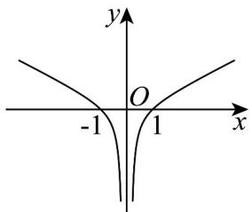
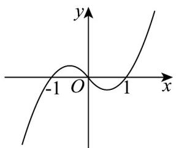
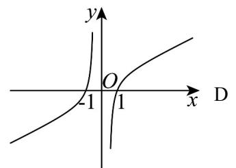
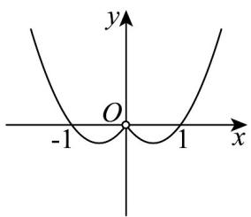

> [!faq]- 《第三章 函数的概念与性质（高效培优讲义）》官方解析
>
> > [!success]- **【答案】** C
>
> > [!note]- **【解析】**
> > 因为 $f(x)$ 是 $[-2,2]$ 上的偶函数，所以 $f(1 - 2m) = f(|1 - 2m|)$
> >
> > 又 $f(x)$ 在 $[0,2]$ 上单调递增，结合 $f(1 - 2m) > f(1)$ ，所以 $\left\{ \begin{array}{l} -2 \leq 1 - 2m \leq 2 \\ |1 - 2m| > 1 \end{array} \right.$ ，
> >
> > 解得 $-\frac{1}{2} \leq m < 0$ 或 $1 < m \leq \frac{3}{2}$
> >
> > 故实数 $m$ 的取值范围为 $\left[-\frac{1}{2},0\right)\cup \left(1,\frac{3}{2}\right]$
> >
> > 故选：C
> >
> > 6. 函数 $f(x)=\frac{x^{2}-1}{2|x|}$ 的大致图象是（）
> >
> > 【答案】
> >
> > A.
> > 
> >
> > B
> >
> > 
> >
> > 
> >
> > 
> >
> > 【答案】A
> >
> > 【详解】由 $|x|\neq 0$ 得 $f(x)$ 的定义域为 $\{x|x\neq 0\}$ ，又 $f(-x) = \frac{(-x)^2 - 1}{2| - x|} = \frac{x^2 - 1}{2|x|} = f(x)$ ，故 $f(x)$ 为偶函数，排
> >
> > 除 B，C；
> >
> > 当 $x > 0$ 时， $f(x) = \frac{x^2 - 1}{2x} = \frac{1}{2}\left(x - \frac{1}{x}\right)$ ，则 $f(x)$ 在 $(0, +\infty)$ 上单调递增，排除D，
> >
> > 故选 **A**
