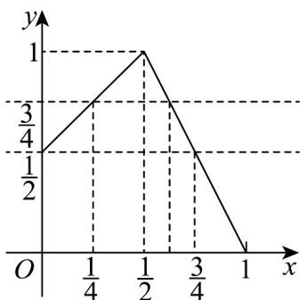

> [!faq]- 《第三章 函数的概念与性质（高效培优讲义）》官方解析
>
> > [!success]- **【答案】** D
>
> > [!note]- **【解析】**
> > 当 $x \in \left[0, \frac{1}{2}\right]$ 时， $f(x) = x + \frac{1}{2} \in \left[\frac{1}{2}, 1\right]$ ，且 $f\left(\frac{1}{4}\right) = \frac{3}{4}$
> >
> > 当 $x \in \left(\frac{1}{2}, 1\right]$ 时， $f(x) = 2 - 2x \in [0,1)$ ，且 $f\left(\frac{3}{4}\right) = \frac{1}{2}$
> >
> > 作出 $f(x)$ 的图象如下：
> >
> > 
> >
> > 若 $m \in A$ ，且 $f(f(m)) \in A$ ，即可 $f(f(m)) \in \left[0, \frac{1}{2}\right]$ 故 $\frac{3}{4} \leq f(m) \leq 1$
> >
> > 由于 $m \in A$ ，由图象可知 $\frac{1}{4} \leq m \leq \frac{1}{2}$
> >
> > 故选：D
> >
> > ## 方法技巧
> >
> > 1、一般分段函数求值有以下四种：
> >
> > （1）已知自变量的值求函数值，此种题型只需确定自变量在相应的定义域选择合适的解析式代值进行计算即可，同时也要注意函数的奇偶性、周期性的应用.求形如 $f\left\{f\left\{\cdots f[f(a)]\right\}\right\}$ 的函数时，求解时遵循由内到
> >
> > 外的顺序进行；
> >
> > (2)已知函数值求自变量的值，此种题型只需令相应的解析式等于函数值，求出自变量的值之后再确定是否
> >
> > 在相应的定义域内，若在，则保留；否则就舍去；
> >
> > (3)分段函数与不等式的综合，解简单的分段函数不等式只需将对应的不等式解集与定义域取交集，最后再将
> >
> > 得到的答案取并集即可.解含参的分段函数不等式要注意以下两个问题：（1）问题中参数值影响变形时，往
> >
> > 往要分类讨论，需有明确的标准、全面的考虑；（2）求解过程中，求出的参数的值或范围并不一定符合题意，
> >
> > 因此要检验结果是否符合要求。
> >
> > (4)分段函数图象及其应用，根据每段函数的定义区间和解析式在同一坐标系中作出图象，然后应用，作图时要注意每段图象端点的虚实.
> >
> > 注意：
> > - **①**：因为分段函数在其定义域内的不同子集上其对应法则不同，而分别用不同的式子来表示，因此在求函数值时，一定要注意自变量的值所在子集，再代入相应的解析式求值。
> > - **②**：“分段求解”是处理分段函数问题解的基本原则。
> >
> > 2、求分段函数的值域或最值
> >
> > 已知分段函数解析式求值域或最值，也属于常考基本题型，解决这类问题的关键是求出分段函数中每一段对
> >
> > 应函数值的取值范围（然后再求并集，即得分段函数的值域），或者求出分段函数中每一段对应函数值的最
> >
> > 值（然后进行比较，即得分段函数的最值）.此外，借助于数形结合思想（即画出分段函数的图像加以分析），
> >
> > 也是解决此类问题的常用方法.
