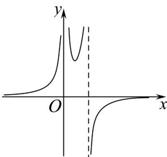

<!-- question-source:start -->
【典例1】函数 $y = \frac{a}{(x - b)|x - c|}$ 的图像如图所示，可以判断 $a, b, c$ 分别满足（）

A. $a < 0, b > 0, c = 0$ B. $a > 0, b > 0, c = 0$

C. $a < 0, b = 0, c > 0$ D. $a < 0, b = 0, c = 0$
<!-- question-source:end -->

![[高中/课堂同步/题库/人教A版高中数学同步讲义(2026)/01_必修第一册/第三章 函数的概念与性质/第三章 函数的概念与性质（高效培优讲义）/题型05_函数图象/questions/answers/Q00074629A1.md]]
