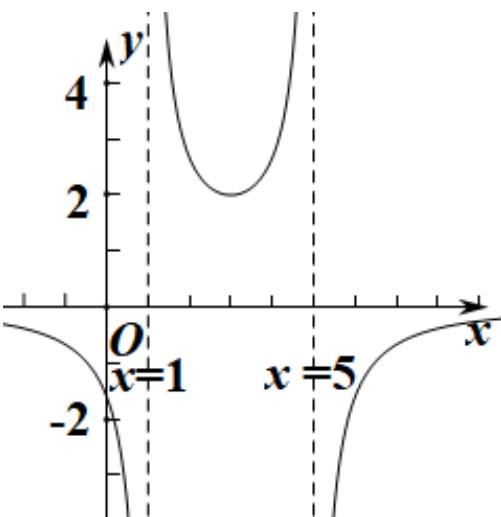

<!-- question-source:start -->
【典例2】已知函数的图像 $f(x) = \frac{1}{ax^2 + bx + c} (a, b, c \in R)$ 的图象如下，则（）

A. $a <   0,b > 0,c <   0.$ B. $a > 0,b > 0,c <   0.$

C $a <   0,b > 0,c > 0.$ D $a > 0,b <   0,c > 0$
<!-- question-source:end -->

![[高中/课堂同步/题库/人教A版高中数学同步讲义(2026)/01_必修第一册/第三章 函数的概念与性质/第三章 函数的概念与性质（高效培优讲义）/题型05_函数图象/questions/answers/Q00074630A1.md]]
