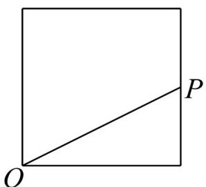
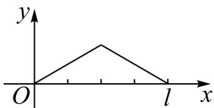
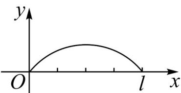
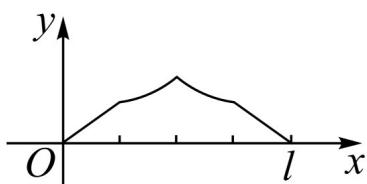
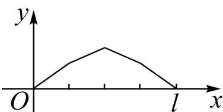

<!-- question-source:start -->
【变式1】点 $P$ 从点 $O$ 出发，按逆时针方向沿周长为 $l$ 的正方形运动一周，记 $O$ ， $P$ 两点连线的距离 $y$ 与点

$P$ 走过的路程 $x$ 为函数 $f(x)$ ，则 $y = f(x)$ 的图像大致是（ ）.

A.

B

C.

D.

<!-- question-source:end -->

![[高中/课堂同步/题库/人教A版高中数学同步讲义(2026)/01_必修第一册/第三章 函数的概念与性质/第三章 函数的概念与性质（高效培优讲义）/题型05_函数图象/questions/answers/Q00074631A1.md]]
