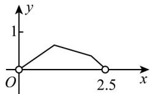
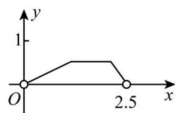
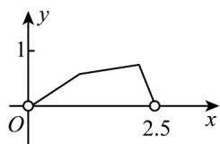
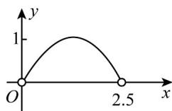

<!-- question-source:start -->
【变式3】已知边长为1的正方形ABCD， $E$ 为 $CD$ 边的中点，动点 $P$ 在正方形ABCD边上沿

$A \rightarrow B \rightarrow C \rightarrow E$ 运动，设点 $P$ 经过的路程为 $x$ ，VAPE 的面积为 $y$ ，则关于 $x$ 的函数的图像大致为（）

A

B

C.

D

<!-- question-source:end -->

![[高中/课堂同步/题库/人教A版高中数学同步讲义(2026)/01_必修第一册/第三章 函数的概念与性质/第三章 函数的概念与性质（高效培优讲义）/题型05_函数图象/questions/answers/Q00074633A1.md]]
