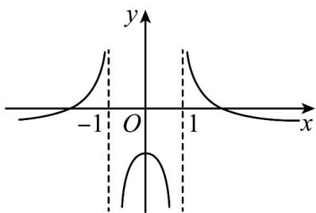
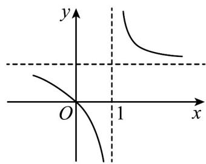
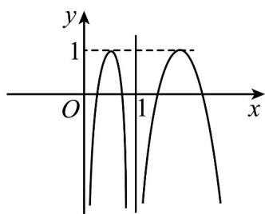
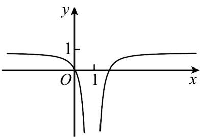

> [!faq]- 《第三章 函数的概念与性质（高效培优讲义）》官方解析
>
> > [!success]- **【答案】** A.  B  C.  D 
>
> > [!note]- **【解析】**
> > 根据 $x^{2} - 2x + 1 = (x - 1)^{2}$ 0，根据分母不为0，则 $x \neq 1$
> >
> > $$
> > y = \frac {x ^ {2} - 2 x}{x ^ {2} - 2 x + 1} = 1 - \frac {1}{x ^ {2} - 2 x + 1}
> > $$
> >
> > 根据 $x^{2} - 2x + 1 > 0$ 得 $\frac{1}{x^2 - 2x + 1} >0$
> >
> > 则 $-\frac{1}{x^2 - 2x + 1} < 0$ ，则 $-\frac{1}{x^2 - 2x + 1} + 1 < 1$ ，排除A、B项；
> >
> > 而 $y = -\frac{1}{x^2 - 2x + 1}$ ，其图像关于直线 $x = 1$ 对称，
> >
> > 且在 $x \in (-\infty, 1)$ 上单调递减，在 $x \in (1, +\infty)$ 上单调递增，
> >
> > 最后将其向上平移 1 个单位，则得到图中图像，且当 x = 0 时，y = 0，故 D 正确.
> >
> > 故选 **D**
