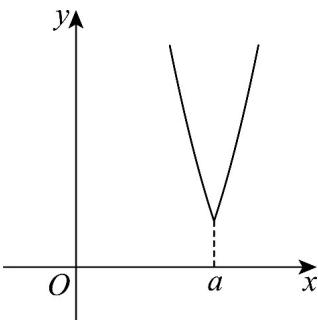

> [!faq]- 《第三章 函数的概念与性质（高效培优讲义）》官方解析
>
> > [!success]- **【答案】** B
>
> > [!note]- **【解析】**
> > 
> >
> > 画出函数 $f(x)$ 的图像，
> >
> > 当 $x > 0$ 时， $f(a + x) = (a + x)^2 - a(a + x) + 1 = x^2 + ax + 1$
> >
> > $$
> > f (a - x) = (a - x) ^ {2} - 3 a (a - x) + 2 a ^ {2} + 1 = x ^ {2} + a x + 1
> > $$
> >
> > 即 $f(a + x) = f(a - x)$
> >
> > 同理：当 x < 0 时，也可得 $f(a + x) = f(a - x)$
> >
> > 所以 $f(x)$ 的图像的图像关于 x = a 对称；
> >
> > 所以 $f(2a - 1) < f(3 - a)$ 等价于 $(2a - 1 - a)^2 < (3 - a - a)^2$
> >
> > 即 $3a^{2} - 10a + 8 > 0$
> >
> > 解得：a > 2 或 $a < \frac{4}{3}$ ，
> >
> > 又 $a > 0$
> >
> > 所以 $a$ 得取值范围是 $\left(0, \frac{4}{3}\right) \cup (2, +\infty)$
> >
> > 故选：B
> >
> > ## 方法技巧
> >
> > (1) 比较大小．比大小常用的方法是①利用单调性比大小；
> > - **②**：搭桥法，即引入中间量，从而确定大小关系；
> > - **③**：数形结合比大小。
> >
> > 注：一般三个数比较大小使用中间量法（一个大于1，一个介于0-1之间，一个小于0）再结合函数的图像判
> >
> > 断大小。
> >
> > (2) 解不等式．在求解与抽象函数有关的不等式时，往往是利用函数的单调性将“f”符号脱掉，使其转化为具体的不等式求解．此时应特别注意函数的定义域．
> >
> > 解抽象函数不等式问题（如： $f(a^{2} + a - 5) < 2.$ ）的一般步骤：
> >
> > 第一步：(定性)确定函数 $f(x)$ 在给定区间上的单调性；
> >
> > 第二步：(转化)将函数不等式转化为 $f(M) < f(N)$ 的形式；
> >
> > 第三步：(去 $f$ )运用函数的单调性“去掉”函数的抽象符号“ $f$ ”，转化成一般的不等式或不等式组；
> >
> > 第四步：(求解)解不等式或不等式组确定解集；
> >
> > 第五步：(反思)反思回顾．查看关键点，易错点及解题规范．
