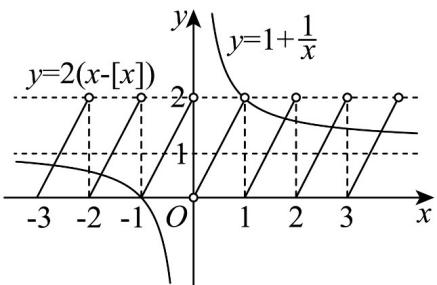

> [!faq]- 《第三章 函数的概念与性质（高效培优讲义）》官方解析
>
> > [!success]- **【答案】** D
>
> > [!note]- **【解析】**
> > 对于A，根据题意， $f\left(x + \frac{1}{2}\right) = \left\{x + \frac{1}{2}\right\}$ ， $f(x) = \{x\}$ ，当 $x = \frac{1}{2}$ 时， $f\left(x + \frac{1}{2}\right) = \{1\} = 1 - [1] = 1 - 1 = 0$
> >
> > $f(x)=\left\{\frac{1}{2}\right\}=\frac{1}{2}-\left[\frac{1}{2}\right]=\frac{1}{2}$ ，所以 $f\left(x+\frac{1}{2}\right)\neq f(x)$ ，故A错误；
> >
> > 对于 B， $f(1)=\{1\}=1-\left[1\right]=0$ ， $f(2)=\{2\}=2-\left[2\right]=0$ ，所以 $f(1)=f(2)$ ，小数函数在定义域内不是单调递
> >
> > 增，故 B 错误；
> >
> > 对于C，由 $g(x) = x\{x\} = x\cdot f(x) = x(x - [x]) = x^2 -x\cdot [x]$ ，因为 $g\left(-\frac{1}{3}\right) = \left(-\frac{1}{3}\right)^2 -\left(-\frac{1}{3}\right)\left[-\frac{1}{3}\right] = \frac{1}{9} -\frac{1}{3} = -\frac{2}{9}$
> >
> > $g\left(\frac{1}{3}\right) = \left(\frac{1}{3}\right)^2 -\frac{1}{3}\left[\frac{1}{3}\right] = \frac{1}{9} -0 = \frac{1}{9}$ ，所以 $g\left(-\frac{1}{3}\right)\neq -g\left(\frac{1}{3}\right)$ ，所以 $g(x) = x\{x\}$ 不是奇函数，故C错误；
> >
> > 对于 D， $h(x)=2x\{x\}-x-1$ 的零点，即方程 $2x\{x\}-x-1=0$ 的根
> >
> > $x = 0$ 显然不是方程的根；
> >
> > 当 $x \neq 0$ ，方程化为 $2(x - [x]) = 1 + \frac{1}{x}$ ，作出两函数 $y = 2(x - [x])$ 与 $y = 1 + \frac{1}{x}$ 的图像如图：
> >
> > 
> >
> > 由图知，两函数的交点除 $(-1,0)$ 之外，其余的交点关于 $(0,1)$ 中心对称，则函数 $h(x) = 2x\{x\} - x - 1$ 的所有零点
> >
> > 之和为 -1，故 D 正确.
> >
> > 故选：D.
> >
> > ## 方法技巧
> >
> > (1)定义域关于原点对称，这是函数具有奇偶性的必要不充分条件，所以首先考虑定义域；
> >
> > (2)判断 $f(x)$ 与 $f(-x)$ 是否具有等量关系，在判断奇偶性的运算中，可以转化为判断奇偶性的等价等量关系式 $(f(x) + f(-x) = 0$ (奇函数)或 $f(x) - f(-x) = 0$ (偶函数))是否成立.
