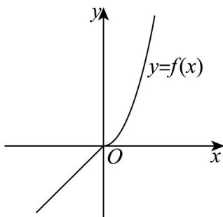

> [!faq]- 《第三章 函数的概念与性质（高效培优讲义）》官方解析
>
> > [!success]- **【答案】** C
>
> > [!note]- **【解析】**
> > 若 $x > 0$ ，则 $-x < 0$ ，且函数 $g(x)$ 是 $\mathbf{R}$ 上的奇函数，
> >
> > 可得 $f(x)=g(x)=-g(-x)=-\left[-2(-x)^{2}+3(-x)\right]=2x^{2}+3x$
> >
> > 即 $f(x)=\left\{\begin{aligned}x,x&\leq0\\ 2x^{2}+3x,x&>0\end{aligned}\right.$ ，作出函数 $f(x)$ 的图象，
> >
> > 
> >
> > 由图象可知 $f(x)$ 在定义域 $\mathbf{R}$ 上单调递增，
> >
> > 若 $f(6 - x) > f\left(x^{2}\right)$ ，则 $6 - x > x^2$ ，解得 $-3 < x < 2$
> >
> > 所以实数 x 的取值范围是 $(-3,2)$ .
> >
> > 故选 **C**.
