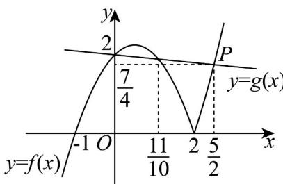
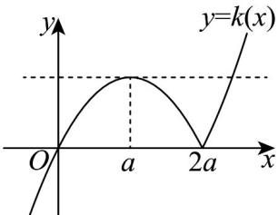
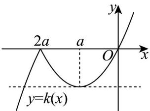

> [!faq]- 《第三章 函数的概念与性质（高效培优讲义）》官方解析
>
> > [!success]- **【答案】** (1)答案见解析 (2) $\frac{7}{4}$ (3)答案见解析
>
> > [!note]- **【解析】**
> > （1）当 $a = 1$ 时， $f(x) = (x + 1)|x - 2| = \begin{cases} - (x + 1)(x - 2), & x < 2, \\ (x + 1)(x - 2), & x \end{cases}$
> >
> > 当 x < 2 时，令 $f(x) = g(x)$ ，得 $-\left(x + 1\right)\left(x - 2\right) = 2 - \frac{1}{10}x$ ，解得 x = 0 或 $x = \frac{11}{10}$ ；
> >
> > 当 $x$ 2时，令 $f(x) = g(x)$ ，得 $(x + 1)(x - 2) = 2 - \frac{1}{10} x$ ，解得 $x = \frac{5}{2}$ （ $x = -\frac{8}{5}$ 舍去）
> >
> > 作出 $f(x), g(x)$ 的大致图象如图（1）所示：
> >
> > 
> > 图(1)
> >
> > 观察图象可知，当 $x \leq 0$ 或 $\frac{11}{10} \leq x \leq \frac{5}{2}$ 时， $f(x) \leq g(x)$ ；
> >
> > 当 $0 < x < \frac{11}{10} x > \frac{5}{2}$ 时， $f(x) > g(x)$
> >
> > (2) 当 $x=\frac{5}{2}$ 时， $f\left(\frac{5}{2}\right)=g\left(\frac{5}{2}\right)=2-\frac{1}{10}\times\frac{5}{2}=\frac{7}{4}$ ，所以点 $P\left(\frac{5}{2},\frac{7}{4}\right)$
> >
> > 由（1）可知 $h(x) = \max \left\{f(x), g(x)\right\}$ 的图象是图（1）中粗线部分，
> >
> > 由 $g(x)$ 是减函数可知点 $P\left(\frac{5}{2},\frac{7}{4}\right)$ 是 $h(x)$ 图象的最低点，
> >
> > 所以 $h(x)$ 的最小值是 $\frac{7}{4}$
> >
> > (3) $k(x) = f(x) - |x - 2a| = x|x - 2a| = \begin{cases} x(x - 2a), & x = 2a, \\ x(2a - x), & x < 2a \end{cases} = \begin{cases} (x - a)^2 - a^2, & x = 2a, \\ -(x - a)^2 + a^2, & x < 2a. \end{cases}$
> > - **①**：当 a > 0 时， $k(x)$ 的大致图象如图（2）所示，
> >
> > 
> > 图(2)
> >
> > 因为 $k(x)$ 在区间 $(m,n)$ 上既有最大值又有最小值， $(m,n)$ 是开区间，
> > 所以最大值，最小值只能在 x=a 和 x=2a 处取得，且 $f(2a)=0, f(a)=a^{2}$ 由 $x(x-2a)=a^{2}$ ，解得 $x=\left(\sqrt{2}+1\right)a$ （负值舍去），又 $f(0)=f(2a)=0$ ，
> > 所以 $0 \leq m < a, 2a < n \leq \left(\sqrt{2} + 1\right)a$
> > - **②**：当 a < 0 时， $k(x)$ 的大致图象如图（3）所示，
> >
> > 
> > 图(3)
> >
> > 因为 $k(x)$ 在区间 $(m,n)$ 上既有最大值又有最小值， $(m,n)$ 是开区间，
> >
> > 所以最大值，最小值只能在 $x = 2a$ 和 $x = a$ 处取得，且 $f(2a) = 0, f(a) = -a^2$
> >
> > 由 $x(2a - x) = -a^2$ ，解得 $x = (\sqrt{2} + 1)a$ （正值舍去），又 $f(0) = f(2a) = 0$
> >
> > 所以 $\left(\sqrt{2} + 1\right)a \leq m < 2a, a < n \leq 0$
> >
> > 综上，当 $a > 0$ 时， $m$ 的取值范围为 $[0, a), n$ 的取值范围为 $\left(2a, \left(\sqrt{2} + 1\right)a\right]$ ；当 $a < 0$ 时， $m$ 的取值范围为
> >
> > $\left[\left(\sqrt{2} + 1\right)a, 2a\right), n$ 的取值范围为 $(a,0]$ .
