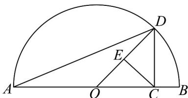
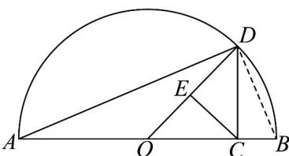

> [!faq]- 《专题02 基本不等式的四大常考题型（高效培优专项训练）》官方解析
>
> > [!success]- **【答案】** 问题甲：一个直径 $a$ 寸的披萨和一个直径 $b$ 寸的披萨，面积和等于两个直径都是 $x$ 寸的披萨； 问题乙：某人散步，第一圈的速度是 a，第二圈的速度是 b，这两圈的平均速度为 y； 问题丙：将一物体放在两臂不等长的天平测量，放左边时右侧砝码质量为 $a$ （天平平衡），放右边时左边砝码质量为 $b$ （天平平衡），物体的实际质量为 $z$ ：A. $x > y > z$ B. $x > z > y$ C. $z > x > y$ D. $z > y > x$
>
> > [!note]- **【解析】**
> > 由问题甲，结合圆的面积公式可得 $\pi \left(\frac{a}{2}\right)^2 +\pi \left(\frac{b}{2}\right)^2 = 2\pi \left(\frac{x}{2}\right)^2$ ，有 $a^2 +b^2 = 2x^2$ ，即 $x = \sqrt{\frac{a^2 + b^2}{2}}$ ，由问题乙，设每圈的长度为 $s$ ，则 $\frac{2s}{\frac{s}{a} + \frac{s}{b}} = y$ ，整理为可得 $\frac{2ab}{a + b} = y$
> >
> > 由问题丙，设天平左边的杠杆长为 m，右边的杠杆长为 n，
> >
> > 则 $\left\{ \begin{array}{l}zm = an\\ bm = zn \end{array} \right.$ ，可得 $z^{2} = ab$ ，即 $\sqrt{ab} = z$
> >
> > 因为 $a$ 、 $b$ 是不相等的正数，则有 $a + b > 2\sqrt{ab}$ ，可得 $\frac{2ab}{a + b} < \sqrt{ab}$
> >
> > 根据重要不等式可知 $a^2 + b^2 > 2ab$ ，得 $\sqrt{\frac{a^2 + b^2}{2}} > \sqrt{ab}$
> >
> > 则有 $\sqrt{\frac{a^{2}+b^{2}}{2}}>\sqrt{ab}>\frac{2ab}{a+b}$ ，所以 x>z>y
> >
> > 故选：B.
> >
> > 2．《几何原本》中的几何代数法（以几何方法研究代数问题）成为了后世数学家处理问题的重要依据·通过这一原理，很多的代数公理或定理都能够通过图形实现证明，也称之为无字证明，如图所示的图形中，在 $AB$ 上取一点 $C$ ，使得 $AC = a$ ， $BC = b$ ，过点 $C$ 作 $CD \perp AB$ 交以 $AB$ 为直径的半圆弧于 $D$ ，连结 $OD$ ，作 $CE \perp OD$ ，垂足为 $E$ ，由 $CD \quad DE$ 可以直接证明的不等式是（）·
> >
> > 
> >
> > A. $\frac{a + b}{2} \sqrt{ab} (a > 0, b > 0)$ B. $a^2 + b^2 \sqrt{ab} (a > 0, b > 0)$ C. $\left|\frac{a - b}{2}\right| \leq \sqrt{ab}, (a > 0, b > 0)$ D. $\sqrt{ab} \frac{2ab}{a + b} (a > 0, b > 0)$
> >
> > 【答案】D
> >
> > 【详解】
> >
> > 
> >
> > 连接 $DB$ ，因为 $AB$ 是圆 $O$ 的直径，所以 $\angle ADB = 90^{\circ}$ ，所以在 Rt $\Delta ADB$ 中，中线 $OD = \frac{AB}{2} = \frac{a + b}{2}$ ，由射影定理可得 $CD^{2} = AC \cdot CB = ab$ ，所以 $CD = \sqrt{ab}$ ：
> >
> > 在 RtΔDCO 中，由射影定理可得 $CD^{2}=DE\cdot OD$ ，即 $DE=\frac{CD^{2}}{OD}=\frac{ab}{\frac{a+b}{2}}=\frac{2ab}{a+b}$ ，
> >
> > 由 $CD$ $DE$ 得 $\sqrt{ab}$ $\frac{2ab}{a + b}$
> >
> > 故选 **D**
