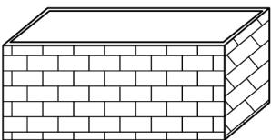
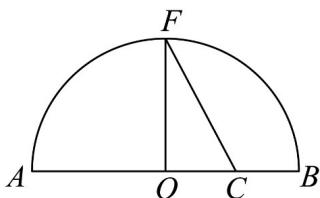

> [!faq]- 《专题02 基本不等式的四大常考题型（高效培优专项训练）》官方解析
>
> > [!success]- **【答案】**  A. 160000元 B. 179200元 C. 198400元 D. 297600元
>
> > [!note]- **【解析】**
> > 设池底的长为 $x$ ，宽为 $y$ ，则 $3xy = 4800$ ，即 $y = \frac{1600}{x}$ 因水池无盖，则建造池体需要建造池壁有4个面，池底一个面，建造这个水池的总造价是 $100xy + 2(x + y)\times 3\times 80 = 160000 + 480\left(x + \frac{1600}{x}\right)$ $160000 + 480\times 2\sqrt{x\cdot\frac{1600}{x}} = 198400$ 当且仅当 $x = \frac{1600}{x}$ ，即 $x = 40$ 时，等号成立，
> >
> > 故选：C.
> >
> > 32. 我国古代著名数学巨著《周髀算经》记载着周朝时期的商高与周公的对话，商高提出了“勾三股四弦五”特例·后来古希腊的毕达哥拉斯学派用演绎法证明了直角三角形斜边的平方等于两直角边的平方之和．若一个直角三角形的斜边长等于10，则这个直角三角形周长的最大值为（）A. 24 B. $10\sqrt{3} + 10$ C. $10\sqrt{2} + 10$ D. 20
> >
> > 【答案】C
> >
> > 【详解】设这个直角三角形的两条直角边长分别为 $x$ 、 $y$ ，由勾股定理可得 $x^{2} + y^{2} = 100$
> >
> > 由基本不等式可得 $x^{2} + y^{2}$ 2xy，所以 $2\left(x^{2} + y^{2}\right)x^{2} + 2xy + y^{2}$
> >
> > 即 $\left(x + y\right)^2 \leq 2\left(x^2 + y^2\right) = 200$ ，故 $x + y \leq 10\sqrt{2}$
> >
> > 当且仅当 $\left\{\begin{aligned}x&=y\\ x^{2}+y^{2}&=100\\ x&>0,y>0\end{aligned}\right.$ 时，即当时，等号成立，
> >
> > 因此这个直角三角形周长的最大值为 $10\sqrt{2} + 10$
> >
> > 故选：C.
> >
> > 33. 《几何原本》卷 $^{2}$ 的几何代数法（以几何方法研究代数问题）成了后世西方数学家处理问题的重要依据，运用这一原理，很多代数的公理或定理都能够通过图形实现证明，也称之为无字证明·现有如图所示图形，点F在半圆O上，点C在直径AB上，且 $OF\perp AB$ ，设AC=a,BC=b，则该图形可以完成的无字证明为（）
> >
> > 【答案】
> >
> > 
> >
> > A $a^2 + b^2$ $2ab(a > 0, b > 0)$
> >
> > B. $\frac{a + b}{2}$ $\sqrt{ab} (a > 0,b > 0)$
> >
> > C. $\sqrt{ab}$ $\frac{2ab}{a + b} (a > 0,b > 0)$
> >
> > D. $\sqrt{\frac{a^{2}+b^{2}}{2}}\quad\frac{a+b}{2}(a>0,b>0)$
> >
> > 【答案】D
> >
> > 【详解】由题 $OF = \frac{a + b}{2}, OC = \frac{a - b}{2}$
> >
> > 所以 $CF = \sqrt{\left(\frac{a + b}{2}\right)^2 + \left(\frac{a - b}{2}\right)^2} = \sqrt{\frac{a^2 + b^2}{2}}$
> >
> > 所以由 $OF \leq CF$ 得 $\frac{a+b}{2} \leq \sqrt{\frac{a^{2}+b^{2}}{2}}$ .
> >
> > 故选 **D**.
