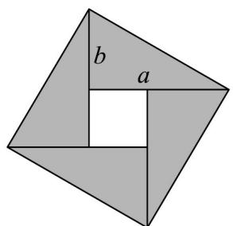

> [!faq]- 《专题02 基本不等式的四大常考题型（高效培优专项训练）》官方解析
>
> > [!success]- **【答案】** 问题甲：一个直径 a 寸的披萨和一个直径 b 寸的披萨，面积和等于两个直径都是 x 寸的披萨的面积和； 问题乙：购买某物品所花钱数一定，第一次购买的单价为 $a$ 元，第二次购买的单价为 $b$ 元，则这两次的平均价格为 $y$ ， 问题丙：将一物体放在两臂不等长的天平测量，放左边时右侧砝码质量为 $a$ （天平平衡），放右边时左边砝码质量为 $b$ （天平平衡），物体的实际质量为 $z$ ：A. $x > y > z$ B. $x > z > y$ C. $z > x > y$ D. $z > y > x$
>
> > [!note]- **【解析】**
> > 问题甲中， $\pi\left(\frac{a}{2}\right)^{2}+\pi\left(\frac{b}{2}\right)^{2}=2\pi\left(\frac{x}{2}\right)^{2}$ ，即可 $\sqrt{\frac{a^{2}+b^{2}}{2}}=x$ ，
> > 问题乙中，设每次购买花的钱为，则 $y=\frac{2m}{\frac{m}{a}+\frac{m}{b}}=\frac{2}{\frac{1}{a}+\frac{1}{b}}$ 问题丙中，设左右量词的臂长分别为 m, n，则 $\left\{\begin{aligned}m z&=na\\ n z&=mb\end{aligned}\right.$ ，故 $z=\sqrt{ab}$ 由于 $a > 0, b > 0, a \neq b, \frac{a^2 + b^2}{2} \quad ab$ ，故 $x > z$ ，
> >
> > 又 $y = \frac{2}{\frac{1}{a} + \frac{1}{b}} \leq \frac{2}{2\sqrt{\frac{1}{a} \cdot \frac{1}{b}}} = \sqrt{ab}$ 所以 $y < z$
> >
> > 因此 $x > z > y$
> >
> > 故选：B
> >
> > 36. 一般认为，教室的窗户面积应小于地面面积，但窗户面积与地面面积之比应不小于 $15\%$ ，且这个比值越大，通风效果越好·以下结论叙述正确的个数为（）
> >
> > 【答案】
> > - **①**：若教室的窗户面积与地面面积之和为 $200\mathrm{m}^2$ ，则窗户面积至少应该为 $30\mathrm{m}^2$
> > - **②**：若窗户面积和地面面积都增加原来的 $10\%$ ，则教室通风效果不变
> > - **③**：若窗户面积和地面面积都增加相同的面积，则教室的通风效果变好
> > - **④**：若窗户面积第一次增加了 $m\%$ ，第二次增加了 $n\%$ ，地面面积两次都增加了 $\frac{m + n}{2}\%$ ，则教室的通风效果变差A.1 B.2 C.3 D.4
> >
> > 【答案】B
> >
> > 【详解】对于①，设该教室窗户面积为 $x$ ，则地板面积为 $200 - x$ ，依题意有 $\left\{ \begin{array}{ll} \frac{x}{200 - x} & 15\% \\ x < 200 - x \end{array} \right.$
> >
> > 解得 $\frac{600}{23} \leq x < 100$ ，所以这所教室的窗户面积至少为 $\frac{600}{23} \mathrm{~m}^2$ ，故①错误；
> > - **对于②**：，记窗户面积为 $a$ 和地板面积为 $b$ ，同时窗户增加的面积为 $10\% \cdot a$
> >
> > 同时地板增加的面积为 $10\% \cdot b$
> >
> > 由题可知增加面积前后窗户面积与地板面积的比分别为 $\frac{a}{b}, \frac{a + 10\% \cdot a}{b + 10\% \cdot b} = \frac{a(1 + 10\%)}{b(1 + 10\%)} = \frac{a}{b}$
> >
> > 所以公寓采光效果不变，故②正确；
> > - **对于③**：，记窗户面积为 a 和地板面积为 b，同时增加的面积为 c。
> >
> > 由题可知， $0 < a \langle b, c \rangle 0$ ，增加面积前后窗户面积与地板面积的比分别为 $\frac{a}{b}, \frac{a + c}{b + c}$ ，
> >
> > 因为 $\frac{a + c}{b + c} -\frac{a}{b} = \frac{b(a + c) - a(b + c)}{b(b + c)} = \frac{c(b - a)}{b(b + c)}$ ，且 $0\langle a\langle b,c\rangle 0,b - a\rangle 0$
> >
> > 所以 $\frac{a + c}{b + c} -\frac{a}{b} >0$ ，即 $\frac{a + c}{b + c} >\frac{a}{b}$
> >
> > 所以，同时增加相同的窗户面积和地板面积，公裹的采光效果变好了，故③正确；
> > - **对于④**：，记窗户面积为 $a$ 和地板面积为 $b$ ，则窗户增加后的面积为 $\left(1 + n\%\right)\left(1 + m\%\right) \cdot a$
> >
> > 地板增加后的面积为 $\left(1+\frac{m+n}{2}\%\right)^{2}\cdot b$
> >
> > 由题可知增加面积前后窗户面积与地板面积的比分别为 $\frac{a}{b}, \frac{(1+n\%)(1+m\%) \cdot a}{(1+\frac{m+n}{2}\%)^2 \cdot b}$ ，
> >
> > 因为 $\frac{(1 + n\%)(1 + m\%)}{(1 + \frac{m + n}{2}\%)^2} = \frac{1 + (n\% + m^2\%) + m\% n^2\%}{1 + (\frac{m + n}{2}\%)^2 + (n\% + m\%)}$
> >
> > 又因为 $m > 0, n > 0, \frac{m + n}{2} \sqrt{mn}$ ，所以 $\left(\frac{m + n}{2}\%\right)^2 m\% n\%$
> >
> > 因为 $\frac{(1 + n\%)(1 + m\%)}{(1 + \frac{m + n}{2}\%)^2} = \frac{1 + (n\% + m\%) + m\% n\%}{1 + (\frac{m + n}{2}\%)^2 + (n\% + m\%)} \leq 1$ ，所以 $\frac{(1 + n\%)(1 + m\%) \cdot a}{(1 + \frac{m + n}{2}\%)^2 \cdot b} \leq \frac{a}{b}$
> >
> > 当时， $\frac{(1+n\%)(1+m\%) \cdot a}{(1+\frac{m+n}{2}\%)^2 \cdot b} = \frac{a}{b}$ ，采光效果不变，
> >
> > 所以无法判断教室的采光效果是否变差了，故④错误·
> >
> > 故选：B.
> >
> > 37. 三国时期赵爽在《勾股方圆图注》中对勾股定理的证明可用现代数学表述为如图所示，我们教材中利用该图作为“( )”的几何解释·
> >
> > 
> >
> > A. 如果 $a > b > 0$ ，那么 $\sqrt{a} > \sqrt{b}$ B. 如果 $a > b > 0$ ，那么 $a^2 > b^2$ C. 对任意实数 $a$ 和 $b$ ，有 $a^2 + b^2 = 2ab$ ，当且仅当 $a = b$ 时等号成立
> > D. 对任意正实数 $a$ 和 $b$ ，有 $a + b = 2\sqrt{ab}$ ，当且仅当 $a = b$ 时等号成立
> >
> > 【答案】C
> >
> > 【详解】可将直角三角形的两直角边长度取作 a, b，斜边为 $c(c^{2} = a^{2} + b^{2})$ ，则外围的正方形的面积为 $c^{2}$ ，也就是 $a^{2} + b^{2}$ ，
> > 四个阴影面积之和刚好为 2ab，对任意正实数 a 和 b，有 $a^{2} + b^{2} - 2ab$ ，当且仅当 a = b 时等号成立，故选 C.
> >
> > 38. 古希腊科学家阿基米德在《论平面图形的平衡》一书中提出了杠杆原理，它是使用天平秤物品的理论基础，当天平平衡时，左臂长与左盘物品质量的乘积等于右臂长与右盘物品质量的乘积，一家商店使用一架两臂不等长的天平称黄金，其中左臂长和右臂长之比为 $\lambda (\lambda \neq 1)$ ，一位顾客到店里购买20克黄金，售货员先将10克砝码放在天平左盘中，取出一些黄金放在天平右盘中使天平平衡；再将10克砝码放在天平右盘中，然后取出一些黄金放在天平左盘中使天平平衡，最后将两次称得的黄金交给顾客，则顾客购得的黄金重量（ ）A. 大于20克B. 小于20克C. 等于20克D. 当 $\lambda > 1$ 时，大于20克；当 $\lambda \in (0,1)$ 时，小于20克
> >
> > 【答案】A
> >
> > 【详解】设第一次取出的黄金质量为 a 克，第二次黄金质量为 b 克，
> >
> > 由题意可得 $a = 10\lambda$ ， $\lambda b = 10$ ，可得 $b = \frac{10}{\lambda}$
> >
> > 易知 $\lambda > 0$ 且 $\lambda \neq 1$
> >
> > 所以， $a + b = 10\lambda +\frac{10}{\lambda} = 10\left(\lambda +\frac{1}{\lambda}\right)$ $10\times 2\sqrt{\lambda\cdot\frac{1}{\lambda}} = 20$
> >
> > 当且仅当 $\lambda = \frac{1}{\lambda} (\lambda > 0, \lambda \neq 1)$ 时，等号成立，
> >
> > 事实上， $\lambda \neq \frac{1}{\lambda}$ ，等号不成立，则 $a + b > 20$ 。
> >
> > 因此，顾客购得的黄金重量大于 $20$ 克·
> >
> > 故选 **A**.
