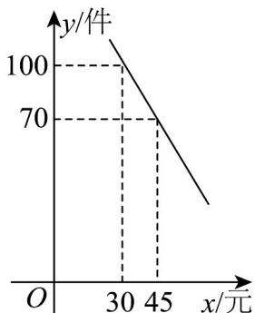

<!-- question-source:start -->
29. 某主播在直播平台上销售一款成本为每件 $^{24}$ 元的商品·经调查发现，该商品每天的销售量 $^{y}$ （件）与销售单价 $^{x}$ （元）之间满足一次函数关系，其图象如图所示·

(1)求该商品每天的销售量 $y$ 与销售单价 $x$ 之间的函数关系式；

(2)若该主播按单价不低于成本价，且不高于 $50$ 元销售，则销售单价定为多少元时利润最大？最大利润是多少？

(3)若该主播要使销售该商品每天获得的利润不低于 $1280$ 元，则每天的销售量最少应为多少件？
<!-- question-source:end -->

![[高中/课堂同步/题库/人教A版高中数学同步讲义(2026)/01_必修第一册/第二章 一元二次函数、方程和不等式/专题03 二次函数与一元二次方程、不等式的四大常考题型（高效培优专项训练）/题型三_实际问题中的一元二次不等式问题/questions/answers/Q00074795A1.md]]
