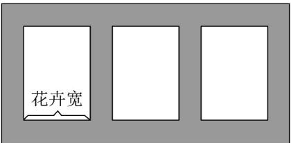

> [!faq]- 《专题03 二次函数与一元二次方程、不等式的四大常考题型（高效培优专项训练）》官方解析
>
> > [!success]- **【答案】** 
>
> > [!note]- **【解析】**
> > 设矩形花卉的宽为 $x(x > 0)$ 米，
> >
> > 因为三块花卉的面积均为 $150$ 平方米，则长为 $\frac{150}{x}$ 米，
> >
> > 又矩形花卉的长比宽至少多5米，所以 $\frac{150}{x} x + 5$
> >
> > 即 $x^{2} + 5x - 150\leq 0$ ，即 $(x - 10)(x + 15)\leq 0$ ，解得 $0 <   x\leq 10$
> >
> > 所以花卉宽的取值范围是 $(0,10]$ .
> >
> > 故答案为： $(0,10]$ .
