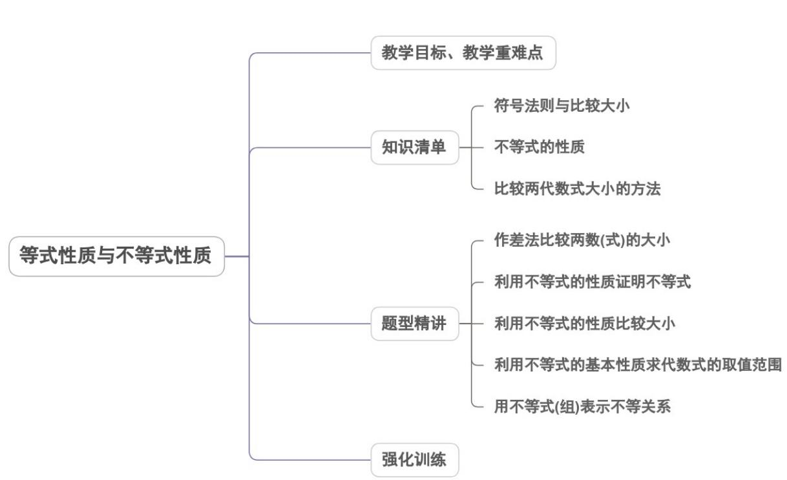

<!-- source-part:1 pages:1-35 -->

## 专题2.1 等式性质与不等式性质

## 内容概览

## 教学目标、教学重难点

<table><tr><td>教学目标</td><td>1.能用不等式(组)表示实际问题中的不等关系.2.初步掌握用作差法比较两实数的大小.3.掌握不等式的基本性质,并能运用这些性质解决有关问题</td></tr><tr><td>教学重难点</td><td>1.重点:掌握不等式性质及其应用.2.难点:不等式性质的应用.</td></tr></table>

## 知识清单

## 知识点 01 符号法则与比较大小

两实数的加、乘运算结果的符号具有以下符号性质：

①两个同号实数相加，和的符号不变符号语言： $a>0,b>0\Rightarrow a+b>0$ ； $a<0,b<0\Rightarrow a+b<0$

②两个同号实数相乘，积是正数符号语言： $a > 0, b > 0 \Rightarrow ab > 0$ ； $a < 0, b < 0 \Rightarrow ab > 0$

③两个异号实数相乘，积是负数符号语言： $a > 0, b < 0 \Rightarrow ab < 0$

④任何实数的平方为非负数，0 的平方为 0 符号语言： $x \in R \Rightarrow x^{2} \quad 0$ ， $x = 0 \Leftrightarrow x^{2} = 0$ 。

比较两个实数大小的法则：

对任意两个实数 a 、 b ① $a - b > 0 \Leftrightarrow a > b$ ; ② $a - b < 0 \Leftrightarrow a < b$ ; ③ $a - b = 0 \Leftrightarrow a = b$ .

## 【即学即练】

1. 下列不等式中可以用来表示“a 的 $^{2}$ 倍比 a 的平方的相反数小”的是（）

【答案】
A. $2a < a^{2}$ B. $2a > -a^{2}$ C. $a < -2a^{2}$ D. $2a < -a^{2}$

【答案】D

【分析】依题意，先用 $a$ 表示代数式，再建立不等关系即得

【详解】因 a 的 $^{2}$ 倍为 2a, a 的平方的相反数为 $-a^{2}$ ,

则不等式为： $2a<-a^{2}$

故选：D.

2. 下面能表示“a 与 b 的和是非正数”的不等式为（）

【答案】
A. $a + b < 0$ B. $a + b > 0$

C. $a + b\leq 0$ D. $a + b = 0$

【答案】C

【分析】根据非正数含义即可得到答案·

【详解】因为非正数小于等于 $^{0}$ ，则能表示“a 与 b 的和是非正数”的不等式为 $a + b \leq 0$ .

故选：C.

## 知识点 02 不等式的性质

基本性质有：

(1)对称性： $a > b\Leftrightarrow b <   a$ (2)传递性： $a > b,b > c\Rightarrow a > c$ (3)可加性： $a > b\Leftrightarrow a + c > b + c$ $(c\in R)$

$$
\left\{ \begin{array}{l} c > 0 \Rightarrow a c > b c \\ c = 0 \Rightarrow a c = b c \\ c <   0 \Rightarrow a c <   b c \end{array} \right.
$$

(4)可乘性：a>b， $\left\lfloor c<0\Rightarrow ac<bc\right.$

运算性质有：

(1)可加法则： $a > b, c > d \Rightarrow a + c > b + d.$ (2)可乘法则： $a > b > 0, c > d > 0 \Rightarrow a \cdot c > b \cdot d > 0$

(3)可乘方性： $a > b > 0, n \in N^{*} \Rightarrow a^{n} > b^{n} > 0$

## 【即学即练】

1. 设 $a, b$ 为实数，则“ $a > b > 0$ ”的一个充分不必要条件是（）

【答案】
A. $\sqrt{a - 1} > \sqrt{b - 1}$ B. $a^2 > b^2$ C. $\frac{1}{b} > \frac{1}{a}$ D. $a - b > b - a$

【答案】A

【详解】由 $\sqrt{a-1} > \sqrt{b-1}$ ，知 $\left\{\begin{aligned}a-1 &> b-1, \\ b-1 &=0,\end{aligned}\right.$ 可得 a > b - 1，可推出 a > b > 0，反向推不出，故 A 满足题意；由 $a^{2} > b^{2}$ ，得 $|a| > |b|$ ，推不出 a > b > 0，反向可推出，故 B 不满足题意；由 $\frac{1}{b} > \frac{1}{a}$ ，得 a > b > 0 或 b > 0 > a 或 0 > a > b，推不出 a > b > 0，反向可推出，故 C 不满足题意；由 $a-b > b-a$ ，得 a > b，推不出 a > b > 0，反向可推出，故 C 不满足题意。

向可推出，故 $D$ 不满足题意·

2. 已知 $0 < a < 1$ ，则（ ）A. $a^2 > \frac{1}{a} > a > -a$ B. $a > a^2 > \frac{1}{a} > -a$ C. $\frac{1}{a} > a > a^2 > -a$ D. $\frac{1}{a} > a^2 > a > -a$

【答案】C

【详解】因为 $0 < a < 1$ ，所以 $0 < a^2 < 1, \frac{1}{a} > 1, -1 < -a < 0$ 。由于 $0 < a < 1$ ，故在不等式上同时乘以 $a$ 得 $0 < a^2 < a$ ，即 $\frac{1}{a} > 1 > a > a^2 > 0 > -a$ ，因此， $\frac{1}{a} > a > a^2 > -a$ 。

## 知识点 03 比较两代数式大小的方法

作差法：任意两个代数式 $a$ 、 $b$ ，可以作差 $a - b$ 后比较 $a - b$ 与0的关系，进一步比较 $a$ 与 $b$ 的大小.

① $a - b > 0 \Leftrightarrow a > b$ ; ② $a - b < 0 \Leftrightarrow a < b$ ; ③ $a - b = 0 \Leftrightarrow a = b$ .

作商法：任意两个值为正的代数式 a 、 b ，可以作商 $a \div b$ 后比较 $\frac{a}{b}$ 与 1 的关系，进一步比较 a 与 b 的大小.
① $\frac{a}{b}>1\Leftrightarrow a>b$ ; ② $\frac{a}{b}<1\Leftrightarrow a<b$ ; ③ $\frac{a}{b}=1\Leftrightarrow a=b$

中间量法：若 $a > b$ 且 $b > c$ ，则 $a > c$ （实质是不等式的传递性）.一般选择0或1为中间量

【即学即练】

$$
a ^ {2} - b ^ {2} \quad a - b
$$

1. 设 $a > b > 0$ ，比较 $\overline{a^2 + b^2}$ 与 $\overline{a + b}$ 的大小

【答案】 $\frac{a^{2}-b^{2}}{a^{2}+b^{2}}>\frac{a-b}{a+b}$

【分析】先判断两个式子的符号，然后利用作商法与 $^{1}$ 进行比较即可·

【详解】∵ a > b > 0 $\Rightarrow$ a + b > 0, a - b > 0

$$
\therefore \frac {a ^ {2} - b ^ {2}}{a ^ {2} + b ^ {2}} = \frac {(a + b) (a - b)}{a ^ {2} + b ^ {2}} > 0, \frac {a - b}{a + b} > 0
$$

$$
\therefore \frac {\frac {a ^ {2} - b ^ {2}}{a ^ {2} + b ^ {2}}}{\frac {a - b}{a + b}} = \frac {(a + b) ^ {2}}{a ^ {2} + b ^ {2}} = 1 + \frac {2 a b}{a ^ {2} + b ^ {2}} > 1,
$$

$$
\therefore \frac {a ^ {2} - b ^ {2}}{a ^ {2} + b ^ {2}} > \frac {a - b}{a + b}
$$

2. 已知 $c > 1$ ，且 $x = \sqrt{c + 1} - \sqrt{c}$ ， $y = \sqrt{c} - \sqrt{c - 1}$ ，则 $x, y$ 之间的大小关系是（）A. $x > y$ B. $x = y$ C. $x < y$ D. $x, y$ 的关系随 $c$ 而定

【答案】C

【分析】应用作商法比较 $\frac{x}{y},1$ 的大小关系即可·

【详解】由题设，易知 $x, y > 0$ ，又 $\frac{x}{y} = \frac{\sqrt{c + 1} - \sqrt{c}}{\sqrt{c} - \sqrt{c - 1}} = \frac{\sqrt{c} + \sqrt{c - 1}}{\sqrt{c + 1} + \sqrt{c}} < 1$

故选：C.

## 题型精讲

![[高中/课堂同步/题库/人教A版高中数学同步讲义(2026)/01_必修第一册/第二章 一元二次函数、方程和不等式/专题2.1 等式性质与不等式性质（高效培优讲义）/题型01_作差法比较两数_式_的大小/题型01_作差法比较两数_式_的大小.md]]
![[高中/课堂同步/题库/人教A版高中数学同步讲义(2026)/01_必修第一册/第二章 一元二次函数、方程和不等式/专题2.1 等式性质与不等式性质（高效培优讲义）/题型02_利用不等式的性质证明不等式/题型02_利用不等式的性质证明不等式.md]]
![[高中/课堂同步/题库/人教A版高中数学同步讲义(2026)/01_必修第一册/第二章 一元二次函数、方程和不等式/专题2.1 等式性质与不等式性质（高效培优讲义）/题型03_利用不等式的性质比较大小/题型03_利用不等式的性质比较大小.md]]
![[高中/课堂同步/题库/人教A版高中数学同步讲义(2026)/01_必修第一册/第二章 一元二次函数、方程和不等式/专题2.1 等式性质与不等式性质（高效培优讲义）/题型04_利用不等式的基本性质求代数式的取值范围/题型04_利用不等式的基本性质求代数式的取值范围.md]]
![[高中/课堂同步/题库/人教A版高中数学同步讲义(2026)/01_必修第一册/第二章 一元二次函数、方程和不等式/专题2.1 等式性质与不等式性质（高效培优讲义）/题型05_用不等式_组_表示不等关系/题型05_用不等式_组_表示不等关系.md]]
![[高中/课堂同步/题库/人教A版高中数学同步讲义(2026)/01_必修第一册/第二章 一元二次函数、方程和不等式/专题2.1 等式性质与不等式性质（高效培优讲义）/强化训练/强化训练.md]]
