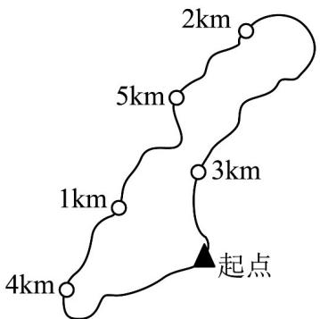

> [!faq]- 《专题2.1 等式性质与不等式性质（高效培优讲义）》官方解析
>
> > [!success]- **【答案】** A．若 $a > b > 0, c < d < 0$ ，则一定有 $\frac{a}{c} > \frac{b}{d}$ B．若 $\frac{a}{c^2} > \frac{b}{c^2}$ ，则 $a > b$ C．若 $b > a > 0, m > 0$ ，则 $\frac{a + m}{b + m} > \frac{a}{b}$ D．若 $a > b, c < d$ ，则 $a - c > b - d$
>
> > [!note]- **【分析】**
> > 对 $^{A}$ 举反例即可判断；对 $^{B}$ 和 $^{D}$ ，利用不等式基本性质即可判断；对 $^{C}$ ，利用作差法即可判断。
>
> > [!note]- **【解析】**
> > 对于 A，若 a=2, b=1, c=-2, d=-1，则 $\frac{a}{c}=\frac{b}{d}$ ，故 A 错误.
> >
> > 对于 B，由 $\frac{a}{c^{2}} > \frac{b}{c^{2}}$ ，可知 $c^{2} \neq 0$ ，所以 $c^{2} > 0$ ，所以 a > b·故 B 正确·
> >
> > 对于 C， $\frac{a+m}{b+m}-\frac{a}{b}=\frac{ab+bm-ab-am}{b\cdot(b+m)}=\frac{m(b-a)}{b\cdot(b+m)}$ ，因为 b>a>0,m>0
> >
> > 所以 $\frac{m(b-a)}{b\cdot(b+m)}>0$ ，所以 $\frac{a+m}{b+m}>\frac{a}{b}$ ·故 C 正确·
> >
> > 对于 $^{D}$ ，因为 c < d，所以 $-c > -d \cdot$ 又 a > b，所以 a - c > b - d · 故 $^{D}$ 正确·
> >
> > 故选：A.
> >
> > 17. 刘老师沿着某公园的环形道（周长大于 $1 \mathrm{~km}$ ）按逆时针方向跑步，他从起点出发、并用软件记录了运动
> >
> > 轨迹，他每跑 $1\mathrm{km}$ ，软件会在运动轨迹上标注出相应的里程数。已知刘老师共跑了 $11\mathrm{km}$ ，恰好回到起点，
> >
> > 前 $5\mathrm{km}$ 的记录数据如图所示，则刘老师总共跑的圈数为（）
> >
> > 
> >
> > A. 7 B. 8 C. 9 D. 10
> >
> > 【答案】B
> >
> > 【分析】利用环形道的周长与里程数的关系建立不等关系求出周长的范围，再结合跑回原点的长度建立方程，
> >
> > 即可求解·
> >
> > 【详解】设公园的环形道的周长为 t，刘老师总共跑的圈数为 x， $(x \in \mathbb{N}^{*})$ ，
> > 则由题意 $\left\{\begin{aligned}&1<t<2\\ &2t<3\\ &3t>4\\ &4t>5\end{aligned}\right.$ ，所以 $\frac{4}{3}<t<\frac{3}{2}$ ，
> >
> > 所以 $\frac{2}{3} < \frac{1}{t} < \frac{3}{4}$ ，因为 $xt = 11$ ，所以 $\frac{22}{3} < x = \frac{11}{t} < \frac{33}{4}$ ，又 $x \in \mathbb{N}^*$ ，所以 $x = 8$ ，
> >
> > 即刘老师总共跑的圈数为 8.
> >
> > 故选 **B**
