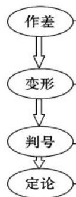

> [!faq]- 《专题2.1 等式性质与不等式性质（高效培优讲义）》官方解析
>
> > [!success]- **【答案】** AB
>
> > [!note]- **【解析】**
> > 因为 $P - R = \sqrt{2} - (\sqrt{6} - \sqrt{2}) = 2\sqrt{2} - \sqrt{6} > 0$ ，所以 $P > R$
> >
> > 因为 $R - Q = \sqrt{6} -\sqrt{2} -(\sqrt{7} -\sqrt{3}) = (\sqrt{6} +\sqrt{3}) - (\sqrt{7} +\sqrt{2})$
> >
> > 又 $(\sqrt{6} +\sqrt{3})^2 = 9 + 2\sqrt{18},(\sqrt{7} +\sqrt{2})^2 = 9 + 2\sqrt{14}$ ，所以 $\sqrt{6} +\sqrt{3} >\sqrt{7} +\sqrt{2}$ ，所以 $R > Q$
> >
> > ## 方法技巧
> >
> > ## 作差法比较大小的步骤
> >
> > 
> >
> > 两个实数（或代数式）的大小，可以根据它们的差的符号进行判断
> >
> > (1) 进行因式分解转化为多个因式相乘
> >
> > (2) 通过配方转化为几个非负实数之和
> >
> > 注意题目本身提供的字母的取值范围
> >
> > 根据符号判断大小
