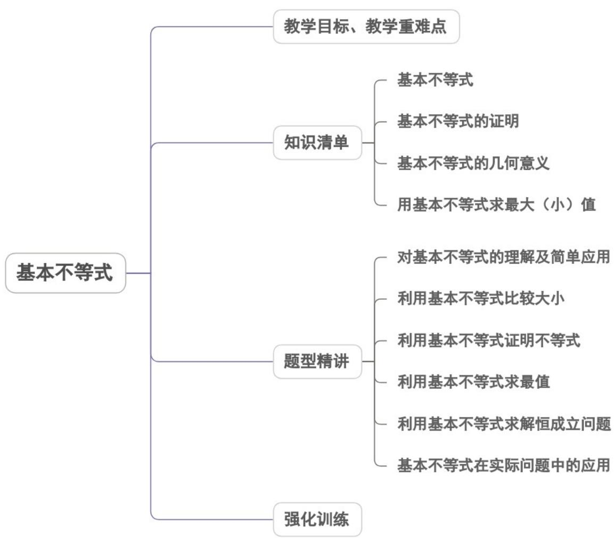
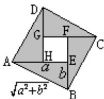
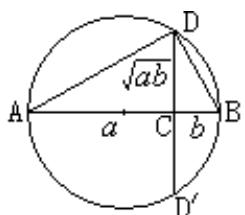
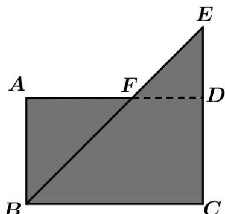
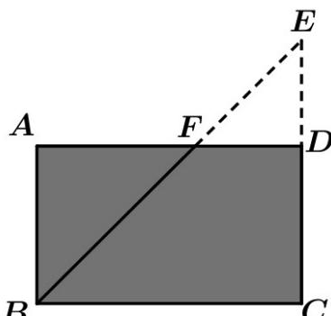
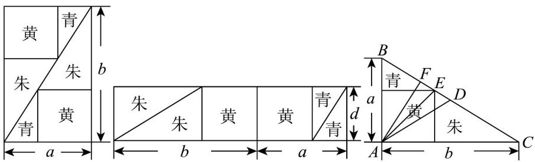

<!-- source-part:1 pages:1-50 -->

## 专题2.2 基本不等式

## 教学目标、教学重难点

<table><tr><td>教学目标</td><td>1.掌握重要的不等式、基本不等式(均值不等式)的内容,成立条件及公式的证明。2.利用基本不等式的性质及变形求相关函数的最值及证明。</td></tr><tr><td>教学重难点</td><td>1.重点:利用基本不等式解决问题.2.难点:基本不等式的应用.</td></tr></table>

## 知识清单

## 知识点 01 基本不等式

1. 对公式 $a^{2} + b^{2}$ 2ab 及 $\frac{a + b}{2} \sqrt{ab}$ 的理解.

（1）成立的条件是不同的：前者只要求 $a, b$ 都是实数，而后者要求 $a, b$ 都是正数；

(2) 取等号“=”的条件在形式上是相同的，都是“当且仅当 a = b 时取等号”.

2.由公式 $a^2 + b^2 = 2ab$ 和 $\frac{a + b}{2} = \sqrt{ab}$ 可以引申出常用的常用结论

① $\frac{b}{a}+\frac{a}{b}\quad2\quad(a,b$ 同号）；

② $\frac{b}{a} +\frac{a}{b}\leq -2$ （ $a,b$ 异号）；

$$
\frac {2}{\frac {1}{a} + \frac {1}{b}} \leq \sqrt {a b} \leq \frac {a + b}{2} \leq \sqrt {\frac {a ^ {2} + b ^ {2}}{2}} (a > 0, b > 0) \text {或} a b \leq (\frac {a + b}{2}) ^ {2} \leq \frac {a ^ {2} + b ^ {2}}{2} (a > 0, b > 0) \tag {③}
$$

## 【即学即练】

1. 若实数 $x, y, z$ 满足 $x + y + z = 0$ ，且 $x > y > z$ ，则 $\frac{y}{\sqrt{x^2 + z^2}}$ 的取值范围为（）

【答案】
A. $\left(-\frac{\sqrt{5}}{5}, \frac{\sqrt{5}}{5}\right)$ B. $\left(-\frac{\sqrt{2}}{2}, \frac{\sqrt{2}}{2}\right)$ C. $\left(-\frac{1}{2}, \frac{1}{2}\right)$ D. $(-1, 1)$

【答案】A

【详解】因为 $x > y > z, x + y + z = 0$

所以 $y = -(x + z)$ 且 $x > -(x + z) > z$ ,

故 $-2 < \frac{z}{x} < -\frac{1}{2}$ 且 x > 0，

所以 $-\frac{5}{2}<\frac{z}{x}+\frac{x}{z}\leq-2$

故 $-\frac{1}{2} \leq \frac{1}{\frac{z}{x} + \frac{x}{z}} < -\frac{2}{5}$ ,

$$
- 1 \leq \frac {2}{\frac {z}{x} + \frac {x}{z}} <   - \frac {4}{5},
$$

$$
\left(\frac {y}{\sqrt {x ^ {2} + z ^ {2}}}\right) ^ {2} = \frac {y ^ {2}}{x ^ {2} + z ^ {2}} = \frac {(x + z) ^ {2}}{x ^ {2} + z ^ {2}} = 1 + \frac {2 x z}{x ^ {2} + z ^ {2}} = 1 + \frac {2}{\frac {z}{x} + \frac {x}{z}} \in [ 0, \frac {1}{5})
$$

所以 $\frac{y}{\sqrt{x^2 + z^2}}\in (-\frac{\sqrt{5}}{5},\frac{\sqrt{5}}{5})$

故选：A

2. 设 $a > 0, b > 0$ ，则“ $\frac{a + b}{2}$ 6”是“ $\sqrt{ab}$ 6”的（）

【答案】
A. 充分不必要条件
B. 必要不充分条件
C. 充要条件
D. 既不充分也不必要条件

【答案】B

【详解】 $\because a > 0, b > 0, \therefore \frac{a + b}{2} \sqrt{ab}$ ，当且仅当 $a = b$ 时等号成立，若 $\sqrt{ab} 6$ 时， $\frac{a + b}{2} \sqrt{ab} 6$ ，则 $\sqrt{ab} 6 \Rightarrow \frac{a + b}{2} 6$ ，

即“ $\frac{a+b}{2}$ 6”是“ $\sqrt{ab}$ 6”的必要不充分条件，
而 $\frac{a+b}{2}$ 6无法推出 $\sqrt{ab}$ 6，
所以“ $\frac{a+b}{2}$ 6”是“ $\sqrt{ab}$ 6”的必要不充分条件.

故选：B·

3. 下列说法正确的是（ ）

【答案】
A. $x + \frac{1}{x}$ 最小值为 2
B. $x + \frac{1}{x}$ 最大值为 2
C. $\sqrt{x^{2}+1}+\frac{1}{\sqrt{x^{2}+1}}$ 最小值为 2
D. $\sqrt{x^{2}+1}+\frac{1}{\sqrt{x^{2}+1}}$ 最大值为 2

【答案】C

【详解】当 $x > 0$ 时， $x + \frac{1}{x} - 2\sqrt{x \times \frac{1}{x}} = 2$ ，当且仅当 $x = \frac{1}{x}$ 即 $x = 1$ 时，等号成立；当 $x < 0$ 时， $x + \frac{1}{x} = -\left[(-x) + \frac{1}{(-x)}\right] \leq -2\sqrt{(-x) \times \frac{1}{(-x)}} = -2$ ，当且仅当 $(-x) = \frac{1}{(-x)}$ 即 $x = -1$ 时，等号成立；故选项AB错误；任意 $x \in \mathbb{R}$ ， $\sqrt{x^2 + 1} + \frac{1}{\sqrt{x^2 + 1}} - 2$ ，当且仅当 $\sqrt{x^2 + 1} = \frac{1}{\sqrt{x^2 + 1}}$ 时，即 $x^2 = 0$ 也即 $x = 0$ 时，等号成立，所以 $\sqrt{x^2 + 1} + \frac{1}{\sqrt{x^2 + 1}}$ 最小值为 $2$ ，故选项C正确；当 $x$ 趋向于无穷大时， $\sqrt{x^2 + 1} + \frac{1}{\sqrt{x^2 + 1}}$ 也趋向于无穷大，所以 $\sqrt{x^2 + 1} + \frac{1}{\sqrt{x^2 + 1}}$ 无最大值，

故 $^{D}$ 错误·

故选：C.

知识点 02 基本不等式 $\sqrt{ab} \leq \frac{a + b}{2}$ 的证明

方法一：几何面积法

如图，在正方形 ABCD 中有四个全等的直角三角形.

设直角三角形的两条直角边长为 $a$ 、 $b$ ，那么正方形的边长为 $\sqrt{a^2 + b^2}$ .这样，4个直角三角形的面积的和是

2ab，正方形ABCD的面积为 $a^2 + b^2$ 。由于4个直角三角形的面积小于正方形的面积，所以： $a^2 + b^2 - 2ab$ 。当

直角三角形变为等腰直角三角形，即 $a = b$ 时，正方形 $EFGH$ 缩为一个点，这时有 $a^2 + b^2 = 2ab$

得到结论：如果 $a, b \in \mathbb{R}^{+}$ ，那么 $a^2 + b^2 = 2ab$ （当且仅当 $a = b$ 时取等号“=”）

特别的，如果 $a > 0$ ， $b > 0$ ，我们用 $\sqrt{a}$ 、 $\sqrt{b}$ 分别代替 $a$ 、 $b$ ，可得：

如果 $a > 0$ ， $b > 0$ ，则 $a + b = 2\sqrt{ab}$ （当且仅当 $a = b$ 时取等号“=”）.

通常我们把上式写作：如果 $a > 0$ ， $b > 0$ ， $\sqrt{ab} \leq \frac{a + b}{2}$ ，（当且仅当 $a = b$ 时取等号“=”）

方法二：代数法

$\therefore a^{2} + b^{2} - 2ab = (a - b)^{2}\quad 0$ ，当 $a\neq b$ 时， $(a - b)^{2} > 0$ ；当 $a = b$ 时， $(a - b)^{2} = 0$

所以 $(a^{2}+b^{2})$ 2ab ，（当且仅当 a=b 时取等号“=”）.

## 【即学即练】

1. 已知 $a > 0, b > 0$ ，则使 $\frac{1}{a} + \frac{1}{b} = 4$ 成立的一个必要不充分条件是（）A. $a^2 + b^2 = 1$ B. $a + b \geq 4ab$ C. $a + b = 1$ D. $\frac{1}{a^2} + \frac{1}{b^2} = 8$

【答案】D

【详解】对于 A，令 $a=\frac{1}{2}, b=\frac{1}{3}$ ，显然有 $\frac{1}{a}+\frac{1}{b}$ ，但 $a^{2}+b^{2}\neq1$ ，A 不是；

对于 B，当 a > 0，b > 0 时， $a + b \quad 4ab \Leftrightarrow \frac{1}{a} + \frac{1}{b} \quad 4$ ，B 不是；

对于 C， $a=\frac{1}{2},b=\frac{1}{3}$ ，显然有 $\frac{1}{a}+\frac{1}{b}$ ，4，但 $a+b\neq1$ ，C 不是；

对于 D，当 $\frac{1}{a} + \frac{1}{b}$ 4，则 $\frac{\frac{1}{a^{2}} + \frac{1}{b^{2}}}{2}$ $\left(\frac{\frac{1}{a} + \frac{1}{b}}{2}\right)^{2}$ 4，即 $\frac{1}{a^{2}} + \frac{1}{b^{2}}$ 8，

反过来，令 $a = \frac{1}{3}, b = 2$ ，不等式 $\frac{1}{a^2} + \frac{1}{b^2}$ 8成立，而 $\frac{1}{a} + \frac{1}{b} = 3.5 < 4$ D是·

故选：D

2. 若 $a > 0, b > 0$ ，则使 $a + b \leq 4$ 成立的一个充分不必要条件为（）

【答案】

A. $\frac{1}{a} +\frac{1}{b}\leq 1$ B. $\frac{b^2}{a} +\frac{a^2}{b}$ 4 C. $a^2 +b^2\leq 8$ D. $\frac{b}{a} +\frac{a}{b}$ 4

【答案】C

【详解】对于 A，易知当 $a=4, b=4$ 时满足 $\frac{1}{a}+\frac{1}{b}\leq1$ ，但此时 $a+b\leq4$ 不成立，可知 A 错误；

对于 B，当 a=4, b=4，可知 $\frac{b^{2}}{a}+\frac{a^{2}}{b}$ 成立，但 $a+b\leq4$ 不成立，可知 B 错误；

对于 C，由 $a^{2}+b^{2}\leq8$ 可得 $\frac{(a+b)^{2}}{2}\leq a^{2}+b^{2}\leq8$ ，即可得 $a+b\leq4$ ，即充分性成立；

当 a=3, b=1 时，满足 $a+b\leq4$ ，但此时 $a^{2}+b^{2}\leq8$ 不成立，即必要性不成立，可得 C 正确；

对于 D，当 a=4, b=1 时，易知 $\frac{b}{a}+\frac{a}{b}$ 成立，此时 $a+b\leq4$ 不成立，可得 D 错误。

故选：C

3. 已知 $a, b > 0$ ，则下列不等式中不成立的是（）

【答案】

A. $a + b + \frac{1}{\sqrt{ab}} 2\sqrt{2}$ B. $(a + b)\left(\frac{1}{a} + \frac{1}{b}\right) 4$ C. $\frac{a^2 + b^2}{\sqrt{ab}} 2\sqrt{ab}$ D. $\frac{2ab}{a + b} > \sqrt{ab}$

【答案】D

【详解】A. $\because a+b$ $2\sqrt{ab}$ （当且仅当a=b时取等号），

$a+b+\frac{1}{\sqrt{ab}}$ $2\sqrt{ab}+\frac{1}{\sqrt{ab}}$ $2\sqrt{2\sqrt{ab}\cdot\frac{1}{\sqrt{ab}}}=2\sqrt{2}$ ，当且仅当 $2\sqrt{ab}=\frac{1}{\sqrt{ab}}$ 且 a=b 时取等号·

选项 A 正确·

B. $(a+b)\left(\frac{1}{a}+\frac{1}{b}\right)=1+1+\frac{b}{a}+\frac{a}{b}\quad2+2\sqrt{\frac{b}{a}\cdot\frac{a}{b}}=4$ ，当且仅当 $\frac{b}{a}=\frac{a}{b}$ 即a=b时取等号·

选项 B 正确·

C. $\because a^{2}+b^{2}\quad2ab$ （当且仅当 a=b 时取等号），

$$
\therefore \frac {a ^ {2} + b ^ {2}}{\sqrt {a b}} \quad \frac {2 a b}{\sqrt {a b}} = 2 \sqrt {a b}.
$$

选项 C 正确·

D. $\because a+b\quad2\sqrt{ab}$ （当且仅当 a=b 时取等号），

$$
\therefore \frac {2 a b}{a + b} \leq \frac {2 a b}{2 \sqrt {a b}} = \sqrt {a b}.
$$

选项 D 错误·

故选：D.

知识点03 基本不等式 $\sqrt{ab} \leq \frac{a + b}{2}$ 的几何意义

如图，AB 是圆的直径，点 C 是 AB 上的一点，AC = a，BC = b，过点 C 作 $DC \perp AB$ 交圆于点 D，连接 AD、BD.

易证 $Rt\Delta ACD \sim Rt\Delta DCB$ ，那么 $CD^2 = CA \cdot CB$ ，即 $CD = \sqrt{ab}$ 。

这个圆的半径为 $\frac{a + b}{2}$ ，它大于或等于 $CD$ ，即 $\frac{a + b}{2} \sqrt{ab}$ ，其中当且仅当点 $C$ 与圆心重合，即 $a = b$ 时，等

号成立.

## 【即学即练】

1. 数学里有一种证明方法叫做Proof without words，也被称为无字证明，是指仅用图象而无需文字解释就能不证自明的数学命题，由于这种证明方法的特殊性，无字证明被认为比严格的数学证明更为优雅与有条理·在同一平面内有形状、大小相同的图 $^{1}$ 和图 $^{2}$ ，其中四边形ABCD为矩形，三角形BCE为等腰直角三角形，设 $AB=\sqrt{a}$ ， $BC=\sqrt{b}(a>0,b>0)$ ，则借助这两个图形可以直接无字证明的不等式是（）

【答案】

图1

图2

A. $\frac{a + b}{2} \sqrt{ab} (a > 0, b > 0)$ B. $\frac{a + b}{2} \leq \sqrt{\frac{a^2 + b^2}{2}} (a > 0, b > 0)$ C. $\frac{2ab}{a + b} \leq \sqrt{ab} (a > 0, b > 0)$ D. $a^2 + b^2 = 2\sqrt{ab} (a > 0, b > 0)$

【答案】A

【详解】由四边形ABCD为矩形，三角形BCE为等腰直角三角形，可推出三角形ABF也为等腰直角三角形，

$$
S _ {1} = S _ {\Delta A B F} + S _ {\Delta B C E} = \frac {1}{2} \sqrt {a} \cdot \sqrt {a} + \frac {1}{2} \sqrt {b} \cdot \sqrt {b} = \frac {a + b}{2}
$$

图2阴影部分的面积 $S_{2} = S_{ABCD} = \sqrt{a}\cdot \sqrt{b} = \sqrt{ab}$

由两图阴影部分面积关系直观得出 $S_{1} \quad S_{2}$ ，即 $\frac{a + b}{2} \sqrt{ab}$ ，当且仅当 $a = b$ 时，等号成立·

故选：A.

2．《九章算术》中“勾股容方”问题：“今有勾五步，股十二步，问勾中容方几何？”魏晋时期数学家刘徽在其
《九章算术注》中利用出入相补原理给出了这个问题的一般解法：如图（1），用对角线将长和宽分别为b和a的矩形分成两个直角三角形，每个直角三角形再分成一个内接正方形（黄）和两个小直角三角形（朱、青）·将三种颜色的图形进行重组，得到如图（2）所示的矩形，该矩形长为 $a+b$ ，宽为内接正方形的边长d.
由刘徽构造的图形可以得到许多重要的结论，如图（3），设D为斜边BC的中点，作直角三角形ABC的内
接正方形的对角线AE，过点A作AF⊥BC于点F，下列推理正确的是（）

(2)
(1)

(3)

A. 由题图（1）和题图（2）面积相等得 $d = \frac{2ab}{a + b}$

B. 由 $AE$ $AF$ 可得 $\sqrt{\frac{a^2 + b^2}{2}}$ $\frac{2}{\frac{1}{a} + \frac{1}{b}}$

C. 由 AD AE 可得 $\sqrt{\frac{a^{2}+b^{2}}{2}}$ $\frac{a+b}{2}$

D. 由 $AD$ $AF$ 可得 $a^2 + b^2$ $2ab$

【答案】D

【详解】A选项：由图（1）和图（2）面积相等可得 $ab = (a + b)d$ ，所以 $d = \frac{ab}{a + b}$ ，A错误；

B 选项：因为 $AF \perp BC$ ，所以 $\frac{1}{2} ab = \frac{1}{2}\sqrt{a^2 + b^2} \times AF$ ，得 $AF = \frac{ab}{\sqrt{a^2 + b^2}}$

设图（3）中正方形边长为 $t$ ，因为小三角形（青）与VABC相识，

所以 $\frac{a-t}{a}=\frac{t}{b}$ ，解得 $t=\frac{ab}{a+b}$ ，所以 $AE=\frac{\sqrt{2}ab}{a+b}$

因为 AE AF，所以 $\frac{\sqrt{2}ab}{a+b}$ $\frac{ab}{\sqrt{a^{2}+b^{2}}}$ ，整理得 $\sqrt{\frac{a^{2}+b^{2}}{2}}$ $\frac{a+b}{2}$ ， $^{B}$ 错误；

C 选项：因为 D 为斜边 BC 的中点，所以 $BD = \frac{\sqrt{a^{2} + b^{2}}}{2}$ ，

因为 $AD \quad AE$ ，所以 $\frac{\sqrt{a^2 + b^2}}{2} \quad \frac{\sqrt{2}ab}{a + b}$ ，整理得 $\sqrt{\frac{a^2 + b^2}{2}} \quad \frac{2}{\frac{1}{a} + \frac{1}{b}}$ ，C 错误；

$^{D}$ 选项：因为 AD AF，所以 $\frac{\sqrt{a^{2}+b^{2}}}{2}$ $\frac{ab}{\sqrt{a^{2}+b^{2}}}$ ，整理得 $a^{2}+b^{2}$ 2ab， $^{D}$ 正确·

故选：D

## 知识点 04 用基本不等式 $\sqrt{ab} \leq \frac{a + b}{2}$ 求最大（小）值

在用基本不等式求函数的最值时，应具备三个条件：一正二定三取等.

① 一正：函数的解析式中，各项均为正数；

② 二定：函数的解析式中，含变数的各项的和或积必须有一个为定值；

③ 三取等：函数的解析式中，含变数的各项均相等，取得最值.

## 【即学即练】

1. 已知 $0 < n < 1 < m$ ，且 $m + n = 2$ ，则 $\frac{m^2}{m - 1} + \frac{n^2 + 2}{n}$ 的最小值为（）A.8 B. $4 + 2\sqrt{2}$ C. $5 + 2\sqrt{2}$ D. $6 + 2\sqrt{2}$

【答案】D

【详解】由 0 < n < 1 < m ，且 $m + n = 2$ ，

所以 $\frac{m^2}{m - 1} +\frac{n^2 + 2}{n} = \frac{m^2 - 1 + 1}{m - 1} +\frac{n^2 + 2}{n} = m + 1 + \frac{1}{m - 1} +n + \frac{2}{n} = 3 + \frac{1}{m - 1} +\frac{2}{n}$ $\left(\frac{1}{m - 1} +\frac{2}{n}\right)\left[(m - 1) + n\right] = 3 + \frac{n}{m - 1} +\frac{2(m - 1)}{n}\quad 3 + 2\sqrt{\frac{n}{m - 1}\cdot\frac{2(m - 1)}{n}} = 3 + 2\sqrt{2}$

当且仅当 $\frac{n}{m - 1} = \frac{2(m - 1)}{n}$ 即 $n = \sqrt{2}(m - 1)$ ， $m = \sqrt{2}, n = 2 - \sqrt{2}$ 时取等号，所以 $3 + \frac{1}{m - 1} + \frac{2}{n} \quad 6 + 2\sqrt{2}$ 所以 $\frac{m^2}{m - 1} + \frac{n^2 + 2}{n}$ 的最小值为 $6 + 2\sqrt{2}$

故选：D

2. 已知 $x > 0, y > -1, z > 0, 2y + 3z = 2 - x$ ，则 $\frac{3}{x} + \frac{1}{y + 1} + \frac{1}{z}$ 的最小值为（）A. $\frac{7}{2} + \sqrt{6}$ B. $\frac{7 + \sqrt{6}}{2}$ C. $\frac{5 + \sqrt{6}}{2}$ D. $\frac{5}{2} + \sqrt{6}$

【答案】A

【详解】因为 $x+2y+3z=2$ ，所以 $x+2(y+1)+3z=4$ ，
所以 $4\left(\frac{3}{x}+\frac{1}{y+1}+\frac{1}{z}\right)=\left[x+2(y+1)+3z\right]\left(\frac{3}{x}+\frac{1}{y+1}+\frac{1}{z}\right)$ ，
所以 $4\left(\frac{3}{x}+\frac{1}{y+1}+\frac{1}{z}\right)=2+\frac{2(y+1)}{z}+\frac{6(y+1)}{x}+\frac{3z}{y+1}+3+\frac{9z}{x}+\frac{x}{y+1}+\frac{x}{z}+3$ 又 $\frac{2(y+1)}{z}+\frac{3z}{y+1}\quad2\sqrt{6}$ ，当且仅当 $y+1=\frac{\sqrt{6}}{2}z$ 时等号成立， $\frac{6(y+1)}{x}+\frac{x}{y+1}\quad2\sqrt{6}$ ，当且仅当 $y+1=\frac{\sqrt{6}}{6}x$ 时等号成立， $\frac{9z}{x}+\frac{x}{z}\quad2\sqrt{9}=6$ ，当且仅当 $x=3z$ 时等号成立，
三个等号可同时成立，所以 $\left[4\left(\frac{3}{x}+\frac{1}{y+1}+\frac{1}{z}\right)\right]_{\min}=14+4\sqrt{6}$ 当且仅当 $x=\frac{12-2\sqrt{6}}{5},y=\frac{2\sqrt{6}-7}{5},z=\frac{12-2\sqrt{6}}{15}$ 时等号成立，
所以 $\frac{3}{x}+\frac{1}{y+1}+\frac{1}{z}$ 的最小值为 $\frac{7}{2}+\sqrt{6}$

故选：A.

3. 已知正数 $m$ ， $n$ 满足 $m^2 + 4n^2 = 5$ ，则 $\frac{m - \frac{2m}{2n + 3}}{m}$ 的最大值为（）A. $\frac{1}{2}$ B. 1 C. $\sqrt{2}$ D. 2

【答案】B

【详解】因为 $m^{2}+4n^{2}=5$ ，所以 $m-\frac{2m}{2n+3}=\frac{m(2n+1)}{2n+3}\leq\frac{m^{2}+(2n+1)^{2}}{2(2n+3)}=\frac{m^{2}+4n^{2}+4n+1}{2(2n+3)}=\frac{4n+6}{2(2n+3)}=1$ ，
当且仅当 $m = 2n + 1$ ，即 $\left\{\begin{aligned}m &= 2\\ n &= \frac{1}{2}\end{aligned}\right.$ 时取等号·

故选：B.

## 题型精讲

![[高中/课堂同步/题库/人教A版高中数学同步讲义(2026)/01_必修第一册/第二章 一元二次函数、方程和不等式/专题2.2 基本不等式（高效培优讲义）/题型01_对基本不等式的理解及简单应用/题型01_对基本不等式的理解及简单应用.md]]
![[高中/课堂同步/题库/人教A版高中数学同步讲义(2026)/01_必修第一册/第二章 一元二次函数、方程和不等式/专题2.2 基本不等式（高效培优讲义）/题型02_利用基本不等式比较大小/题型02_利用基本不等式比较大小.md]]
![[高中/课堂同步/题库/人教A版高中数学同步讲义(2026)/01_必修第一册/第二章 一元二次函数、方程和不等式/专题2.2 基本不等式（高效培优讲义）/题型03_利用基本不等式证明不等式/题型03_利用基本不等式证明不等式.md]]
![[高中/课堂同步/题库/人教A版高中数学同步讲义(2026)/01_必修第一册/第二章 一元二次函数、方程和不等式/专题2.2 基本不等式（高效培优讲义）/题型04_利用基本不等式求最值/题型04_利用基本不等式求最值.md]]
![[高中/课堂同步/题库/人教A版高中数学同步讲义(2026)/01_必修第一册/第二章 一元二次函数、方程和不等式/专题2.2 基本不等式（高效培优讲义）/题型05_利用基本不等式求解恒成立问题_典例1_设_x_0__y_0__/题型05_利用基本不等式求解恒成立问题_典例1_设_x_0__y_.md]]
![[高中/课堂同步/题库/人教A版高中数学同步讲义(2026)/01_必修第一册/第二章 一元二次函数、方程和不等式/专题2.2 基本不等式（高效培优讲义）/题型06_基本不等式在实际问题中的应用/题型06_基本不等式在实际问题中的应用.md]]
![[高中/课堂同步/题库/人教A版高中数学同步讲义(2026)/01_必修第一册/第二章 一元二次函数、方程和不等式/专题2.2 基本不等式（高效培优讲义）/强化训练/强化训练.md]]
