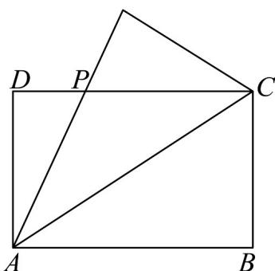

<!-- question-source:start -->
20．如图，设矩形 $ABCD(AB>AD)$ 的周长为24，把VABC沿AC向△ADC折叠，AB折过去后交DC于点P，设AB=x，求△ADP的最大面积及相应x的值．

<!-- question-source:end -->

![[高中/课堂同步/题库/人教A版高中数学同步讲义(2026)/01_必修第一册/第二章 一元二次函数、方程和不等式/专题2.2 基本不等式（高效培优讲义）/强化训练/questions/answers/Q00074881A1.md]]
