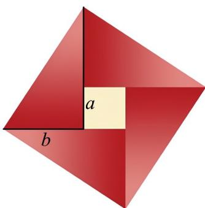

<!-- question-source:start -->
【变式1】如图在北京召开的第 $^{24}$ 届国际数学家大会的会标，会标是根据中国古代数学家赵爽的弦图设计的，

颜色的明暗使它看上去像一个风车，代表中国人民热情好客。我们教材中利用该图作为一个说法的一个几何

解释，这个说法正确的是（）

A. 如果 $a > b > 0$ ，那么 $\sqrt{a} > \sqrt{b}$ B. 如果 $a > b > 0$ ，那么 $a^2 > b^2$

C．对任意正实数 a 和 b，有 $a^{2} + b^{2} - 2ab$ ，当且仅当 a = b 时等号成立 D．对任意正实数 a 和 b，有 $a+b\quad2\sqrt{ab}$ ，当且仅当 $a=b$ 时等号成立
<!-- question-source:end -->

![[高中/课堂同步/题库/人教A版高中数学同步讲义(2026)/01_必修第一册/第二章 一元二次函数、方程和不等式/专题2.2 基本不等式（高效培优讲义）/题型06_基本不等式在实际问题中的应用/questions/answers/Q00074861A1.md]]
