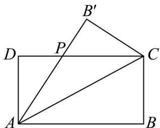

<!-- question-source:start -->
【变式3】如图，设矩形 $ABCD(AB > AD)$ 的周长为 24cm，把 VABC 沿 AC 向 $\triangle ADC$ 折叠，AB 折过去后交

$DC$ 于点 $P$ ，设 $AB = x\mathrm{cm}$ ， $CP = a\mathrm{cm}$

(1) 当 $x = 8$ 时，求 $a$ 的值；

(2)设 $VCPB'$ 的面积为S，求S的最大值.
<!-- question-source:end -->

![[高中/课堂同步/题库/人教A版高中数学同步讲义(2026)/01_必修第一册/第二章 一元二次函数、方程和不等式/专题2.2 基本不等式（高效培优讲义）/题型06_基本不等式在实际问题中的应用/questions/answers/Q00074863A1.md]]
