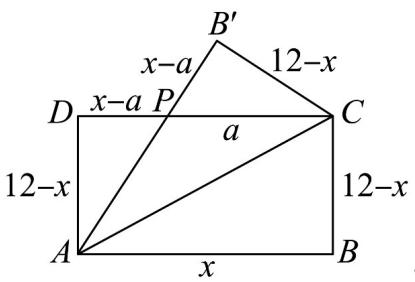

> [!faq]- 《专题2.2 基本不等式（高效培优讲义）》官方解析
>
> > [!success]- **【答案】** (1) $a = 5$ (2) $\left(108-72\sqrt{2}\right)\mathrm{cm}^{2}$
>
> > [!note]- **【解析】**
> > （1）如图，由矩形 $ABCD(AB > AD)$ 的周长为 24cm，AB = 8cm，可知 $AD = 4cm$ ， $DP = (8 - a)\text{cm}$ .
> >
> > $$
> > \because \angle A P D = \angle C P B ^ {\prime} \quad \angle A D P = \angle C B ^ {\prime} P = 9 0 ^ {\circ} \quad A D = C B ^ {\prime}
> > $$
> >
> > $\therefore \mathrm{Rt}\triangle ADP\cong \mathrm{Rt}\triangle CB^{\prime}P$
> >
> > $$
> > \therefore A P = C P = a \mathrm{cm}
> > $$
> >
> > 在 Rt△ADP 中，由勾股定理得 $AD^{2} + DP^{2} = AP^{2}$ ，即 $4^{2} + (8 - a)^{2} = a^{2}$ ，解得 a = 5。
> >
> > (2) 如图，由矩形 $ABCD(AB > AD)$ 的周长为 24cm，可知 $AD = (12 - x)\mathrm{cm}$ ， $DP = (x - a)\mathrm{cm}$ ，
> >
> > $$
> > \because \angle A P D = \angle C P B ^ {\prime} \quad \angle A D P = \angle C B ^ {\prime} P = 9 0 ^ {\circ} \quad A D = C B ^ {\prime}
> > $$
> >
> > 
> >
> > $\therefore \mathrm{Rt}\triangle ADP \cong \mathrm{Rt}\triangle CB'P$
> >
> > $$
> > \therefore A P = C P = a \mathrm{cm}
> > $$
> >
> > 在 Rt△ADP 中，由勾股定理得 $AD^{2} + DP^{2} = AP^{2}$ ，即 $(12 - x)^{2} + (x - a)^{2} = a^{2}$
> >
> > 解得 $a=\frac{x^{2}-12x+72}{x}$
> >
> > 所以 DP = x - a = $\frac{12x - 72}{x}$ .
> >
> > 所以 $\mathrm{VCPB}^{\prime}$ 的面积为 $S = \frac{1}{2} PB^{\prime}\cdot B^{\prime}C = \frac{1}{2}\times \frac{12x - 72}{x}\times (12 - x)$
> >
> > $$
> > = 6 \times \frac {- x ^ {2} + 1 8 x - 7 2}{x} = 6 \left[ - \left(x + \frac {7 2}{x}\right) + 1 8 \right].
> > $$
> >
> > 由基本不等式与不等式的性质，得 $S \leq 6 \times \left(-2\sqrt{x \cdot \frac{72}{x}} + 18\right) = 108 - 72\sqrt{2}$
> >
> > 当且仅当 $x=\frac{72}{x}$ 时，即当 $x=6\sqrt{2}$ 时， $VCPB'$ 的面积最大，
> >
> > 面积的最大值为 $\left(108-72\sqrt{2}\right)\mathrm{cm}^{2}$ .
