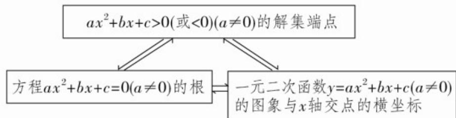

> [!faq]- 《专题2.3 二次函数与一元二次方程、不等式（高效培优讲义）》官方解析
>
> > [!success]- **【答案】** (1) $\left\{k\mid k>\frac{3}{8}\right\}$ (2)1
>
> > [!note]- **【解析】**
> > （1）由题意得 $\left\{ \begin{array}{l} x_{1}x_{2} = \frac{1}{4k^{2} + 1} >0,\\ \Delta = (4k + 1)^{2} - 4(4k^{2} + 1) > 0, \end{array} \right.$ 即 $k > \frac{3}{8}$
> >
> > 所以实数 k 的取值范围为 $\left\{k \mid k > \frac{3}{8}\right\}$ ;
> >
> > (2) 由 (1) 知，当 $k > \frac{3}{8}$ 时，方程有两个实数根，
> >
> > 可知 $x_{1} + x_{2} = \frac{4k + 1}{4k^{2} + 1}, x_{1}x_{2} = \frac{1}{4k^{2} + 1}$
> >
> > 于是 $\frac{x_1}{x_2} +\frac{x_2}{x_1} +4 = \frac{\left(x_1 + x_2\right)^2}{x_1x_2} +2 = \frac{(4k + 1)^2}{4k^2 + 1} +2 = 6 + \frac{8k - 3}{4k^2 + 1}$
> >
> > 由 $k > \frac{3}{8}$ ，则 $8k - 3 > 0$ ，则 $\frac{8k - 3}{4k^2 + 1} > 0$
> >
> > 即要使 $\frac{8k - 3}{4k^2 + 1}$ 的值为正整数，且 $k$ 为整数，则 $\frac{8k - 3}{4k^2 + 1} = 1$
> >
> > 则有 $4k^{2} + 1 \leq 8k - 3$ ，化简得 $(k - 1)^{2} \leq 0$ ，则 $k = 1$ ，
> >
> > 令 $k = 1$ ，此时 $\frac{8k - 3}{4k^2 + 1} = 1$ 为整数，则 $k = 1$ 满足题意.
> >
> > 故使得 $\frac{x_1}{x_2} +\frac{x_2}{x_1} +4$ 的值为整数的整数 $k$ 的值为1·
> >
> > ## 方法技巧
> >
> > ## 三个“二次”之间的关系
> >
> > 1. 三个“二次”中，一元二次函数是主体，讨论一元二次函数主要是将问题转化为一元二次方程和一元二次不等式的形式来研究。
> >
> > 2. 讨论一元二次方程和一元二次不等式又要将其与相应的一元二次函数相联系，通过一元二次函数的图象及性质来解决问题，关系如下：
> >
> > 
