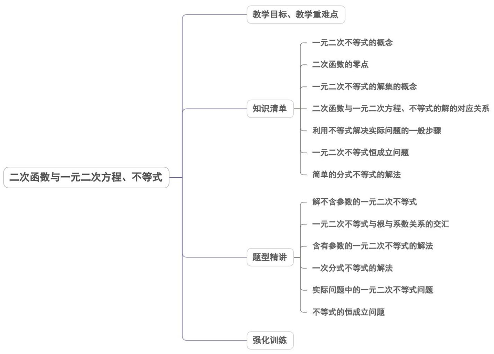
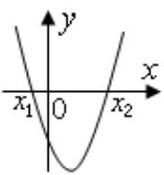
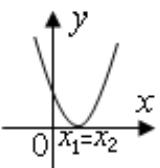
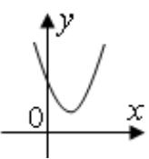
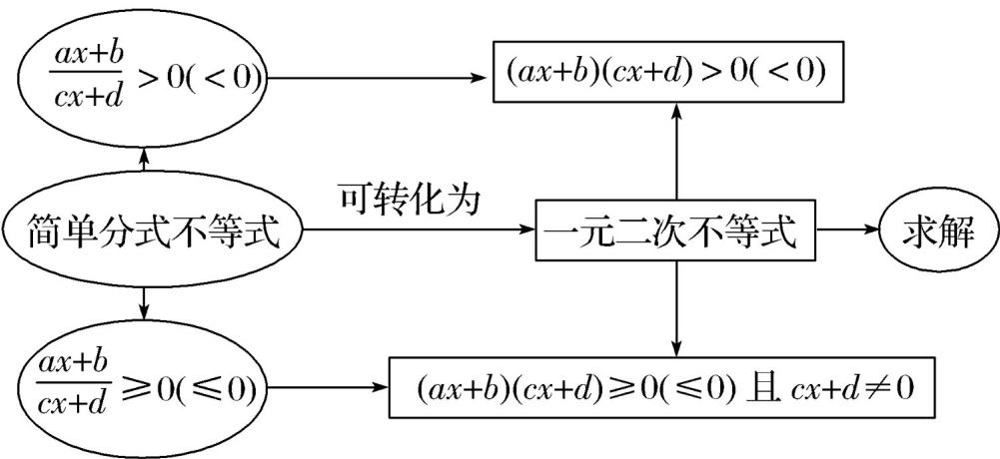

<!-- source-part:1 pages:1-50 -->

## 专题2.3二次函数与一元二次方程、不等式

## 内容概览

教学目标、教学重难点

二次函数与一元二次方程、不等式

## 教学目标、教学重难点

<table><tr><td>教学目标</td><td>1.理解一元二次方程、一元二次不等式与二次函数的关系。2.掌握一元二次方程的求解方法,掌握一元二次方程根与系数的关系以及一元二次方程根的分布情况。3.掌握图象法解一元二次不等式,会解简单的能转化为一元二次不等式的分式不等式。</td></tr><tr><td>教学重难点</td><td>1.重点:一元二次不等式(不含参)的求解与一元二次不等式(含参)的求解2.难点:一元二次不等式与对应函数、方程的关系.</td></tr></table>

## 知识清单

## 知识点 01 一元二次不等式的概念

一般地，我们把只含有一个未知数，并且未知数的最高次数是2的不等式，称为一元二次不等式，即形如 $ax^{2}+bx+c>0(0)$ 或 $ax^{2}+bx+c<0(\leq0)$ （其中a,b,c均为常数， $a\neq0$ ）的不等式都是一元二次不等式。

## 【即学即练】

1. 已知 $ax^2 + bx + c > 0$ 的解集是 $(-2,3)$ ，则下列说法正确的是（ ）A. $a > 0$ B. 不等式 $cx^2 + bx + a < 0$ 的解集是 $\left(-\frac{1}{2}, \frac{1}{3}\right)$ C. $\frac{12}{3b + 4} + b$ 的最小值是 $\frac{8}{3}$ D. 当 $c = 2$ 时， $f(x) = 3ax^2 + 6bx$ ， $x \in [n_1, n_2]$ 的值域是 $[-3,1]$ ，则 $n_2 - n_1$ 的取值范围是 $[2,4]$

【答案】BCD

【详解】对于 A，由题意可知：-2,3 是关于 x 的方程 $ax^{2} + bx + c = 0$ 的两个根，且 a < 0，故 A 错误；

对于 ${}^{\mathrm{B}}$ ，由题意可知： $\left\{ \begin{array}{ll} - \frac{b}{a} = 1\\ \frac{c}{a} = -6 & ,\text{可得}\\ b = -a,c = -6a & a <   0 \end{array} \right.$

不等式 $cx^{2} + bx + a < 0$ 化为： $-6ax^{2} - ax + a < 0$

由 a<0 可得 $6x^{2}+x-1<0$ ，解得 $-\frac{1}{2}<x<\frac{1}{3}$ ，

所以不等式 $cx^2 + bx + a < 0$ 的解集为 $\left(-\frac{1}{2}, \frac{1}{3}\right)$ ，故 $B$ 正确；

对于 C，因为 b = -a ，b > 0

可得 $\frac{12}{3b + 4} + b = \frac{12}{3b + 4} + \frac{1}{3}(3b + 4) - \frac{4}{3}$ $2\sqrt{\frac{12}{3b + 4} \cdot \frac{1}{3}(3b + 4)} - \frac{4}{3} = \frac{8}{3}$

当且仅当 $\frac{12}{3b + 4} = \frac{1}{3}(3b + 4)$ ，即 $b = \frac{2}{3}$ 时，等号成立，

所以 $\frac{12}{3b+4}+b$ 的最小值是 $\frac{8}{3}$ ，故 C 正确；

对于D，当 $c = 2$ 时， $b = -a = \frac{1}{3}$

则 $f(x) = 3ax^{2} + 6bx = -x^{2} + 2x = -(x - 1)^{2} + 1$

当 $x = 1$ 时， $f(x)$ 取到最大值 $f(1) = 1$

由 $f(x) = -3$ 得， $x = -1$ 或 $x = 3$

$f(x) = 3ax^{2} + 6bx, x \in [n_{1}, n_{2}]$ 的值域是 $[-3, 1]$

因 $f(x)$ 在 $\left[n_{1}, n_{2}\right]$ 上的最小值为 -3 ，最大值为 1 ，

从而得 $n_1 = -1, 1 \leq n_2 \leq 3$ 或 $-1 \leq n_1 \leq 1, n_2 = 3$

因此 $2 \leq n_{2} - n_{1} \leq 4$ ，故D正确.

故选：BCD.

2. 已知函数 $y = (a + b)x^2 - (a + 2)x + 2$ ，

(1)若 $a > 0, b > 0$ ，且 $x = 2$ 是方程 $\left(a + b\right)x^2 - (a + 2)x + 2 = 0$ 的一个根，求 $ab$ 的最大值；

(2)若 $b = 2$ ，对 $\forall x\in \mathbf{R}$ ，不等式 $y = 0$ 恒成立，求 $a$ 的取值范围；

(3)若 $b = 0$ ，不等式 $y < 0$ 恰有4个整数解，求 $a$ 的取值范围·

【答案】(1) $\frac{1}{8}$

(2) $-2 \leq a \leq 6$

(3) $\frac{1}{3}\leq a<\frac{2}{5}$

【详解】（1）若 $x = 2$ 是方程 $\left(a + b\right)x^2 -\left(a + 2\right)x + 2 = 0$ 的一个根，

则 $(a+b)\times4-(a+2)\times2+2=0$ ，整理得 $a+2b=1$ ，

因为 $a > 0, b > 0$

所以 $a + 2b$ $2\sqrt{2ab}$ ，即 $1$ $2\sqrt{2ab}$ ，故 $ab \leq \frac{1}{8}$ ，

当且仅当 $a = 2b$ ，即 $a = \frac{1}{2}, b = \frac{1}{4}$ 时， $ab$ 的最大值为 $\frac{1}{8}$ ；

(2) 若 $b = 2$ ，则 $y = (a + 2)x^2 - (a + 2)x + 2 = 0$ ，

当 $a = -2$ 时，不等式为20恒成立，符合题意；

当 $a \neq -2$ 时，对 $\forall x \in \mathbf{R}$ ，不等式 $(a + 2)x^2 - (a + 2)x + 2 = 0$ ，则有：

$$
\left\{ \begin{array}{l} a + 2 > 0 \\ \Delta = (a + 2) ^ {2} - 8 (a + 2) \leq 0 \end{array} \Rightarrow \left\{ \begin{array}{l} a > - 2 \\ - 2 \leq a \leq 6 \end{array} \Rightarrow - 2 <   a \leq 6 \right. \right.
$$

综上，a 的取值范围为 $-2 \leq a \leq 6$ ；

(3) 若 $b = 0$ ，则 $y = ax^2 - (a + 2)x + 2 = (ax - 2)(x - 1) < 0$

要使得不等式有恰有 $^{4}$ 个整数解，则a>0，

则方程 $(ax - 2)(x - 1) = 0$ 的两根为 $x_{1} = \frac{2}{a}, x_{2} = 1$

因为不等式 $(ax-2)(x-1)<0$ 有恰有 $^{4}$ 个整数解，且a>0，

所以 $5 < \frac{2}{a} \leq 6$ ，解得 $\frac{1}{3} \leq a < \frac{2}{5}$

故 $a$ 的取值范围为 $\frac{1}{3} \leq a < \frac{2}{5}$ .

## 知识点 02 二次函数的零点

一般地，对于二次函数 $y = ax^{2} + bx + c$ ，我们把使 $ax^{2} + bx + c = 0$ 的实数 x 叫做二次函数 $y = ax^{2} + bx + c$ 的零点.

【即学即练】

1. 已知二次函数 $y = ax^2 + bx + c$ 的图象开口向上且零点为 -2 和 3，则（）

【答案】
A. $b > 0$ 且 $c < 0$ B. $2b = 4a + c$ C. 不等式 $2bx + c < 0$ 的解集为 $\{x | x > -3\}$ D. 不等式 $cx^2 - bx + a > 0$ 的解集为 $\left\{x \mid -\frac{1}{2} < x < \frac{1}{3}\right\}$

【答案】BC

【详解】对于 A，由题意得 a > 0 且 -23 为一元二次方程 $ax^{2} + bx + c = 0$ 的两个根，

故 $-2 + 3 = -\frac{b}{a}$ ， $-2\times 3 = \frac{c}{a}$ ，即 $b = -a <   0$ ， $c = -6a <   0$ ，故A错误；

对于 B，-2 为一元二次方程 $ax^{2} + bx + c = 0$ 的根，故 $4a - 2b + c = 0$

即 $2b = 4a + c$ ，故 $\mathbf{B}$ 正确；

对于 $^{C}$ ，由 $^{A}$ 选项可知， $2bx+c<0$ 即 $-2ax-6a<0$ ，解得x>-3，故 $^{C}$ 正确；

对于 D， $cx^{2}-bx+a>0$ 即 $-6ax^{2}+ax+a>0$ ，又 a>0

故 $6x^{2} - x - 1 < 0$ ，解得 $-\frac{1}{3} < x < \frac{1}{2}$ ，故D错误

故选：BC.

2. 已知二次函数 $y = x^{2} - 2(m - 1)x + m^{2} - 2m - 3$ ，其中 $m$ 为实数。

(1)求证：对任意实数 $m$ ，该二次函数有两个零点（即函数对应方程的根）；

(2)设该二次函数在 $\left(0, +\infty\right)$ 上有两个零点为 $x_{1}, x_{2}$ ，且 $\frac{1}{x_{1}} + \frac{1}{x_{2}} = \frac{2}{3}$ ，求此二次函数的解析式。

【答案】(1)证明见解析

(2) $y = x^{2} - 8x + 12$

【详解】（1） $\Delta=4(m-1)^{2}-4(m^{2}-2m-3)=16>0$

故该二次函数在有两个不同的零点·

(2) 因该二次函数在 $(0, +\infty)$ 上有两个不同的零点，故 $\left\{ \begin{array}{l} x_{1} + x_{2} = 2(m - 1) \\ x_{1}x_{2} = m^{2} - 2m - 3 \end{array} \right.$ ，故

其中 $\left\{\begin{aligned}&2(m-1)>0\\ &m^{2}-2m-3>0\end{aligned}\right.$ ，故 m>3，

因为 $\frac{1}{x_{1}}+\frac{1}{x_{2}}=\frac{2}{3}$ ，故 $\frac{2(m-1)}{m^{2}-2m-3}=\frac{2}{3}$ ，故 m=5，

故 $y = x^{2} - 8x + 12$ .

## 知识点 03 一元二次不等式的解集的概念

使一元二次不等式成立的所有未知数的值组成的集合叫做这个一元二次不等式的解集.

【即学即练】

1. 在平面直角坐标系中，二次函数 $y = x^{2} + mx + m^{2} - m$ （m 为常数）的图象经过点 $(0,6)$ ，其对称轴在 y 轴左侧，则该二次函数有（）

【答案】

A．最大值 5

B．最大值 $\frac{15}{4}$ C．最小值 5

D．最小值 $\frac{15}{4}$

【答案】D

【详解】由题意可得: $6=m^{2}-m$ ，解得 $m_{1}=3,m_{2}=-2,$

因为二次函数 $y = x^{2} + mx + m^{2} - m$ 图象的对称轴在 y 轴左侧， $\therefore-\frac{b}{2a}=-\frac{m}{2}<0$ ，即 m>0, $\therefore m=3$

$\therefore y = x^{2} + 3x + 6,\therefore$ 二次函数有最小值为 $\frac{4ac - b^2}{4a} = \frac{4\times 1\times 6 - 3^2}{4\times 1} = \frac{15}{4}$

故选：D.

2. 已知存在 $x \in [0,1]$ ，使得 $x^2 - 4x$ ， $m^2 - 4m$ 成立，则 $m$ 的取值范围是（）A.[0,1] B.[1,3] C.[0,4] D.[0,+\infty)

【答案】C

【详解】依题意，令 $f(x) = x^{2} - 4x, x \in [0,1]$ ，

则 $f(x) = x^{2} - 4x = (x - 2)^{2} - 4$ ，其图象开口向上，对称轴为 $x = 2$

所以函数 $f(x)$ 在区间[0,1]上单调递减，则 $f(x)_{\max} = f(0) = 0^2 - 4 \times 0 = 0$

因为存在 $x \in [0,1]$ ，使得 $x^{2} - 4x$ 、 $m^{2} - 4m$ 成立，

所以 $f(x)_{\max}$ $m^{2}-4m$ ，即 0 $m^{2}-4m$ ，

即 $m(m-4) \leq 0$ ，解得 $0 \leq m \leq 4$ ，

所以 m 的取值范围是 $[0,4]$ ，

故选：C.

## 知识点 04 二次函数与一元二次方程、不等式的解的对应关系

对于一元二次方程 $ax^2 + bx + c = 0 (a > 0)$ 的两根为 $x_1$ 、 $x_2$ 且 $x_1 \leq x_2$ ，设 $\Delta = b^2 - 4ac$ ，它的解按照 $\Delta > 0$ ， $\Delta = 0$ ， $\Delta < 0$ 可分三种情况，相应地，二次函数 $y = ax^2 + bx + c (a > 0)$ 的图像与 $x$ 轴的位置关系也分为三

种情况.因此我们分三种情况来讨论一元二次不等式 $ax^2 +bx + c > 0(a > 0)$ 或 $ax^{2} + bx + c <   0(a > 0)$ 的解

集.

<table><tr><td> $\Delta = b^{2} - 4ac$ </td><td> $\Delta >0$ </td><td> $\Delta = 0$ </td><td> $\Delta < 0$ </td></tr><tr><td>二次函数 $y=ax^{2}+bx+c$ (a&gt;0)的图象</td><td></td><td></td><td></td></tr><tr><td> $ax^{2}+bx+c=0$ (a&gt;0)的根</td><td>有两相异实根 $x_{1},x_{2}(x_{1}有两相等实根x_{1}=x_{2}=-\frac{b}{2a无实根$ </td><td>有两相等实根\( x_{1}=x_{2}=-\frac{b}{2a}无实根</td><td>无实根</td></tr><tr><td>\( ax^{2}+bx+c&gt;0(a&gt;0)的解集</td><td> $\{x|x< x_{1}或x>x_{2}\}$ </td><td> $\{x|x\neq-\frac{b}{2a}\}$ </td><td>R</td></tr><tr><td> $ax^{2}+bx+c<0$ (a&gt;0)的解集</td><td>\( \{x|x_{1}∅∅</td><td>∅</td><td>∅</td></tr></table>

## 【即学即练】

1. 已知关于 $x$ 的不等式 $ax^2 + 2bx + 4 \leq 0$ 的解集为 $\left\{x \mid m \leq x \leq \frac{4}{m}\right\}$ ，其中 $m < 0$ ，则 $b$ 的最小值为（）A.-2 B.1 C.2 D. $\frac{5}{2}$

【答案】C

【详解】由题意得， $a > 0$ ，方程 $ax^{2} + 2bx + 4 = 0$ 的两根为 $m,\frac{4}{m}$

$$
\therefore m \times \frac {4}{m} = \frac {4}{a}, m + \frac {4}{m} = - \frac {2 b}{a}, \therefore a = 1, b = - \frac {m}{2} - \frac {2}{m}
$$

$$
\because m <   0, m £ \frac {4}{m}, \therefore m \leq - 2
$$

$b = -\frac{m}{2} - \frac{2}{m} = \left(-\frac{m}{2}\right) + \left(-\frac{2}{m}\right)$ $2\sqrt{\left(-\frac{m}{2}\right) \cdot \left(-\frac{2}{m}\right)} = 2$ ，当且仅当 $-\frac{m}{2} = -\frac{2}{m}$ ，即 $m = -2$ 时等号成立，

$\therefore b$ 的最小值为 2·

故选：C.

2. 已知函数 $y = bx^{2} - 2bx + 3, b \in \mathbf{R}$ .

(1)若关于 $x$ 的不等式 $y < 0$ 有解，求 $b$ 的取值范围；

(2)求 $b$ 的取值范围，使得 $y = 1$ 总有实数解

【答案】(1) $\{b\ b<0$ 或 $b>3\}$ ;

(2) $\{b\ b<0\ b\ 2\}$ 或

【详解】（1）若 $b = 0$ ，则 $y = 3 > 0$ ，不满足题意；

若 $b < 0$ ，则 $y < 0$ 必有解；

若 $b > 0,4b^{2} - 12b > 0$ ，解得 $b > 3$

故 b 的取值范围为 $\{b \quad b < 0$ 或 $b > 3\}$ ;

(2) ①若 b=0 ，则 y=3 ，不满足题意；

②由 $b \neq 0$ ，由 $y = 1$ 知 $bx^{2} - 2bx + 2 = 0$ 总有实数解，

即 $\Delta = (-2b)^{2} - 8b$ 0，则 $b\leq 0$ 或 $b$ 2，

由于 $b \neq 0$ ，则 $b < 0$ 或 $b = 2$ ，

综上， $b \in \{b, b < 0 \text{ 或 } b, 2\}$ .

## 知识点 05 利用不等式解决实际问题的一般步骤

1.选取合适的字母表示题中的未知数；

2.由题中给出的不等关系，列出关于未知数的不等式(组)；

3. 求解所列出的不等式(组);

4. 结合题目的实际意义确定答案。

## 【即学即练】

1. 某单位在对一个长 $800\mathrm{m}$ ，宽 $600\mathrm{m}$ 的草坪进行绿化时，是这样想的：中间为矩形绿草坪，四周是等宽的

花坛，如图所示：若要保证绿草坪的面积不小于总面积的二分之一，则花坛宽度 $x(\mathrm{m})(x > 0)$ 的取值范围是

【答案】 $\{x\mid 0 <   x\leq 100\}$

【详解】因为花坛的宽度为 $x\mathrm{m}$ ，所以绿草坪的长为 $(800 - 2x)\mathrm{m}$ ，宽为 $(600 - 2x)\mathrm{m}$

由题意知 $800 - 2x > 0$ ， $600 - 2x > 0$ ， $x > 0$

所以 $0 < x < 300$

根据题意得 $(800-2x)\cdot(600-2x)\quad\frac{1}{2}\times800\times600$

整理得 $x^{2}-700x+60000\quad0$ ，解得 x 600（舍去）或 $x\leq100$

所以 $0 < x \leq 100$

当 $0 < x \leq 100$ 时，绿草坪的面积不小于总面积的二分之一。

故答案为： $\{x\mid0<x\leq100\}$ .

2. 在一个限速 $40\mathrm{km / h}$ 的弯道上，甲、乙两车相向而行，发现情况不对同时刹车，但还是相碰了·事故后现场勘查测得甲车的刹车距离略超过 $12\mathrm{m}$ ，乙车的刹车距离略超过 $10\mathrm{m}$ ，又知甲、乙两种车型的刹车距离 $s(\mathrm{m})$ 与车速 $x(\mathrm{km / h})$ 之间分别有如下关系： $s_{\text{甲}} = 0.1x + 0.01x^2, s_{\text{乙}} = 0.05x + 0.005x^2$ 。则可判断甲、乙两车的超速现象是（）A. 甲车超速 B. 甲车不超速 C. 乙车超速 D. 乙车不超速

【答案】BC

【详解】由题意，对于甲车，有 $0.1x + 0.01x^{2} > 12$ ，即 $x^{2} + 10x - 1200 > 0$ ，解得 $x > 30$ 或 $x < -40$ （舍去），这表明甲车的车速超过 $30\mathrm{km / h}$ ，但根据题意刹车距离略超过 $12\mathrm{m}$ ，由此估计甲车不会超过限速 $40\mathrm{km / h}$ ；对于乙车，有 $0.05x + 0.005x^{2} > 10$ ，即 $x^{2} + 10x - 2000 > 0$ ，解得 $x > 40$ 或 $x < -50$ （舍去），这表明乙车的车速超过 $40\mathrm{km / h}$ ，超过规定限速，即乙车超速·

## 知识点 06 一元二次不等式恒成立问题

1.转化为一元二次不等式解集为 $\mathbf{R}$ 的情况，即 $ax^2 +bx + c > 0(a\neq 0)$ 恒成立 $\Leftrightarrow \left\{ \begin{array}{l}a > 0\\ \Delta < 0 \end{array} \right.$ 恒成立 $ax^{2} + bx + c <   0(a\neq 0)\Leftrightarrow \left\{ \begin{array}{l}a <   0\\ \Delta < 0. \end{array} \right.$

2. 分离参数，将恒成立问题转化为求最值问题.

【即学即练】

1. “不等式 $x^{2} - x + m > 0$ 在 $\mathbb{R}$ 上恒成立”的一个充分不必要条件是（）

【答案】

A. $m > \frac{1}{4}$ B. $m < 2$ C. $m > 0$ D. $m \geq 2$

【答案】D

【详解】不等式 $x^{2} - x + m > 0$ 在 $\mathbb{R}$ 上恒成立，

$\therefore (-1)^{2} - 4m < 0$ ，解得 $m > \frac{1}{4}$ ，这是其充要条件，

$\left\{m|m\rangle2\right\}$ 是 $\left\{m|m\rangle\frac{1}{4}\right\}$ 的真子集，其充分不必要条件可以是 $m\geq2\cdot$

故选：D.

2. 已知 $m$ 为实数，集合 $A = \{x \mid 0 \leq x \leq 4\}$ .

(1)若命题“ $\exists x \in A, x^2 - 6x + m \leq 0$ ”是假命题，求实数 $m$ 的取值范围；

(2)若 $\forall x\in A,x^2$ $mx - 8$ 恒成立，求实数 $m$ 的取值范围

【答案】(1) $(9,+\infty)$

(2) $\left(-\infty,4\sqrt{2}\right]$

【详解】（1）解：因为集合 $A = \{x\mid 0\leq x\leq 4\}$

由命题“ $\exists x \in A, x^2 - 6x + m \leq 0$ ”是假命题，可得命题“ $\forall x \in A, x^2 - 6x + m > 0$ ”是真命题，

即 $m > -x^{2} + 6x$ 在 $x \in [0,4]$ 上恒成立，

因为函数 $-x^{2} + 6x = -(x - 3)^{2} + 9$ ，当 $x = 3$ 时，取得最大值，最大值为9，所以 $m > 9$

所以实数 m 的取值范围为 $(9, +\infty)$ .

(2) 解：因为 $\forall x \in A, x^{2}$ mx - 8 恒成立，即 $x^{2}$ mx - 8 在 $x \in [0, 4]$ 上恒成立，

即 $mx \leq x^{2} + 8$ 在 $x \in [0, 4]$ 上恒成立，

当 $x = 0$ 时，不等式等价于 $0 \leq 8$ 恒成立，符合题意；

当 $x \in (0,4]$ 时，等价于 $m \leq \frac{x^2 + 8}{x} = x + \frac{8}{x}$ 恒成立，

因为 $x + \frac{8}{x} = 2\sqrt{x \times \frac{8}{x}} = 4\sqrt{2}$ ，当且仅当 $x = \frac{8}{x}$ 时，即 $x = 2\sqrt{2}$ 时，等号成立，所以 $m \leq 4\sqrt{2}$

综上可得，实数 $m$ 的取值范围为 $\left(-\infty, 4\sqrt{2}\right]$

知识点 07 简单的分式不等式的解法

系数化为正，大于取“两端”，小于取“中间”

## 【即学即练】

1. 不等式 $\frac{x-1}{x^{2}-4x+5}>1$ 的解集为 \_\_\_\_.

【答案】(2,3)

【详解】由题设 $1 - \frac{x - 1}{x^2 - 4x + 5} = \frac{x^2 - 5x + 6}{x^2 - 4x + 5} < 0$ ，而 $x^2 - 4x + 5 = (x - 2)^2 + 1 > 0$

所以 $x^{2}-5x+6=(x-2)(x-3)<0$ ，则 2<x<3 ，即解集为 $(2,3)$ .

故答案为：(2,3)

2. 不等式 $\frac{1+x}{1-x}$ 1 的解集为 \_\_\_\_.

【答案】 $\{x\mid 0\leq x <   1\}$

【详解】∵ $\frac{1+x}{1-x}$ 1即 $\frac{2x}{1-x}$ 0

原不等式可化为 $\left\{\begin{aligned}&2x(1-x)&0\\ &1-x\neq0\end{aligned}\right.$

解得 $\{x \mid 0 \leq x < 1\}$ .

故答案为： $\{x\mid 0\leq x <   1\}$

## 题型精讲

![[高中/课堂同步/题库/人教A版高中数学同步讲义(2026)/01_必修第一册/第二章 一元二次函数、方程和不等式/专题2.3 二次函数与一元二次方程、不等式（高效培优讲义）/题型01_解不含参数的一元二次不等式/题型01_解不含参数的一元二次不等式.md]]
![[高中/课堂同步/题库/人教A版高中数学同步讲义(2026)/01_必修第一册/第二章 一元二次函数、方程和不等式/专题2.3 二次函数与一元二次方程、不等式（高效培优讲义）/题型02_一元二次不等式与根与系数关系的交汇/题型02_一元二次不等式与根与系数关系的交汇.md]]
![[高中/课堂同步/题库/人教A版高中数学同步讲义(2026)/01_必修第一册/第二章 一元二次函数、方程和不等式/专题2.3 二次函数与一元二次方程、不等式（高效培优讲义）/题型03_含有参数的一元二次不等式的解法/题型03_含有参数的一元二次不等式的解法.md]]
![[高中/课堂同步/题库/人教A版高中数学同步讲义(2026)/01_必修第一册/第二章 一元二次函数、方程和不等式/专题2.3 二次函数与一元二次方程、不等式（高效培优讲义）/题型04_一次分式不等式的解法/题型04_一次分式不等式的解法.md]]
![[高中/课堂同步/题库/人教A版高中数学同步讲义(2026)/01_必修第一册/第二章 一元二次函数、方程和不等式/专题2.3 二次函数与一元二次方程、不等式（高效培优讲义）/题型05_实际问题中的一元二次不等式问题/题型05_实际问题中的一元二次不等式问题.md]]
![[高中/课堂同步/题库/人教A版高中数学同步讲义(2026)/01_必修第一册/第二章 一元二次函数、方程和不等式/专题2.3 二次函数与一元二次方程、不等式（高效培优讲义）/题型06_不等式的恒成立问题/题型06_不等式的恒成立问题.md]]
![[高中/课堂同步/题库/人教A版高中数学同步讲义(2026)/01_必修第一册/第二章 一元二次函数、方程和不等式/专题2.3 二次函数与一元二次方程、不等式（高效培优讲义）/强化训练/强化训练.md]]
