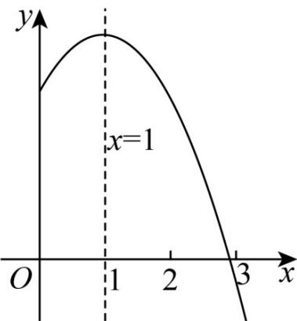

> [!faq]- 《专题2.3 二次函数与一元二次方程、不等式（高效培优讲义）》官方解析
>
> > [!success]- **【答案】** A. $\left(-\infty, \frac{1}{4}\right]$ B. $\left(-\infty, \frac{1}{2}\right]$ C. $\left(-\infty, \frac{5}{2}\right]$ D. $\left[\frac{1}{2}, +\infty\right)$
>
> > [!note]- **【解析】**
> > 因为对任意 $x \in [-1,1]$ ，不等式 $2x^{2} - 2x + 1 - 2m = 0$ 恒成立。
> > 所以 $\left(x^{2}-x+\frac{1}{2}\right)_{\min}$ m，其中 $x \in [-1,1]$ ，
> > 设 $y = x^{2} - x + \frac{1}{2}$ ， $x \in [-1,1]$ ，因为 $y = x^{2} - x + \frac{1}{2} = \left(x - \frac{1}{2}\right)^{2} + \frac{1}{4}$ ，
> > 所以当 $x=\frac{1}{2}$ 时，函数 $y=x^{2}-x+\frac{1}{2}$ ， $x\in[-1,1]$ 取最小值，最小值为 $\frac{1}{4}$ ，
> > 所以 $m \leq \frac{1}{4}$ ，
> >
> > 故选：A.
> >
> > 11. 抛物线 $y = ax^{2} + bx + c (a \neq 0)$ 的部分图象如图所示，下列说法正确的是（）
> >
> > 【答案】
> >
> > 
> >
> > A. $abc > 0$ B. $b = 2a$ C. $3a + c <   0$ D. $b^{2} <   4ac$
> >
> > 【答案】C
> >
> > 【详解】∵抛物线的开口向下，∴a<0
> >
> > $\therefore$ 抛物线的对称轴为 $x = 1$ ， $\therefore -\frac{b}{2a} >0$ ， $\therefore b > 0$
> >
> > $\because$ 抛物线 $y = ax^{2} + bx + c (a \neq 0)$ 与轴相交于正半轴， $\therefore c > 0$ ， $\therefore abc < 0$ ，故A错误；
> >
> > ∵ 抛物线的对称轴为 x=1，∴ $-\frac{b}{2a}=1$ ，∴ b=-2a，故 B 错误；
> >
> > 由图象可知，当 x = -1 时，函数值小于 0，即 $y = a - b + c = a + 2a + c = 3a + c < 0$ ，
> >
> > 故 $^{C}$ 正确；
> >
> > $\because$ 抛物线与 x 轴有两个交点， $\therefore b^{2}-4ac>0,\quad\therefore b^{2}>4ac$ ，故 D 错误.
> >
> > 故选 **C**.
