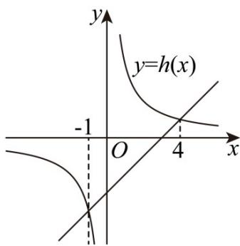

> [!faq]- 《专题2.3 二次函数与一元二次方程、不等式（高效培优讲义）》官方解析
>
> > [!success]- **【答案】** (1) $x = -1$ 或 $x = 4$ (2) $h(x)=\left\{\begin{aligned}&\frac{4}{x},x<-1\text{或}0<x<4\\&x-3,-1\leq x<0\text{或}4\leq x\end{aligned}\right.$ ， $h(x)\in[1,+\infty)$ (3) $H(m) = \left\{ \begin{array}{l}m^2 -m - 6,0 < m < \frac{1}{2}\\ -\frac{25}{4},\frac{1}{2}\leq m\leq \frac{3}{2}\\ m^2 -3m - 4,m > \frac{3}{2} \end{array} \right.$
>
> > [!note]- **【解析】**
> > （1）当 $f(x) = g(x)$ 时， $\frac{4}{x} = x - 3$
> >
> > 则 $x = -1$ 或 $x = 4$ .
> >
> > (2) 如图：
> >
> > 
> >
> > 由函数图象可知： $h(x) = \left\{ \begin{array}{l} \frac{4}{x}, x < -1 \text{或} 0 < x < 4 \\ x - 3, -1 \leq x < 0 \text{或} 4 \leq x \end{array} \right.$
> >
> > 当 $x \in (0, +\infty)$ 时， $h(x) = 1$ ，即函数 $h(x)$ 的值域为 $[1, +\infty)$ ；
> >
> > (3) $t(x) = x(g(x) - f(x)) = x\left(x - 3 - \frac{4}{x}\right) = x^2 -3x - 4$
> >
> > 对称轴： $x=\frac{3}{2}$ ，
> > - **①**：$0 < m < \frac{1}{2}$ 时， $m + 1 < \frac{3}{2}$ ，所以 $t(x)$ 在 $[m, m + 1]$ 上单调递减，
> >
> > $H(m) = (m + 1)^2 -3(m + 1) - 4 = m^2 -m - 6$
> > - **②**：当 $\frac{1}{2} \leq m \leq \frac{3}{2}$ 时， $\frac{3}{2} \in [m, m + 1]$ ，即 $H(m) = \left(\frac{3}{2}\right)^2 - 3 \times \frac{3}{2} - 4 = -\frac{25}{4}$
> > - **③**：当 $m > \frac{3}{2}$ 时，所以 $t(x)$ 在 $[m, m + 1]$ 上单调递增，即 $H(m) = m^2 - 3m - 4$
> >
> > $$
> > \therefore H (m) = \left\{ \begin{array}{l} m ^ {2} - m - 6, 0 <   m <   \frac {1}{2} \\ - \frac {2 5}{4}, \frac {1}{2} \leq m \leq \frac {3}{2} \\ m ^ {2} - 3 m - 4, m > \frac {3}{2} \end{array} \right.
> > $$
