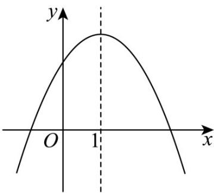

## 强化训练

1. 抛物线 $y = ax^{2} + bx + c$ 的顶点坐标为 $(1, -4a)$ ，其大致图象如图所示，下列结论正确的是（）

【答案】

A. abc > 0

B $4a + 2b + c > 0$

C．若方程 $a(x+1)(x-3)=1$ 有两个根 $x_{1}, x_{2}$ ，且 $x_{1}<x_{2}$ ；则 $-1<x_{1}<x_{2}<3$

D．若方程 $\left|ax^{2}+bx+c\right|=m$ 有四个根，则这四个根的和为4

【答案】BCD

【详解】由的顶点坐标为，则 $\left\{ \begin{array}{l} -\frac{b}{2a} = 1 \\ \frac{4ac - b^2}{4a} = -4a \end{array} \right.$ ，则 $\left\{ \begin{array}{l} b = -2a \\ c = -3a \end{array} \right.$

由抛物线图象开口向下，所以 a < 0 ，所以 $abc = 6a^{3} < 0$ ，所以 A 错误；

$4a + 2b + c = 4a - 4a - 3a = -3a > 0$ ，所以 $^{B}$ 正确；

令 $g(x)=a(x+1)(x-3)$ ，则 $g(x)=a(x+1)(x-3)=0$ 的两根为 -1,3，且开口向下，

因为方程 $a(x+1)(x-3)=1$ 有两个根 $x_{1}, x_{2}$ ，且 $x_{1}<x_{2}$ ，

所以 $g(x)=a(x+1)(x-3)$ 与 y=1 的两交点为 $x_{1}, x_{2}$ ，所以 $-1 < x_{1} < x_{2} < 3$ ，所以 C 错误；

$y=\left|ax^{2}+bx+c\right|=\left|ax^{2}-2ax-3a\right|=\left|a\right|\left|x^{2}-2x-3\right|$ ，其对称轴为 x=1

因为方程 $\left|ax^{2}+bx+c\right|=m$ 有四个根，分别为 $x_{3},x_{4},x_{5},x_{6}$

根据对称性知 $x_{3} + x_{6} = 2, x_{4} + x_{5} = 2$ ，所以这四个根的和为 $4$ ，所以 $D$ 正确·

故选：BCD

![[高中/课堂同步/题库/人教A版高中数学同步讲义(2026)/01_必修第一册/第二章 一元二次函数、方程和不等式/专题2.3 二次函数与一元二次方程、不等式（高效培优讲义）/强化训练/questions/Q00074922.md]]
![[高中/课堂同步/题库/人教A版高中数学同步讲义(2026)/01_必修第一册/第二章 一元二次函数、方程和不等式/专题2.3 二次函数与一元二次方程、不等式（高效培优讲义）/强化训练/questions/Q00074923.md]]
![[高中/课堂同步/题库/人教A版高中数学同步讲义(2026)/01_必修第一册/第二章 一元二次函数、方程和不等式/专题2.3 二次函数与一元二次方程、不等式（高效培优讲义）/强化训练/questions/Q00074924.md]]
![[高中/课堂同步/题库/人教A版高中数学同步讲义(2026)/01_必修第一册/第二章 一元二次函数、方程和不等式/专题2.3 二次函数与一元二次方程、不等式（高效培优讲义）/强化训练/questions/Q00074925.md]]
![[高中/课堂同步/题库/人教A版高中数学同步讲义(2026)/01_必修第一册/第二章 一元二次函数、方程和不等式/专题2.3 二次函数与一元二次方程、不等式（高效培优讲义）/强化训练/questions/Q00074926.md]]
![[高中/课堂同步/题库/人教A版高中数学同步讲义(2026)/01_必修第一册/第二章 一元二次函数、方程和不等式/专题2.3 二次函数与一元二次方程、不等式（高效培优讲义）/强化训练/questions/Q00074927.md]]
![[高中/课堂同步/题库/人教A版高中数学同步讲义(2026)/01_必修第一册/第二章 一元二次函数、方程和不等式/专题2.3 二次函数与一元二次方程、不等式（高效培优讲义）/强化训练/questions/Q00074928.md]]
![[高中/课堂同步/题库/人教A版高中数学同步讲义(2026)/01_必修第一册/第二章 一元二次函数、方程和不等式/专题2.3 二次函数与一元二次方程、不等式（高效培优讲义）/强化训练/questions/Q00074929.md]]
![[高中/课堂同步/题库/人教A版高中数学同步讲义(2026)/01_必修第一册/第二章 一元二次函数、方程和不等式/专题2.3 二次函数与一元二次方程、不等式（高效培优讲义）/强化训练/questions/Q00074930.md]]
![[高中/课堂同步/题库/人教A版高中数学同步讲义(2026)/01_必修第一册/第二章 一元二次函数、方程和不等式/专题2.3 二次函数与一元二次方程、不等式（高效培优讲义）/强化训练/questions/Q00074931.md]]
![[高中/课堂同步/题库/人教A版高中数学同步讲义(2026)/01_必修第一册/第二章 一元二次函数、方程和不等式/专题2.3 二次函数与一元二次方程、不等式（高效培优讲义）/强化训练/questions/Q00074932.md]]
![[高中/课堂同步/题库/人教A版高中数学同步讲义(2026)/01_必修第一册/第二章 一元二次函数、方程和不等式/专题2.3 二次函数与一元二次方程、不等式（高效培优讲义）/强化训练/questions/Q00074933.md]]
![[高中/课堂同步/题库/人教A版高中数学同步讲义(2026)/01_必修第一册/第二章 一元二次函数、方程和不等式/专题2.3 二次函数与一元二次方程、不等式（高效培优讲义）/强化训练/questions/Q00074934.md]]
![[高中/课堂同步/题库/人教A版高中数学同步讲义(2026)/01_必修第一册/第二章 一元二次函数、方程和不等式/专题2.3 二次函数与一元二次方程、不等式（高效培优讲义）/强化训练/questions/Q00074935.md]]
