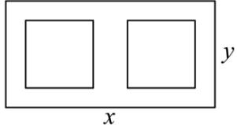

<!-- question-source:start -->
【变式1】如图所示，为宣传2025年世界人工智能大会在上海召开，某公益广告公司拟在一张矩形海报纸上

设计大小相等的左右两个矩形宣传栏，宣传栏的面积之和为 $4.5\mathrm{m}^2$ ，为了美观，要求海报上四周空白的宽度

为 $0.1\mathrm{m}$ ，两个宣传栏之间的空隙的宽度为 $0.2\mathrm{m}$ ，设海报纸的长和宽分别为 $x\mathrm{m}, y\mathrm{m}$ ，为节约成本（即使用纸

量最少），则长 $x =$ \_\_\_\_m.

<!-- question-source:end -->

![[高中/课堂同步/题库/人教A版高中数学同步讲义(2026)/01_必修第一册/第二章 一元二次函数、方程和不等式/专题2.3 二次函数与一元二次方程、不等式（高效培优讲义）/题型05_实际问题中的一元二次不等式问题/questions/answers/Q00074915A1.md]]
