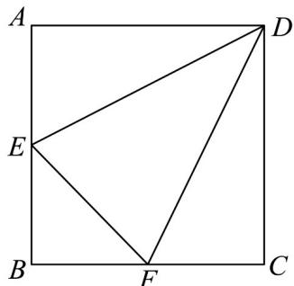

<!-- question-source:start -->
14. 如图所示，在边长为 1 的正方形 $ABCD$ 中，点 $E$ 、 $F$ 分别在线段 $BA$ 、 $BC$ 上运动。若 $\mathrm{Rt}^{\triangle} BEF$ 的周

长为定值 $^{2}$ ， $\triangle DEF$ 的面积为S，则 $\angle EDF$ 的大小为\_\_\_\_，面积S的最小值为\_\_\_\_。

<!-- question-source:end -->

![[高中/课堂同步/题库/人教A版高中数学同步讲义(2026)/01_必修第一册/第二章 一元二次函数、方程和不等式/第二章 一元二次函数、方程和不等式（高效培优单元测试·强化卷）/三_填空题/questions/answers/Q00074948A1.md]]
