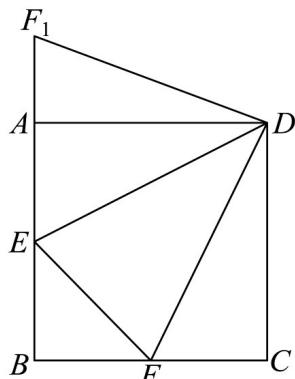

> [!faq]- 《第二章 一元二次函数、方程和不等式（高效培优单元测试·强化卷）》官方解析
>
> > [!success]- **【答案】** $\frac{\pi}{4} / 45^{\circ}$ $\sqrt{2} - 1 / -1 + \sqrt{2}$
>
> > [!note]- **【解析】**
> > 由题意不妨设 $BE = s$ ， $BF = t$ ，则 $EF = 2 - (s + t) = \sqrt{s^2 + t^2}$ ， $AE = 1 - s$ ， $FC = 1 - t$
> >
> > 则 $EF = (1 - s) + (1 - t) = AE + FC$
> >
> > 空1：将 $\triangle DFC$ 绕点 $D$ 顺时针旋转 $90^{\circ}$ 得到 $\triangle DAF_{1}$ ，如图，
> >
> > 
> >
> > 则 $AF_{1}=FC$ ， $EF_{1}=EF$ ， $DF=DF_{1}$ ，DE=DE，
> >
> > 所以 $\triangle DEF_{1}$ 与 $\triangle DEF$ 全等，则 $\angle EDF + \angle EDF_{1} = \frac{\pi}{2}$
> >
> > 所以 $\angle EDF = \angle EDF_{1} = \frac{\pi}{4}$ ;
> >
> > 空2：由题意 $\triangle DEF$ 的面积 $S = 1 - S_{\triangle AED} - S_{\triangle DFC} - S_{\triangle BEF} = 1 - \frac{1}{2}(1 - s) - \frac{1}{2}(1 - t) - \frac{1}{2}st = \frac{s + t - st}{2}$
> >
> > 由 $2 = (s + t) + \sqrt{s^2 + t^2}$ ，令 $m = s + t$ ， $n = \sqrt{s^2 + t^2} > 0$
> >
> > 则 $m + n = 2$ ， $m^2 - n^2 = 2st$
> >
> > 将 $m = 2 - n$ 代入 $m^2 - n^2 = 2st$ 得 $st = 2 - 2n$
> >
> > 所以 $S=\frac{s+t-st}{2}=\frac{2-n-(2-2n)}{2}=\frac{n}{2}$
> >
> > 因为 $0 \leq s \leq 1$ ， $0 \leq t \leq 1$ ， $st = 2 - 2n$ 0，则 $n \leq 1$ ；
> >
> > 因为 $s + t = m = 2 - n$ ， $st = 2 - 2n$
> >
> > 由根与系数关系可得：s 和 t 是方程 $x^{2}-(2-n)x+2-2n=0$ 的实根，
> >
> > 其判别式为非负即 $\Delta = (2 - n)^{2} - 4(2 - 2n) = n^{2} + 4n - 4 \quad 0$
> >
> > 解二次不等式可得： $n - 2 + 2\sqrt{2}$ ，因为 $n\leq 1$ 且 $n > 0$ ，所以 $n\in \left[-2 + \sqrt{2},1\right]$
> >
> > 所以 n 的最小值在 $n = 2\sqrt{2} - 2$ 时取到，此时 $S_{\min} = \frac{n}{2} = \frac{2\sqrt{2} - 2}{2} = \sqrt{2} - 1$ .
> >
> > 故答案为： $\frac{\pi}{4}$ ; $\sqrt{2}-1$ .
