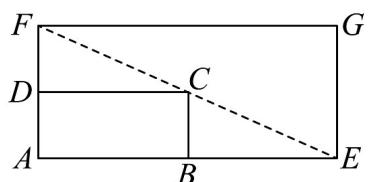

<!-- question-source:start -->
18. 某村原有一块矩形 $ABCD$ 场地建有健身器材，为了满足村民对体育锻炼的需求，计划在原有矩形场地

的基础上扩建成一个更大的矩形场地 $AEGF$ 。为了不影响原有的锻炼环境，建造时要求点 $B$ 在 $AE$ 上，点

$D$ 在 $AF$ 上，且对角线 $EF$ 经过点 $C$ ，如图所示．已知 $AB = 16\mathrm{m}$ ， $AD = 12\mathrm{m}$ ，设 $DF = xm$ ，矩形 $AEGF$ 的

面积为 $y\mathrm{m}^2$

(1)写出 $y$ 关于 $x$ 的表达式，并求出 $x$ 为多少时， $y$ 有最小值；

(2)要使矩形 $AEGF$ 的面积大于 $1024\mathrm{m}^2$ ，则 $DF$ 的长应在什么范围内？
<!-- question-source:end -->

![[高中/课堂同步/题库/人教A版高中数学同步讲义(2026)/01_必修第一册/第二章 一元二次函数、方程和不等式/第二章 一元二次函数、方程和不等式（高效培优单元测试·强化卷）/四_解答题/questions/answers/Q00074952A1.md]]
