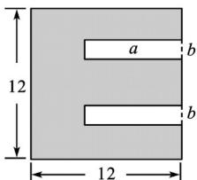

<!-- question-source:start -->
5. 如图所示，一张正方形形状的黑色硬质板，剪去两个一样的小矩形得到一个“E”形的图形，设小矩形的

长、宽分别为 $a$ ， $b(2 \leq a \leq 10)$ ，剪去部分的面积为8，则 $\frac{1}{b + 1} + \frac{9}{a + 9}$ 的最大值为（）

A. 1 B. $\frac{11}{10}$ C. $\frac{6}{5}$ D. 2
<!-- question-source:end -->

![[高中/课堂同步/题库/人教A版高中数学同步讲义(2026)/01_必修第一册/第二章 一元二次函数、方程和不等式/第二章 一元二次函数、方程和不等式（高效培优单元测试·提升卷）/一_选择题/questions/answers/Q00074993A1.md]]
