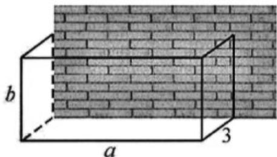

> [!faq]- 《第二章 一元二次函数、方程和不等式（高效培优单元测试·提升卷）》官方解析
>
> > [!success]- **【答案】** $(1)$ 8 (2) $\frac{4+2\sqrt{3}}{9}$
>
> > [!note]- **【解析】**
> > （1）首先有 $x + \frac{9}{x} + 2 = \frac{x^{2} + 2x + 9}{x} = \frac{(x - 3)^{2} + 8x}{x}$ $\frac{8x}{x} = 8$ .
> >
> > 而当 $x = 3$ 时，有 $x + \frac{9}{x} + 2 = 3 + \frac{9}{3} + 2 = 8$
> >
> > 所以 $x+\frac{9}{x}+2$ 的最小值为 8.
> >
> > (2) 首先有 $\frac{1}{x} + \frac{3}{y} = \frac{1}{9} \times 9 \times \left( \frac{1}{x} + \frac{3}{y} \right) = \frac{1}{9} (x + y) \left( \frac{1}{x} + \frac{3}{y} \right) = \frac{(x + y)(3x + y)}{9xy} = \frac{3x^{2} + 4xy + y^{2}}{9xy}$
> >
> > $$
> > = \frac {3 x ^ {2} - 2 \sqrt {3} x y + y ^ {2} + (4 + 2 \sqrt {3}) x y}{9 x y} = \frac {(\sqrt {3} x - y) ^ {2} + (4 + 2 \sqrt {3}) x y}{9 x y} \quad \frac {(4 + 2 \sqrt {3}) x y}{9 x y} = \frac {4 + 2 \sqrt {3}}{9}.
> > $$
> >
> > 而当 $x = \frac{9(\sqrt{3} - 1)}{2}$ ， $y = \frac{9\sqrt{3}(\sqrt{3} - 1)}{2}$ 时，有 $x + y = 9$ ，
> >
> > $$
> > \frac {1}{x} + \frac {3}{y} = \frac {2}{9 (\sqrt {3} - 1)} + \frac {3 \times 2}{9 \sqrt {3} (\sqrt {3} - 1)} = \frac {\sqrt {3} + 1}{9} + \frac {\sqrt {3} (\sqrt {3} + 1)}{9} = \frac {4 + 2 \sqrt {3}}{9}.
> > $$
> >
> > 所以 $\frac{1}{x} + \frac{3}{y}$ 的最小值为 $\frac{4 + 2\sqrt{3}}{9}$
> >
> > 17. 回答下列问题
> >
> > (1)已知 $-2 < x < 3, 2 < y < 5$ ，求 $3x - 4y$ 的取值范围
> >
> > (2)若 $x > 2$ ，求 $3x + \frac{3}{x - 2}$ 的最小值
> >
> > (3)已知 $x > 1, y > 1$ ，且 $3x + 2y = 8$ ，若 $\frac{1}{x - 1} + \frac{6}{y - 1} > m$ 恒成立，求 $m$ 的取值范围
> >
> > 【答案】(1)(-26,1)
> >
> > (2)12
> >
> > (3) $(-∞,9)$
> >
> > 【详解】（1）因为 -2 < x < 3，所以 -6 < 3x < 9，
> >
> > 因为 $2 < y < 5$ ，所以 $-20 < -4y < -8$
> >
> > 得到 $-26 < 3x - 4y < 1$ ，则 $3x - 4y \in (-26, 1)$ .
> >
> > (2) 由题意得 $3x + \frac{3}{x - 2} = 3x - 6 + 6 + \frac{3}{x - 2}$
> >
> > $$
> > = 3 (x - 2) + \frac {3}{x - 2} + 6 = 3 \left[ (x - 2) + \frac {1}{x - 2} + 2 \right]
> > $$
> >
> > 而 $x > 2$ ，由基本不等式得 $(x - 2) + \frac{1}{x - 2}$ $2\sqrt{(x - 2)\times\frac{1}{x - 2}} = 2$
> >
> > 当且仅当 $x - 2 = \frac{1}{x - 2}$ ，此时解得 $x = 3$ ，
> >
> > 则 $(x - 2) + \frac{1}{x - 2} + 2$ 4 $3x + \frac{3}{x - 2}$ 12 $3x + \frac{3}{x - 2}$ 的最小值是12.
> >
> > (3) 因为 $3x + 2y = 8$ ，所以 $3x - 3 + 2y - 2 = 3$ ，
> >
> > 得到 $3(x - 1) + 2(y - 1) = 3$ ，即 $\frac{1}{3}\Big[3(x - 1) + 2(y - 1)\Big] = 1$
> >
> > 则 $\frac{1}{3}\left[3(x - 1) + 2(y - 1)\right]\left(\frac{1}{x - 1} +\frac{6}{y - 1}\right) = \frac{1}{3}\left(3 + \frac{2(y - 1)}{x - 1} +\frac{18(x - 1)}{y - 1} +12\right)$
> >
> > $$
> > = \frac {1}{3} (1 5 + \frac {2 (y - 1)}{x - 1} + \frac {1 8 (x - 1)}{y - 1}) = 5 + \frac {1}{3} (\frac {2 (y - 1)}{x - 1} + \frac {1 8 (x - 1)}{y - 1})
> > $$
> >
> > 由基本不等式得 $\frac{2(y - 1)}{x - 1} +\frac{18(x - 1)}{y - 1}$ $2\sqrt{\frac{2(y - 1)}{x - 1}\times\frac{18(x - 1)}{y - 1}} = 12$
> >
> > 当且仅当 $\frac{2(y-1)}{x-1}=\frac{18(x-1)}{y-1}$ 时取等，而 x>1, y>1
> >
> > 此时解得 $x=\frac{4}{3}, y=2$ ， $\frac{1}{3}\left(\frac{2(y-1)}{x-1}+\frac{18(x-1)}{y-1}\right)$ 4
> >
> > $$
> > 5 + \frac {1}{3} (\frac {2 (y - 1)}{x - 1} + \frac {1 8 (x - 1)}{y - 1}) \quad 9
> > $$
> >
> > 而 $\frac{1}{x-1}+\frac{6}{y-1}>m$ 恒成立，得到 $m\in(-\infty,9)$ .
> >
> > 18. 利用一堵长 $8\mathrm{m}$ ，高 $3\mathrm{m}$ 的旧墙建造一个无盖的长方体储物仓库，如图所示。由于空间限制，仓库的宽
> >
> > 度固定为 $3\mathrm{m}$ .已知仓库三个侧面的建造成本为 $900$ 元 $/ \mathrm{m}^2$ ，仓库底面的建造成本为 $600$ 元 $/ \mathrm{m}^2$ .整个仓库
> >
> > 的建造成本预算为 $32400$ 元，假设成本预算恰好用完．设仓库的长与高分别为 $a, b$ （单位： $\mathfrak{m}$ ）.
> >
> > 
> >
> > (1)求 $a$ 与 $b$ 满足的关系式；
> >
> > (2)求仓库占地（即底面）面积 S 的最小值；
> >
> > (3)求仓库的储物量（即容积 V）的最大值.
> >
> > 【答案】(1) $ab + 6b + 2a = 36$ ，其中 $0 < a \leq 8$ ， $0 < b \leq 3$
> >
> > $$
> > 1 0. 8 \mathrm{m} ^ {2}
> > $$
> >
> > (3) $36m^{3}$
> >
> > 【详解】（1）由题设 $(2\times3b+ab)\times900+3a\times600=32400$ ，则 $6b+ab+2a=36$ 且 $0<a\leq8,0<b\leq3$ ；
> >
> > (2) 由 $a = \frac{6(6 - b)}{b + 2} = 6\left(\frac{8}{b + 2} - 1\right)$ ，得 $S = 3a = 18\left(\frac{8}{b + 2} - 1\right)$
> >
> > 易知 $S$ 是关于 $b$ 的减函数，所以当 $b$ 取最大值 $3\mathrm{m}$ 时， $S$ 取最小值 $10.8\mathrm{m}^2$
> >
> > 故仓库占地面积S的最小值为 $10.8m^{2}$ ，此时a=3.6m,b=3m。
> >
> > (3)
> > 解法一：由 $ab + 6b + 2a = 36$ ，得 $2(a + 3b) = 36 - ab$
> >
> > 因为 $a + 3b = 2\sqrt{3ab}$ （当且仅当 $a = 3b$ 时取等号）.
> >
> > 所以 $36 - ab$ $4\sqrt{3ab}$ ，故 $\left(\sqrt{ab} + 6\sqrt{3}\right)\left(\sqrt{ab} - 2\sqrt{3}\right) \leq 0$ ，解得 $\sqrt{ab} \leq 2\sqrt{3}$
> >
> > 故 $ab \leq 12$ （当且仅当 $a = 6, b = 2$ 时取等号）.
> >
> > 所以仓库容积 V = 3ab 的最大值为 $36m^{2}$ ，此时 a = 6m, b = 2m。
> >
> > 解法二：由 $a = 6\left(\frac{8}{b + 2} -1\right)$ ，得 $V = 3ab = 18\left(\frac{8}{b + 2} -1\right)b$
> >
> > $$
> > V = 1 8 \left(\frac {8}{b + 2} - 1\right) [ (b + 2) - 2 ] = 1 8 \left[ 1 0 - (b + 2) - \frac {1 6}{b + 2} \right]
> > $$
> >
> > 因为 $(b + 2) + \frac{16}{b + 2} = 2\sqrt{(b + 2)\cdot\frac{16}{b + 2}} = 8$ （当且仅当 $b = 2$ 时取等号）.
> >
> > 所以 $V \leq 18(10 - 8) = 36$ （当且仅当 a = 6, b = 2 时取等号）.
> >
> > 故仓库容积 V 的最大值为 $36 \, m^{3}$ ，此时 a = 6m, b = 2m。
