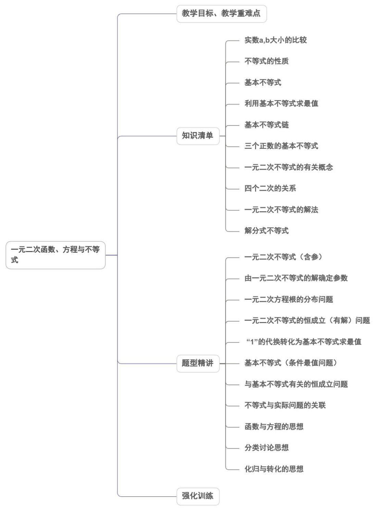
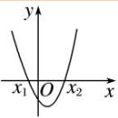
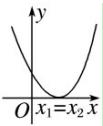
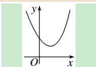

<!-- source-part:1 pages:1-50 -->

## 第二章 一元二次函数、方程和不等式

## 内容概览

## 教学目标、教学重难点

<table><tr><td>教学目标</td><td>1.会用不等式表示不等关系;掌握等式性质和不等式性质。2.会利用不等式性质比较大小。3.会利用不等式的性质进行简易的求范围与证明。4.理解一元二次方程、一元二次不等式与二次函数的关系。5.掌握一元二次方程的求解方法,掌握一元二次方程根与系数的关系以及一元二次方程根的分布情况。6.掌握图象法解一元二次不等式,会解简单的能转化为一元二次不等式的分式不等式。</td></tr><tr><td>教学重难点</td><td>1.重点掌握重要的不等式、基本不等式(均值不等式)的内容,成立条件及公式的证明。2.难点利用基本不等式的性质及变形求相关函数的最值及证明。</td></tr></table>

## 知识清单

## 知识点 01 实数 a, b 大小的比较

1、如果 $a - b$ 是正数，那么 $a > b$ ；如果 $a - b$ 等于0，那么 $a = b$ ；如果 $a - b$ 是负数，那么 $a < b$ ，反过来也对.

2、作差法比大小：① $a - b > 0 \Leftrightarrow a > b$ ；② $a - b = 0 \Leftrightarrow a = b$ ；③ $a - b < 0 \Leftrightarrow a < b$

## 3、不等式性质

性质1：不等式两边加（或减）同一个数（或式子），不等号的方向不变

性质2：不等式两边乘（或除以）同一个正数，不等号的方向不变

性质 3：不等式两边乘（或除以）同一个负数，不等号的方向改变

## 【即学即练】

1. 若 $a, b, c \in \mathbf{R}$ ，则下列命题正确的是（）

【答案】

A. 若 $a > b$ ，则 $ac^2 > bc^2$ B. 若 $\frac{a}{c^2} > \frac{b}{c^2}$ ，则 $a < b$

C. 若 $a < b < c < 0$ ，则 $\frac{b}{a} < \frac{b + c}{a + c}$ D. 若 $a > b$ ，则 $a^2 > b^2$

【答案】C

【详解】对于 A 选项，当 c = 0 时不满足，故 A 错误；

对于B选项，由不等式性质知， $\frac{a}{c^2} >\frac{b}{c^2}$ 两边同时乘以 $c^2 >0$ ，可得 $a > b$ ，故B错误；

对于 C 选项，若 a < b < c < 0，则 $a + c < 0$ ， $b - a > 0$ ， $(b - a)c < 0$ ， $a(a + c) > 0$

故 $\frac{b}{a} -\frac{b + c}{a + c} = \frac{b(a + c) - a(b + c)}{a(a + c)} = \frac{(b - a)c}{a(a + c)} < 0$ ，即 $\frac{b}{a} <  \frac{b + c}{a + c}$ ，故C正确；

对于 D 选项，取 a = -1 ， b = -2 ，可得 $a^{2} < b^{2}$ ，故 D 错误。

故选：C

2. 若实数 $m, n, p$ 满足 $m = 4e^{\frac{3}{5}}, n = 5e^{\frac{2}{3}}, p = \frac{18}{e^2}$ ，则（）A. $p < m < n$ B. $p < n < m$ C. $m < p < n$ D. $n < p < m$

【答案】A

【详解】因为实数 m ， n ， p 满足 $m = 4e^{\frac{3}{5}}$ ， $n = 5e^{\frac{2}{5}}$ ， $p = \frac{18}{e^{2}}$ ，

所以 $\frac{m}{n} = \frac{4e^{\frac{3}{5}}}{5e^{\frac{2}{3}}} = \frac{4}{5}\cdot e^{-\frac{1}{15}} < 1$

$$
\therefore m <   n
$$

$$
\text { 又 } \frac {m}{p} = \frac {4 e ^ {\frac {3}{5}}}{\frac {1 8}{e ^ {2}}} = \frac {2}{9} \cdot e ^ {\frac {1 3}{5}} > 1,
$$

$m > p$

$\therefore p < m < n$

故选：A.

知识点 02 不等式的性质

<table><tr><td>性质</td><td>性质内容</td><td>特别提醒</td></tr><tr><td>对称性</td><td> $a > b \Leftrightarrow b < a$ </td><td> $\Leftrightarrow$ (等价于)</td></tr><tr><td>传递性</td><td> $a > b, b > c \Rightarrow a > c$ </td><td> $\Rightarrow$ (推出)</td></tr><tr><td>可加性</td><td> $a > b \Leftrightarrow a + c > b + c$ </td><td> $\Leftrightarrow$ (等价于</td></tr><tr><td rowspan="2">可乘性</td><td> $\left. \begin{array}{l} a > b \\ c > 0 \end{array} \right\} \Rightarrow ac > bc$ </td><td rowspan="2">注意 $^c$ 的符号(涉及分类讨论的思想)</td></tr><tr><td> $\left. \begin{array}{l} a > b \\ c < 0 \end{array} \right\} \Rightarrow ac < bc$ </td></tr><tr><td>同向可加性</td><td> $\left. \begin{array}{l} a > b \\ c > d \end{array} \right\} \Rightarrow a + c > b + d$ </td><td> $\Rightarrow$ </td></tr><tr><td>同向同正可乘性</td><td> $\left. \begin{array}{l} a > b > 0 \\ c > d > 0 \end{array} \right\} \Rightarrow ac > bd$ </td><td> $\Rightarrow$ </td></tr><tr><td>可乘方性</td><td> $a > b > 0 \Rightarrow a^n > b^n (n \in N, n - 2)$ </td><td rowspan="2"> $a$ ,  $b$ 同为正数</td></tr><tr><td>可开方性</td><td> $a > b > 0 \Rightarrow \sqrt[n]{a} > \sqrt[n]{b} (n \in N, n - 2)$ </td></tr></table>

## 【即学即练】

1. 若 $a, b, c, d \in \mathbb{R}$ ，则下列说法正确的是（）

【答案】

A. 若 $a + c > b + d, c > d$ ，则 $a > b$ B. 若 $a > b > 0 > c > d$ ，则 $\frac{c}{a} - \frac{d}{b} > 0$

C．若 $a < b, c < d$ ，则 $ac < bd$ D．若 $a < b$ ，则 $ac^2 < bc^2$

【答案】B

$$
a = 1, b = 1, c = - 1, d = - 2
$$

$$
a + c > b + d, c > d
$$

$$
a = b
$$

对于 B，因为 a > b > 0，-d > -c > 0，所以 -ad > -bc > 0，即得 bc > ad，又因为 ab > 0

则 $\frac{c}{a} -\frac{d}{b} = \frac{bc - ad}{ab} >0$ ，所以B正确，

对于 C，若 a=1, b=2, c=-2, d=-1 ，满足 a<b, c<d ，则 ac=bd=-2 ，所以 C 错误，

对于 D，若 c=0，则 $ac^{2}=bc^{2}=0$ ，所以 D 错误，

故选：B.

2. 已知 $a > b$ ， $c > d > 0$ ，则（）A. $\frac{d}{c} < \frac{d + 4}{c + 4}$ B. $a - c > b - d$ C. $\frac{a}{c} > \frac{b}{d}$ D. $\frac{1}{a} < \frac{1}{b}$

【答案】A

【详解】对于A， $\frac{d}{c} - \frac{d + 4}{c + 4} = \frac{4(d - c)}{c(c + 4)}$ ，因为 $c > d > 0$ ，所以 $d - c < 0$ ，所以 $\frac{d}{c} - \frac{d + 4}{c + 4} = \frac{4(d - c)}{c(c + 4)} < 0$ 即

$\frac{d}{c}<\frac{d+4}{c+4}$ ，故选项 A 正确.

对于 B，a > b, c > d > 0，取 a = 4，b = 3，c = 2，d = 1，则 a - c = b - d，故选项 B 错误.

对于 C，a > b, c > d > 0，取 a = 2，b = 1，c = 6，d = 3，则 $\frac{a}{c} = \frac{b}{d}$ ，故选项 C 错误.

对于 D，a > b，取 a = 1，b = -1，则 $\frac{1}{a} > \frac{1}{b}$ ，故选项 D 错误.

故选：A.

## 知识点 03 基本不等式

基本不等式: $\forall a > 0, b > 0, a + b = 2\sqrt{ab}$ , (当且仅当 $a = b$ 时, 取“=”号) 其中 $\sqrt{ab}$ 叫做正数 $a$ , $b$ 的几何平均数; $\frac{a + b}{2}$ 叫做正数 $a$ , $b$ 的算数平均数.

如果 $\forall a, b \in R$ , 有 $a^2 + b^2 \geq 2ab$ (当且仅当 $a = b$ 时, 取“=”号)

特别的, 如果 $a > 0, b > 0$ , 用 $\sqrt{a}, \sqrt{b}$ 分别代替 $a, b$ , 代入 $a^2 + b^2 \geq 2ab$ , 可得: $a + b = 2\sqrt{ab}$ , 当且仅当 $a = b$ 时, “=”号成立.

【即学即练】

1. 已知 $a, b > 0$ ，且 $ab = a + b + \frac{5}{4}$ ，则下列关系正确的是（）

【答案】
A. $a + b = 5$ B. $a + b \leq 1$ C. $ab = 10$ D. $ab \leq \frac{1}{2}$

【答案】A

【详解】由 $a > 0, b > 0, ab = a + b + \frac{5}{4} \leq \frac{(a + b)^2}{4}$ ，即 $(a + b)^2 - 4(a + b) - 5 = 0$ ，又 $a, b > 0$ ，

所以 $[(a + b) - 5][(a + b) + 1]\quad 0$ ，可得 $a + b = \frac{5}{2}$ 时等号成立，A对，B错；

由 $ab = a + b + \frac{5}{4} 2\sqrt{ab} +\frac{5}{4}$ ，即 $4ab - 8\sqrt{ab} -5 = (2\sqrt{ab} -5)(2\sqrt{ab} +1)\quad 0$

所以 $\sqrt{ab}$ $\frac{5}{2} \Rightarrow ab$ $\frac{25}{4}$ ，当且仅当 $a = b = \frac{5}{2}$ 时等号成立，C、D 错.

故选：A

2．存在三个实数 $a_1, a_2, a_3$ ，满足下列两个等式：① $a_1 a_2 a_3 = 2$ ；② $a_1 + a_2 + a_3 = 0$ ，其中 $M$ 表示这三个实数$a_{1}, a_{2}, a_{3}$ 中的最大值，则（ ）A. $M$ 的最大值是2 B. $M$ 的最小值是2C. $M$ 的最大值是 $\sqrt{2}$ D. $M$ 的最小值是 $2\sqrt[3]{6}$

【答案】B

【详解】由题意可知， $a_1, a_2, a_3$ 中有2个负数，1个正数，其中 $a_1, a_2$ 是负数， $a_3 > 0$

则 $M = a_{3}$

所以 $a_3 = -\left(a_1 + a_2\right)$ $2\sqrt{a_1a_2}$ ，则 $a_1a_2 \leq \frac{a_3^2}{4}$ ，且 $a_1a_2a_3 = 2$

所以 $a_{1}a_{2}a_{3} = 2\leq \frac{a_{3}^{3}}{4}$ ，即 $a_3$ 2，所以 $M$ 的最小值为2.

故选：B

## 知识点 04 利用基本不等式求最值

①已知 x，y 是正数，如果积 xy 等于定值 P，那么当且仅当 x = y 时，和 $x + y$ 有最小值 $2\sqrt{P}$ ;
②已知 x, y 是正数，如果和 $x + y$ 等于定值 S，那么当且仅当 x = y 时，积 xy 有最大值 $\frac{S^{2}}{4}$ ;
【即学即练】

1. 已知 $0 < x < \frac{1}{3}$ ，则 $y = x(1 - 3x)$ 的最大值为（）A. $\frac{1}{12}$ B. $\frac{1}{4}$ C. $\frac{1}{3}$ D. $\frac{1}{9}$

【答案】A

【详解】因为 $0 < x < \frac{1}{3}$ ，所以 1 - 3x > 0，

$$
y = x (1 - 3 x) = \frac {1}{3} \times 3 x (1 - 3 x) \leq \frac {1}{3} \times \left[ \frac {3 x + (1 - 3 x)}{2} \right] ^ {2} = \frac {1}{1 2},
$$

当且仅当 $3x = 1 - 3x \Rightarrow x = \frac{1}{6}$ 时取等号，

所以最大值为 $\frac{1}{12}$ .

故选：A

2. 已知 $x > 1, y > 2$ 且 $xy - 2x - y = 0$ ，则 $x + y$ 的最小值为（）A. $4\sqrt{2}$ B. $2\sqrt{2} + 3$ C. 4 D. 6

【答案】B

【详解】已知 $x > 1, y > 2$ ，且 $xy - 2x - y = 0$

法一：由 $xy - 2x - y = 0$ 得 $y = \frac{2x}{x - 1}$

则 $x + y = x + \frac{2x}{x - 1} = (x - 1) + \frac{2(x - 1) + 2}{x - 1} + 1$

$$
= (x - 1) + \frac {2}{x - 1} + 3 2 \sqrt {(x - 1) \cdot \frac {2}{x - 1}} + 3 = 2 \sqrt {2} + 3
$$

当且仅当 $x - 1 = \frac{2}{x - 1}, x = \sqrt{2} + 1$ 时取等号，则 $x + y$ 的最小值为 $2\sqrt{2} + 3$ ；

法二：由 $xy - 2x - y = 0$ 得 $(x - 1)(y - 2) = 2$

则 $x + y = (x - 1) + (y - 2) + 3$ $2\sqrt{(x - 1)\cdot(y - 2)} +3 = 2\sqrt{2} +3$

当且仅当 $x - 1 = y - 2$ ，即 $x = \sqrt{2} + 1$ ， $y = \sqrt{2} + 2$ 时取等号，

则 $x + y$ 的最小值为 $2\sqrt{2} + 3$

<table><tr><td> $\frac{2}{\frac{1}{a}+\frac{1}{b}} \leq \sqrt{ab} \leq \frac{a+b}{2} \leq \sqrt{\frac{a^2+b^2}{2}}$ (其中,当且仅当时,取“”号) $a > 0$   $b > 0$   $a = b$ </td></tr></table>

故选：B.

## 知识点 05 基本不等式链

## 【即学即练】

1. 已知正实数 $a, b$ 满足 $a + \frac{2}{b} = 1$ ，则 $\frac{2}{a} + b$ 的最小值为（）A.8 B.6 C.4 D.2

【答案】A

【详解】因为 $a, b$ 是正实数，则 $\frac{2}{a} + b = \left(a + \frac{2}{b}\right)\left(\frac{2}{a} + b\right) = 4 + ab + \frac{4}{ab} \quad 4 + 2\sqrt{ab \cdot \frac{4}{ab}} = 8$

当且仅当 $ab = \frac{4}{ab}$ 即 $a = \frac{1}{2}$ ， $b = 4$ 时取得等号。

故选：A.

2. 若 $x > 0, y > 0$ ，且 $x + y = xy$ ，则 $\frac{x}{x - 1} + \frac{2y}{y - 1}$ 的最小值为（）A. $2 + 2\sqrt{3}$ B. $3 + 2\sqrt{2}$ C. 4 D. 5

【答案】B

【详解】因为 $x > 0$ ， $y > 0$ ，且 $x + y = xy$ ，则 $(x - 1)(y - 1) = xy - x - y + 1 = 1$ ， $xy = x + y > y \Rightarrow x > 1$ ，同理 $y > 1$

$$
\frac {x}{x - 1} + \frac {2 y}{y - 1} = 1 + \frac {1}{x - 1} + 2 + \frac {2}{y - 1} = 3 + \frac {1}{x - 1} + \frac {2}{y - 1} \quad 3 + 2 \sqrt {\frac {1}{x - 1} \times \frac {2}{y - 1}} = 3 + 2 \sqrt {2}
$$

当且仅当 $x=1+\frac{\sqrt{2}}{2}, y=1+\sqrt{2}$ 时， $\frac{x}{x-1}+\frac{2y}{y-1}$ 的最小值为 $3+2\sqrt{2}$ .

故选：B.

## 知识点 06 三个正数的基本不等式

如果 $a > 0, b > 0, c > 0$ ，那么 $\frac{a + b + c}{3} \sqrt[3]{abc}$ （当且仅当 $a = b = c$ 时，取“ $=$ ”号）

## 【即学即练】

1. 设 $\max\left\{a,b,c,d\right\}$ 表示 a, b, c, d 中最大的数，例如 $\max\left\{1,2,1,3\right\}=3$ . 已知 x, y 均为正数，则 $\max\left\{\frac{1}{x},\frac{4}{y},4x,y\right\}$ 的最小值为（）

【答案】B
【详解】设 $\max\left\{\frac{1}{x},\frac{4}{y},4x,y\right\}=M$ ，则 $4M=\frac{1}{x}+4x+\frac{4}{y}+y=2\sqrt{\frac{1}{x}\cdot4x}+2\sqrt{\frac{4}{y}\cdot y}=8$ 当且仅当 $\frac{1}{x}=4x,\frac{4}{y}=y$ ，即 $x=\frac{1}{2},y=2$ 时取等号，则 $4M\quad8\Rightarrow M\quad2$ .

故选：B

2. 若 $\max \left\{x_{1}, x_{2}, x_{3}\right\}$ 表示三个数中的最大值，则对任意的正实数 $x, y$ ， $\max \left\{x, 2y, \frac{4}{x^2} + \frac{1}{y^2}\right\}$ 的最小值是（）A.1 B.2 C.4 D.5

【答案】B

【详解】设 $N = \max \left\{ x, 2y, \frac{4}{x^{2}} + \frac{1}{y^{2}} \right\}$ ，则 $x \leq N$ ， $2y \leq N$ ， $\frac{4}{x^{2}} + \frac{1}{y^{2}} \leq N$

因 $x > 0, y > 0$ ，则得 $2xy\left(\frac{4}{x^2} + \frac{1}{y^2}\right) \leq N^3$ 。又因 $2xy \cdot \left(\frac{4}{x^2} + \frac{1}{y^2}\right)$ $2xy \cdot \frac{4}{xy} = 8$ ，所以 $N^3 = 8$ ，

当且仅当 $x=2y=\frac{4}{x^{2}}+\frac{1}{y^{2}}=2$ ，即 x=2，y=1 时等号成立，故 $\max\left\{x,2y,\frac{4}{x^{2}}+\frac{1}{y^{2}}\right\}$ 的最小值为 2。

故选：B.

## 知识点 07 一元二次不等式的有关概念

## 1、一元二次不等式

只含有一个未知数，并且未知数的最高次数是 $2$ 的不等式，叫做一元二次不等式，一元二次不等式的一般形式 $① ax^{2} + bx + c > 0(a\neq 0)$ （其中 $a,b,c$ 均为常数）

② $ax^{2}+bx+c<0(a\neq0)$ （其中a,b,c均为常数）

③ $ax^{2}+bx+c$ 0(a≠0) (其中a,b,c均为常数)

④ $ax^{2} + bx + c \leq 0 (a \neq 0)$ （其中 a, b, c 均为常数）

## 2、一元二次不等式的解与解集

使某一个一元二次不等式成立的 $x$ 的值，叫作这个一元二次不等式的解，其解的集合，称为这个一元二次不等式的解集.

将一个不等式转化为另一个与它解集相同的不等式，叫作不等式的同解变形.

【即学即练】

1. 设集合 $A = \left\{x \mid x^2 + 2x - 3 > 0\right\}$ ， $B = \left\{x \mid x^2 - 2ax - 1 \leq 0, a > 0\right\}$ . 若 $A \cap B$ 中恰含有一个整数，则实数 $a$ 的取值

范围是（）

A. $\left(0, \frac{3}{4}\right)$ B. $\left[\frac{3}{4}, \frac{4}{3}\right)$ C. $\left[\frac{3}{4}, +\infty\right)$ D. $(1, +\infty)$

【答案】B

【详解】 $A = \{x\mid x^2 +2x - 3 > 0\} = \{x\mid x > 1$ 或 $x <   - 3\}$

因为函数 $f(x) = x^{2} - 2ax - 1$ 图象的对称轴为 $x = a > 0$ ， $f(-3) = 6a + 8 > 0$ ， $f(1) = -2a < 0$

根据对称性可知，要使 $A \cap B$ 中恰含有一个整数，则这个整数为 2，

所以有且，即 $\left\{ \begin{array}{ll}f(2) = 3 - 4a\leq 0\\ f(3) = 8 - 6a > 0 \end{array} \right.$ ，即 $\left\{ \begin{array}{ll}a & \frac{3}{4}\\ a <   \frac{4}{3} \end{array} \right.$ ，即 $\frac{3}{4}\leq a <   \frac{4}{3}$

故选：B.

2. 关于 $x$ 的不等式 $x^{2} - 2(m + 1)x + 4m \leq 0$ 的解集中恰有 $^4$ 个正整数，则实数 $^m$ 的取值范围是（）A. $\left(\frac{5}{2},3\right)$ B. $\left[\frac{5}{2},3\right)$ C. $\left(-1, - \frac{1}{2}\right]$ D. $\left(-1, - \frac{1}{2}\right] \cup \left[\frac{5}{2},3\right)$

【答案】B

【详解】原不等式可化为 $\left(x - 2\right)\left(x - 2m\right) \leq 0$

若 $m \leq 1$ ，则不等式的解集是 $\{x \mid 2m \leq x \leq 2\}$ ，不等式的解集中不可能有4个正整数；

所以 $m > 1$ ，不等式的解集是 $[2,2m]$ ；所以不等式的解集中4个正整数分别是 $2,3,4,5$ ，令 $5\leq 2m <   6$ ，解得 $\frac{5}{2}\leq m <   3$ ，所以 $m$ 的取值范围是 $\left[\frac{5}{2},3\right)$ ：

## 知识点 08 四个二次的关系

## 1、一元二次函数的零点

一般地，对于二次函数 $y = ax^{2} + bx + c$ ，我们把使 $ax^{2} + bx + c = 0$ 的实数 $x$ 叫做二次函数 $y = ax^{2} + bx + c$ 的零点。

## 2、二次函数与一元二次方程的根、一元二次不等式的解集的对应关系

对于一元二次方程 $ax^2 + bx + c = 0 (a > 0)$ 的两根为 $x_1$ 、 $x_2$ 且 $x_1 \leq x_2$ ，设 $\Delta = b^2 - 4ac$ ，它的解按照 $\Delta > 0$ ， $\Delta = 0$ ， $\Delta < 0$ 可分三种情况，相应地，二次函数 $y = ax^2 + bx + c (a > 0)$ 的图象与 $x$ 轴的位置关系也分为三种情况。因此我们分三种情况来讨论一元二次不等式 $ax^2 + bx + c > 0 (a > 0)$ 或 $ax^2 + bx + c < 0 (a > 0)$ 的解集。

<table><tr><td>判别式 $\Delta = b^{2} - 4ac$ </td><td colspan="2"> $\Delta >0$ </td><td colspan="2"> $\Delta = 0$ </td><td> $\Delta < 0$ </td></tr><tr><td>二次函数 $y = ax^{2} + bx + c (a >0$ 的图象</td><td></td><td></td><td></td><td></td><td></td></tr><tr><td>一元二次方程 $ax^{2} + bx + c = 0 (a >0 )$ 的根</td><td colspan="2">有两个不相等的实数根 $x_{1}$ , $x_{2} (x_{1} < x_{2})$ </td><td colspan="2">有两个相等的实数根 $x_{1} = x_{2} = -\frac{b}{2a}$ </td><td>没有实数根</td></tr><tr><td> $ax^{2} + bx + c >0 (a >0 )$ 的解集</td><td colspan="2"> $\{x \mid x < x_{1} \text{或} x >x_{2}\}$ </td><td colspan="2"> $\{x \mid x \neq -\frac{b}{2a}\}$ </td><td>R</td></tr><tr><td> $ax^{2} + bx + c < 0 (a >0 )$ 的解集</td><td colspan="2"> $\{x \mid x_{1} < x < x_{2}\}$ </td><td colspan="2"> $\emptyset$ </td><td> $\emptyset$ </td></tr></table>

## 【即学即练】

1. 关于 $x$ 的方程 $x^{2} + (a - 2)x + 5 - a = 0$ 有两根，其中一根小于2，另一根大于3，则实数 $a$ 的取值范围是

【答案】

( )

A. $\{a \mid a < -5$ 或 $a > -4\}$ B. $\left\{a \mid -5 < a < -4\right\}$

C. $\{a|a < -5\}$ D. $\{a|a > -4\}$

【答案】C

【详解】设 $f(x) = x^{2} + (a - 2)x + 5 - a$

则由题意可知 $\left\{ \begin{array}{l} f(2) < 0 \\ f(3) < 0 \\ \Delta = (a - 2)^2 - 4(5 - a) > 0 \end{array} \right.$ ，即 $\left\{ \begin{array}{l} 4 + 2(a - 2) + 5 - a < 0 \\ 9 + 3(a - 2) + 5 - a < 0 \\ \Delta = (a - 2)^2 - 4(5 - a) > 0 \end{array} \right.$ ，解得 $a < -5$

故实数 $a$ 的取值范围是 $\{a \mid a < -5\}$ .

故选：C.

2．若对任意实数 b，关于 x 的方程 $ax^{2} + b(x + 1) - 2 = x$ 有两个实根，则实数 a 的取值范围是（）

【答案】
A. $0 < a \leq 2$ B. $0 < a \leq 1$ C. $-1 \leq a < 0$ D. $-1 \leq a \leq 1$ 且 $a \neq 0$

【答案】B

【详解】关于 $x$ 的方程 $ax^2 + b(x + 1) - 2 = x$ 有两个实根，即方程 $ax^2 + (b - 1)x + b - 2 = 0$ 有两个实根，所以 $\left\{ \begin{array}{l}a\neq 0\\ \Delta_1 = (b - 1)^2 -4a(b - 2) \quad 0 \end{array} \right.$ ，即 $\left\{ \begin{array}{l}a\neq 0\\ b^2 -2(1 + 2a)b + 8a + 1 \quad 0 \text{对任意实数} b\text{恒成立} \end{array} \right.$ 所以 $\left\{ \begin{array}{l}a\neq 0\\ \Delta_2 = 4(1 + 2a)^2 -4(8a + 1)\leq 0 \end{array} \right.$ ，即 $\left\{ \begin{array}{l}a\neq 0\\ a^2 -a\leq 0 \end{array} \right.$ ，得 $0 < a\leq 1$

故选：B.

## 知识点 09 一元二次不等式的解法

1：先看二次项系数是否为正，若为负，则将二次项系数化为正数；

2：写出相应的方程 $ax^2 + bx + c = 0 (a > 0)$ ，计算判别式 $\Delta$ ：

① $\Delta > 0$ 时，求出两根 $x_{1}$ 、 $x_{2}$ ，且 $x_{1} < x_{2}$ （注意灵活运用十字相乘法）；

② $\Delta = 0$ 时，求根 $x_{1} = x_{2} = -\frac{b}{2a}$

③ $\Delta < 0$ 时，方程无解

3：根据不等式，写出解集.

## 【即学即练】

1. 已知二次函数 $f(x) = ax^2 + bx + c$ ，若不等式 $f(x) = 0$ 的解集为 $[-1, 2]$ ，则函数 $g(x) = f(1 - x)$ 图像为（）

【答案】

A. 开口向上，对称轴为 $x = \frac{1}{2}$ 的抛物线 B. 开口向上，对称轴为 $x = \frac{3}{2}$ 的抛物线

C. 开口向下，对称轴为 $x = \frac{1}{2}$ 的抛物线 D. 开口向下，对称轴为 $x = \frac{3}{2}$ 的抛物线

【答案】C

【详解】因不等式 $f(x) = 0$ 的解集为 $[-1, 2]$ ，则 $a < 0$ ， $ax^2 + bx + c = 0$ 的根为 -1 或 2，

则由韦达定理可得 $-\frac{b}{a} = 1 \Rightarrow \frac{b}{a} = -1$ 。又注意到 $g(x) = f(1 - x) = a(1 - x)^2 + b(1 - x) + c$

$= a(1 - x)^{2} + b(1 - x) + c = ax^{2} - (2a + b)x + a + b + c$ ，则 $g(x)$ 开口向下，对称轴为 $x = -\frac{-(2a + b)}{2a} = 1 + \frac{b}{2a} = \frac{1}{2}$

故选：C

2. 已知关于 $x$ 的不等式 $x^{2} - 4ax + 3a^{2} < 0 (a < 0)$ 的解集为 $\left(x_{1}, x_{2}\right)$ ，则 $x_{1} + x_{2} + \frac{2a}{x_{1}x_{2}}$ 的最大值是（）A. $\frac{4\sqrt{6}}{3}$ B. $-\frac{4\sqrt{6}}{3}$ C. $\frac{4\sqrt{3}}{3}$ D. $-\frac{4\sqrt{3}}{3}$

【答案】B

【详解】因为关于 $x$ 的不等式 $x^{2} - 4ax + 3a^{2} < 0(a < 0)$ 的解集为 $(x_{1}, x_{2})$

所以 $\left\{\begin{aligned}x_{1}+x_{2}&=4a\\ x_{1}x_{2}&=3a^{2}\end{aligned}\right.$

所以 $x_{1} + x_{2} + \frac{2a}{x_{1}x_{2}} = 4a + \frac{2a}{3a^{2}} = 4a + \frac{2}{3a}$

$= -\left[\left(-4a\right) + \frac{2}{-3a}\right] \leq -2\sqrt{\left(-4a\right)\cdot\frac{2}{-3a}} = -\frac{4\sqrt{6}}{3}$ ，当且仅当 $-4a = \frac{2}{-3a}$ ，即 $a = -\frac{\sqrt{6}}{6}$ 时取等号.

故选：B

## 知识点 10 解分式不等式

1、定义：

与分式方程类似，分母中含有未知数的不等式称为分式不等式，如：形如 $\frac{f(x)}{g(x)} < 0$ 或 $\frac{f(x)}{g(x)} > 0$ （其中 $f(x)$ ， $g(x)$ 为整式且 $g(x) \neq 0$ 的不等式称为分式不等式。

2、分式不等式的解法

①移项化零：将分式不等式右边化为0：

$$
② \frac {f (x)}{g (x)} <   0 \Leftrightarrow f (x) \cdot g (x) <   0
$$

$$
③ \frac {f (x)}{g (x)} > 0 \Leftrightarrow f (x) \cdot g (x) > 0
$$

$$
\frac {f (x)}{g (x)} \leq 0 \Leftrightarrow \left\{ \begin{array}{l} f (x) \cdot g (x) \leq 0 \\ g (x) \neq 0 \end{array} \right.
$$

$$
⑤ \frac {f (x)}{g (x)} \quad 0 \Leftrightarrow \left\{ \begin{array}{l l} f (x) \cdot g (x) & 0 \\ g (x) \neq 0 \end{array} \right.
$$

## 【即学即练】

1. 已知关于 $x$ 的不等式 $ax^2 + bx - 2 > 0$ 的解集为 $\{x \mid 1 < x < 2\}$ ，则不等式 $\frac{x - a}{x - b} < 0$ 的解集是（）

【答案】

A. $\left\{x\mid -1 <   x <   \frac{1}{2}\right\}$ B. $\left\{x\mid \frac{1}{2} <  x <   1\right\}$ C. $\left\{x\mid -3 <   x <   1\right\}$ D. $\left\{x\mid -1 <   x <   3\right\}$

【答案】D

【详解】由题可知 $ax^{2}+bx-2=0$ 的根为1和2，代入方程可得a=-1，b=3，
不等式 $\frac{x-a}{x-b}<0$ 等价于 $\frac{x+1}{x-3}<0$ ，则解集为 $\left\{x\mid-1<x<3\right\}$ ，

故选：D.

2. 不等式 $\frac{x - 2024}{-x + 2025}$ 0 的解集是（）A.[2024,2025] B.[2024,2025)C. $(- \infty ,2025]$ D.(2024,+∞)

【答案】B

【详解】 $\frac{x - 2024}{-x + 2025}$ $0\Leftrightarrow \left\{ \begin{array}{c}(x - 2024)(x - 2025)\leq 0\\ x - 2025\neq 0 \end{array} \right.\Leftrightarrow 2024\leq x <   2025$ ，则不等式解集为[2024,2025).

故选：B

## 题型精讲

![[高中/课堂同步/题库/人教A版高中数学同步讲义(2026)/01_必修第一册/第二章 一元二次函数、方程和不等式/第二章 一元二次函数、方程和不等式（高效培优讲义）/题型01_一元二次不等式_含参/题型01_一元二次不等式_含参.md]]
![[高中/课堂同步/题库/人教A版高中数学同步讲义(2026)/01_必修第一册/第二章 一元二次函数、方程和不等式/第二章 一元二次函数、方程和不等式（高效培优讲义）/题型02_由一元二次不等式的解确定参数/题型02_由一元二次不等式的解确定参数.md]]
![[高中/课堂同步/题库/人教A版高中数学同步讲义(2026)/01_必修第一册/第二章 一元二次函数、方程和不等式/第二章 一元二次函数、方程和不等式（高效培优讲义）/题型03_一元二次方程根的分布问题/题型03_一元二次方程根的分布问题.md]]
![[高中/课堂同步/题库/人教A版高中数学同步讲义(2026)/01_必修第一册/第二章 一元二次函数、方程和不等式/第二章 一元二次函数、方程和不等式（高效培优讲义）/题型04_一元二次不等式的恒成立_有解_问题/题型04_一元二次不等式的恒成立_有解_问题.md]]
![[高中/课堂同步/题库/人教A版高中数学同步讲义(2026)/01_必修第一册/第二章 一元二次函数、方程和不等式/第二章 一元二次函数、方程和不等式（高效培优讲义）/题型05__1_的代换转化为基本不等式求最值/题型05__1_的代换转化为基本不等式求最值.md]]
![[高中/课堂同步/题库/人教A版高中数学同步讲义(2026)/01_必修第一册/第二章 一元二次函数、方程和不等式/第二章 一元二次函数、方程和不等式（高效培优讲义）/题型06_基本不等式_条件最值问题/题型06_基本不等式_条件最值问题.md]]
![[高中/课堂同步/题库/人教A版高中数学同步讲义(2026)/01_必修第一册/第二章 一元二次函数、方程和不等式/第二章 一元二次函数、方程和不等式（高效培优讲义）/题型07_与基本不等式有关的恒成立问题/题型07_与基本不等式有关的恒成立问题.md]]
![[高中/课堂同步/题库/人教A版高中数学同步讲义(2026)/01_必修第一册/第二章 一元二次函数、方程和不等式/第二章 一元二次函数、方程和不等式（高效培优讲义）/题型08_不等式与实际问题的关联/题型08_不等式与实际问题的关联.md]]
![[高中/课堂同步/题库/人教A版高中数学同步讲义(2026)/01_必修第一册/第二章 一元二次函数、方程和不等式/第二章 一元二次函数、方程和不等式（高效培优讲义）/题型09_函数与方程的思想/题型09_函数与方程的思想.md]]
![[高中/课堂同步/题库/人教A版高中数学同步讲义(2026)/01_必修第一册/第二章 一元二次函数、方程和不等式/第二章 一元二次函数、方程和不等式（高效培优讲义）/题型10_分类讨论思想/题型10_分类讨论思想.md]]
![[高中/课堂同步/题库/人教A版高中数学同步讲义(2026)/01_必修第一册/第二章 一元二次函数、方程和不等式/第二章 一元二次函数、方程和不等式（高效培优讲义）/题型11_化归与转化的思想/题型11_化归与转化的思想.md]]
![[高中/课堂同步/题库/人教A版高中数学同步讲义(2026)/01_必修第一册/第二章 一元二次函数、方程和不等式/第二章 一元二次函数、方程和不等式（高效培优讲义）/强化训练/强化训练.md]]
