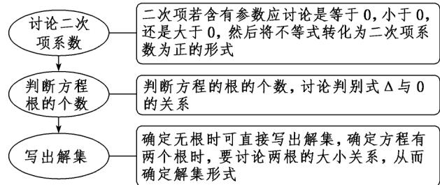

> [!faq]- 《第二章 一元二次函数、方程和不等式（高效培优讲义）》官方解析
>
> > [!success]- **【答案】** A
>
> > [!note]- **【解析】**
> > 当 $a < -1$ 时， $-1 < \frac{1}{a} < 0$ ，此时解集为 $\left\{x \mid x < -1 \text{ 或 } x > \frac{1}{a}\right\}$
> >
> > 当 $a = -1$ 时， $\frac{1}{a} = -1$ ，此时解集为 $\{x\mid x\neq -1\}$
> >
> > 当 $-1 < a < 0$ 时， $\frac{1}{a} < -1$ ，此时解集为 $\left\{x \mid x < \frac{1}{a} \text{或 } x > -1\right\}$
> >
> > 当 $a = 0$ 时，不等式为 $-(x + 1) < 0$ ，此时解集为 $\{x|x > -1\}$
> >
> > 当 $a > 0$ 时， $\frac{1}{a} >0$ ，此时解集为 $\left\{x\mid -1 <   x <   \frac{1}{a}\right\}$
> >
> > 故 A 正确，B、C、D 错误.
> >
> > ## 方法技巧
> >
> > 
