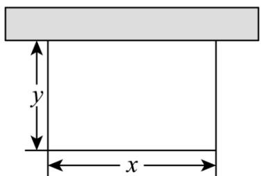

<!-- question-source:start -->
【变式1】如图，某农户计划用 $20\mathrm{m}$ 的篱笆围成一个一边靠墙（墙足够长）的矩形菜地。设该矩形菜地与墙

平行的边长为 $x\mathrm{m}$ ，与墙垂直的边长为 $y\mathrm{m}$ ：

(1)当 $x$ 为何值时，面积取得最大值？最大面积为多少？

(2)求 $\frac{3x+20}{xy}$ 的最小值.
<!-- question-source:end -->

![[高中/课堂同步/题库/人教A版高中数学同步讲义(2026)/01_必修第一册/第二章 一元二次函数、方程和不等式/第二章 一元二次函数、方程和不等式（高效培优讲义）/题型05__1_的代换转化为基本不等式求最值/questions/answers/Q00078967A1.md]]
